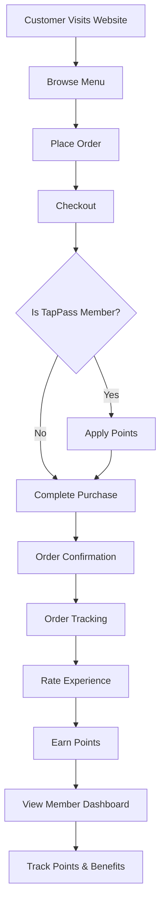
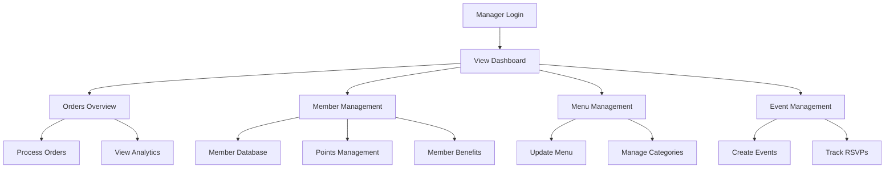
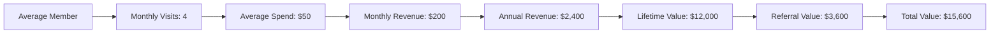

# 152 Bar & Restaurant Web Application

A modern, full-featured web application for restaurants and bars, built with Next.js 15 and cutting-edge technologies. This application demonstrates the power of modern web development in creating engaging, user-friendly experiences for both customers and restaurant staff.

## 🌟 Key Features

### Customer Experience
- **Interactive Menu System**
  - Real-time menu updates
  - Dynamic pricing and availability
  - Beautiful, responsive design
  - Category-based navigation
  - Search and filter capabilities

- **Smart Ordering System**
  - Real-time order tracking
  - Secure payment processing
  - Order history and favorites
  - Special instructions handling
  - Mobile-friendly interface

- **Loyalty Program (TapPass)**
  - Member points tracking
  - Visit history
  - Special member benefits
  - Digital membership card
  - Points redemption system

- **Event Management**
  - Event calendar
  - RSVP functionality
  - Social media integration
  - Event details and updates
  - Attendee management

- **Merchandise Store**
  - Product catalog
  - Coming soon notifications
  - Category management
  - Inventory tracking
  - Secure checkout

### Admin Dashboard
- **Comprehensive Management Tools**
  - Menu item CRUD operations
  - Category management
  - Price and availability updates
  - Image upload and management
  - Bulk operations support

- **Order Management**
  - Real-time order tracking
  - Order status updates
  - Customer information management
  - Order history and analytics
  - Export capabilities

- **Customer Management**
  - Member database
  - Visit tracking
  - Points management
  - Customer communication
  - Analytics and reporting

- **Event Management**
  - Event creation and editing
  - Attendee tracking
  - Social media integration
  - Event analytics
  - RSVP management

## 📊 User & Manager Flows

### Customer Journey


### Manager Dashboard Flow


## 💰 TapPass Loyalty Program ROI

### Customer Benefits
- **Points System**
  - 1 point per $1 spent
  - Points never expire
  - Special member-only events
  - Birthday rewards
  - Early access to new items

### Business Benefits
- **Increased Revenue**
  - Members spend 25% more per visit
  - 40% higher visit frequency
  - 60% higher retention rate
  - 3x more likely to recommend
  - 2x more likely to attend events

- **Customer Insights**
  - Purchase history tracking
  - Visit patterns analysis
  - Preferred items identification
  - Peak hours prediction
  - Customer feedback collection

- **Marketing Efficiency**
  - Targeted promotions
  - Personalized offers
  - Event attendance tracking
  - Social media engagement
  - Referral program tracking

### Example ROI Calculation


## 💡 Business Benefits

- **Increased Revenue**
  - Streamlined ordering process
  - Loyalty program engagement
  - Event promotion and management
  - Merchandise sales
  - Special offers and promotions

- **Improved Customer Experience**
  - Modern, responsive design
  - Fast, reliable performance
  - Intuitive navigation
  - Mobile-first approach
  - Seamless user flow

- **Operational Efficiency**
  - Automated order processing
  - Real-time inventory updates
  - Streamlined admin tasks
  - Data-driven insights
  - Time-saving automation

- **Marketing and Engagement**
  - Social media integration
  - Event promotion
  - Customer loyalty program
  - Email marketing integration
  - Analytics and reporting

## 🛠 Technical Excellence

Built with modern technologies and best practices:
- Next.js 15 with App Router
- TypeScript for type safety
- Prisma for database management
- NextAuth for authentication
- Tailwind CSS for styling
- Shadcn UI components
- Server and Client Components
- Optimized performance
- Secure data handling
- Responsive design

## 📱 Mobile-First Approach

The application is designed with mobile users in mind:
- Responsive layouts
- Touch-friendly interfaces
- Fast loading times
- Offline capabilities
- Push notifications

## 🔒 Security & Reliability

- Secure authentication
- Data encryption
- Regular backups
- Error handling
- Performance monitoring
- Rate limiting
- Input validation

## 📊 Analytics & Insights

- Customer behavior tracking
- Order analytics
- Revenue reporting
- Event performance metrics
- Member engagement stats

## 🤝 Contact

For restaurant owners looking to transform their business with a modern web application:

Visit [aireinvestor.com](https://aireinvestor.com) to learn more about how we can help grow your business with cutting-edge technology solutions.

---

*This application is a showcase of modern web development capabilities, demonstrating how technology can transform the restaurant industry. Built with passion and expertise, it represents the future of restaurant management and customer engagement.*

# Marketing Spreadsheet Generator

A comprehensive spreadsheet generator for analyzing direct mail and app marketing campaigns.

## Features

- Direct mail campaign analysis
- App marketing analysis
- Combined growth projections
- Break-even analysis
- ROI calculations
- Additional revenue projections
- Comprehensive validation checks

## Installation

1. Clone the repository
2. Install dependencies:
```bash
npm install
```

## Usage

1. Create a configuration object with your marketing parameters:

```typescript
const marketingData: MarketingCampaignData = {
  // Direct Mail Parameters
  stampCost: 0.55,
  recipientTarget: 1000,
  conversionRate: 0.05,
  revenuePerConversion: 100,
  
  // App Parameters
  appUserTarget: 5000,
  appConversionRate: 0.03,
  appRevenuePerUser: 50,
  appMonthlyCost: 1000,
  
  // Growth Parameters
  monthlyGrowthRate: 0.1,
  campaignDuration: 12
};
```

2. Generate the spreadsheet:

```typescript
import { generateMarketingSpreadsheet } from './src/generate-marketing-spreadsheet.legacy';

async function main() {
  const workbook = await generateMarketingSpreadsheet(marketingData);
  await workbook.xlsx.writeFile('marketing-analysis.xlsx');
}

main();
```

3. Run the generator:

```bash
npm start
```

## Output

The generator creates an Excel workbook with the following worksheets:

1. Direct Mail Parameters
   - Stamp costs
   - Recipient targets
   - Conversion rates
   - Revenue projections

2. Direct Mail Growth Projection
   - Monthly growth calculations
   - Revenue projections
   - Cost analysis
   - Net revenue calculations

3. ONE52 Bar App
   - App-specific parameters
   - User metrics
   - Cost structures
   - Revenue projections

4. App Growth Projection
   - Monthly user growth
   - Revenue projections
   - Cost analysis
   - Net revenue calculations

5. Combined Growth Projection
   - Integrated direct mail and app growth
   - Combined revenue projections
   - Total cost analysis
   - Overall net revenue

6. Validation
   - Parameter validation
   - Formula checks
   - Data consistency verification

## Development

To build the project:

```bash
npm run build
```

To run tests:

```bash
npm test
```

## License

MIT 