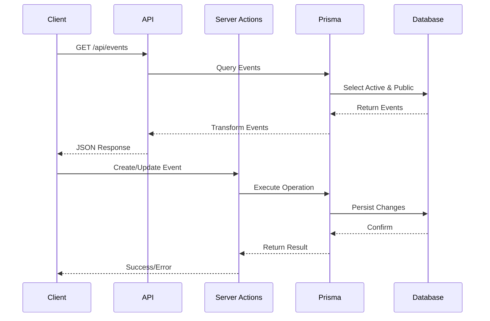

# Events System Documentation (Updated March 30, 2024) 🗓️

## System Overview 🌐

Our events system is now fully database-driven with a complete admin interface. Here's how it all works:

### 1. Directory Structure 📁
```
my_app/
├── src/
│   ├── components/events/
│   │   ├── EventsList.tsx         # Reusable events grid component
│   │   ├── EventsClientPage.tsx   # Client-side events page logic
│   │   ├── UpcomingEvents.tsx     # Homepage events display
│   │   └── EventsPageSkeleton.tsx # Loading state
│   │
│   ├── app/
│   │   ├── events/
│   │   │   ├── page.tsx           # Public events page
│   │   │   └── EventsClient.tsx   # Client-side logic
│   │   │
│   │   ├── admin/events/
│   │   │   └── page.tsx           # Admin events management
│   │   │
│   │   └── api/events/
│   │       └── route.ts           # Events API endpoints
│   │
│   └── lib/
│       └── utils/
│           └── event-transform.ts  # Prisma to App type conversion
```

### 2. Data Flow 🔄



### 3. Event Display Settings 🎯

Each event has three visibility flags:
- `isActive` ✅: Event is enabled in the system
- `isPublic` 🌍: Event is visible to the public
- `showPastDate` ⏰: Event remains visible after its date

Example:
```typescript
const event = {
  title: "LIVE MUSIC! TYLER RUSSELL!",
  date: new Date("2024-08-09"),
  time: "8:00 PM",
  isActive: true,
  isPublic: true,
  showPastDate: false
};
```

### 4. Admin Interface Features 🛠️

The admin interface (`/admin/events`) provides:
- Create new events
- Edit existing events
- Delete events
- Toggle visibility settings
- Set display time format
- Upload event images
- Preview event details

Example form data:
```typescript
const formData = {
  title: "LIVE MUSIC! TYLER RUSSELL!",
  description: "Join us at One-52 Bar and Grill for LIVE MUSIC!",
  date: new Date("2024-08-09T20:00:00"),
  time: "8:00 PM",
  image: "https://content-lax3-1.xx.fbcdn.net/v/t39.30808-6/454241592_10473634940654",
  isActive: true,
  isPublic: true,
  showPastDate: false
};
```

### 5. Public Display Features 🎪

The public events page (`/events`) includes:
- Upcoming events section
- Optional past events section
- Event details with images
- Date and time formatting
- Responsive grid layout
- Loading states

Example display:
```typescript
const displayEvent = {
  title: "LIVE MUSIC! TYLER RUSSELL!",
  formattedDate: "Friday, August 9, 2024",
  time: "8:00 PM",
  description: "Join us at One-52 Bar and Grill for LIVE MUSIC!",
  image: "https://content-lax3-1.xx.fbcdn.net/v/t39.30808-6/454241592_10473634940654"
};
```

### 6. Date Handling 📅

The system handles dates in multiple formats:
- Database: DateTime (ISO format)
- Admin Form: datetime-local input
- Display Time: Custom format string
- Public Display: Localized format

Example transformations:
```typescript
// Database format
const dbDate = "2024-08-09T20:00:00.000Z";

// Form input format
const formDate = "2024-08-09T20:00";

// Display format
const displayDate = "Friday, August 9, 2024";
const displayTime = "8:00 PM";
```

### 7. Implementation Notes 📝

1. **Server Actions**
   - Used for all database operations
   - Proper error handling
   - Type-safe operations

2. **Client Components**
   - Optimistic updates
   - Loading states
   - Error boundaries

3. **Data Validation**
   - Required fields checking
   - Date format validation
   - Image URL validation

Would you like me to explain any of these sections in more detail? 🤔

Next topics we could explore:
1. 📊 Event analytics and tracking
2. 🎟️ Event registration system
3. 🔄 Recurring events
4. 📱 Mobile event notifications
5. 🗺️ Event location integration

Let me know which aspect you'd like to dive deeper into! 🚀