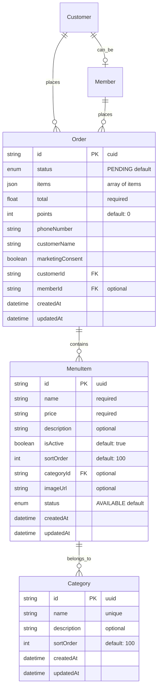
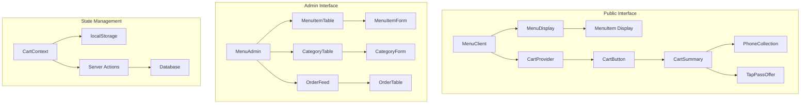
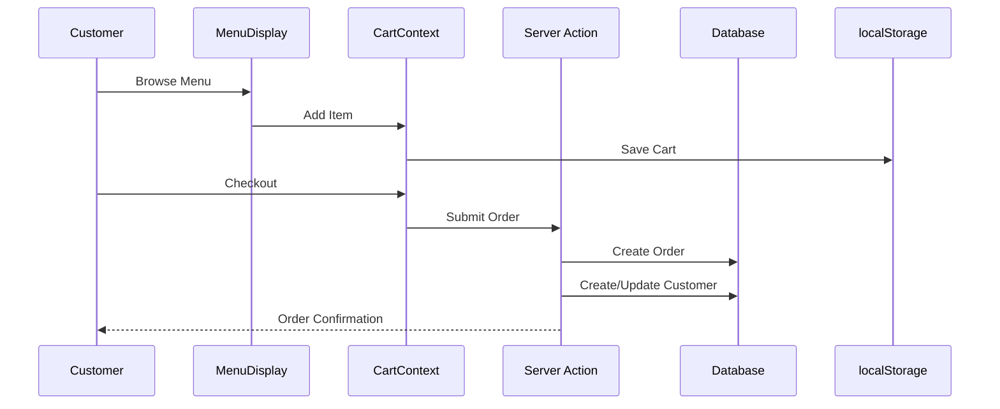
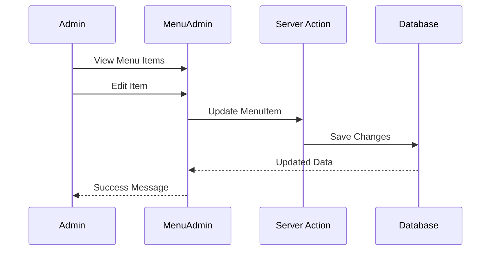
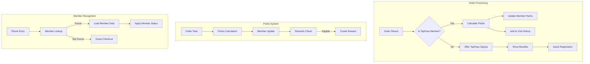
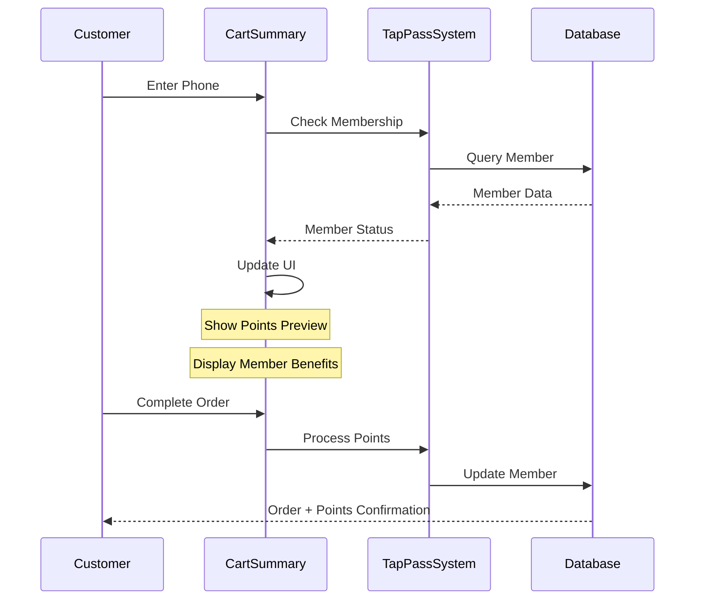

# Menu System Implementation Documentation

## System Overview

Our menu system is a comprehensive solution that integrates menu management, ordering, and customer tracking. The implementation follows Next.js 15 best practices with a focus on type safety, server components, and efficient state management.

## Core Components

### 1. Data Models



### 2. Type Safety Implementation

#### Zod Validation Schemas
```typescript
// src/lib/validations/menu.ts
export const menuItemSchema = z.object({
  name: z.string().min(1, 'Name is required'),
  description: z.string().optional(),
  price: z.string().min(1, 'Price is required'),
  categoryId: z.string().min(1, 'Category is required'),
  imageUrl: z.string().url().optional(),
  isActive: z.boolean().default(true),
  sortOrder: z.number().int().min(0),
});

export const categorySchema = z.object({
  name: z.string().min(1, 'Name is required'),
  description: z.string().optional(),
  sortOrder: z.number().int().min(0),
  isActive: z.boolean().default(true),
});
```

### 3. Component Architecture



## Implementation Details

### 1. Server Actions

#### Menu Management
```typescript
// src/actions/menu/admin.ts
- createMenuItem(): Creates new menu items with validation
- updateMenuItem(): Updates existing items
- deleteMenuItem(): Soft delete with status update
- updateMenuItemStatus(): Toggles item availability
- createCategory(): Manages menu categories
- updateCategory(): Updates category details
```

#### Order Processing
```typescript
// src/actions/orders/index.ts
- createOrder(): Processes new orders
- updateOrderStatus(): Manages order lifecycle
- getOrders(): Retrieves orders with filtering
- linkOrderToCustomer(): Associates orders with customers
```

### 2. Client Components

#### Cart Management
```typescript
// src/components/menu/cart/CartContext.tsx
- Uses React Context for cart state
- Implements localStorage persistence
- Handles item quantity management
- Calculates totals and points
```

#### Admin Interface
```typescript
// src/components/menu/adminMenu/MenuItemTable.tsx
- Implements sorting and filtering
- Bulk status updates
- Real-time status toggle
- Price formatting and validation
```

### 3. Database Integration

#### Prisma Schema
```prisma
model MenuItem {
  id          String         @id @default(uuid())
  name        String
  price       String
  description String?
  isActive    Boolean        @default(true)
  sortOrder   Int           @default(100)
  categoryId  String?
  imageUrl    String?
  status      MenuItemStatus @default(AVAILABLE)
  category    Category?      @relation(fields: [categoryId], references: [id])
  createdAt   DateTime      @default(now())
  updatedAt   DateTime      @updatedAt

  @@index([categoryId])
}
```

## User Flows

### 1. Customer Ordering



### 2. Admin Management



## Security and Validation

1. **Input Validation**
   - Zod schemas for all inputs
   - Price format validation
   - Required field checks
   - URL validation for images

2. **Access Control**
   - Admin routes protected
   - API routes secured
   - Session validation

3. **Error Handling**
   - Graceful error recovery
   - User-friendly messages
   - Error logging

## Performance Optimizations

1. **Server Components**
   - Menu display uses RSC
   - Admin tables are client components
   - Optimized data fetching

2. **State Management**
   - Local storage for cart
   - React Query for admin data
   - Optimistic updates

3. **Database**
   - Proper indexing
   - Efficient relations
   - Soft deletes

## Testing Strategy

1. **Unit Tests**
   - Validation functions
   - Price calculations
   - Cart operations

2. **Integration Tests**
   - Order flow
   - Admin operations
   - Customer creation

3. **E2E Tests**
   - Complete order flow
   - Admin CRUD operations
   - Error scenarios

## Monitoring and Analytics

1. **Order Tracking**
   - Order status updates
   - Customer history
   - Member points tracking

2. **Performance Metrics**
   - API response times
   - Cart conversion rate
   - Error rates

3. **Business Metrics**
   - Popular items
   - Peak order times
   - Customer retention

## TapPass Integration

### 1. Member Benefits System



### 2. Integration Points

#### Cart Integration
```typescript
// src/components/menu/cart/TapPassOffer.tsx
- Displays member benefits during checkout
- Quick registration option
- Points preview calculation
- Membership level benefits display
```

#### Order Processing
```typescript
// src/actions/orders/index.ts
interface OrderProcessing {
  // Member detection and points
  if (memberId) {
    const points = calculatePoints(total);
    await updateMemberPoints(memberId, points);
    await createVisitRecord(memberId, total, points);
  }

  // Guest conversion opportunity
  if (!memberId && marketingConsent) {
    await createCustomer({
      phoneNumber,
      name: customerName,
      marketingConsent: true
    });
  }
}
```

### 3. Member Recognition Flow



### 4. Data Model Integration

```prisma
// Extended Order Model with Member Relations
model Order {
  // ... existing fields ...
  memberId         String?
  member           Member?     @relation(fields: [memberId], references: [id])
  points           Int        @default(0)
  // ... existing fields ...

  @@index([memberId])
}

// Member Points Tracking
model Visit {
  id        String   @id @default(cuid())
  memberId  String
  member    Member   @relation(fields: [memberId], references: [id])
  orderId   String?
  order     Order?   @relation(fields: [orderId], references: [id])
  points    Int      @default(0)
  amount    Float
  visitDate DateTime @default(now())
}
```

### 5. Member Benefits Implementation

1. **Points System**
   - Order total to points conversion
   - Bonus points for special items
   - Points history tracking
   - Automatic reward generation

2. **Member Recognition**
   - Automatic member detection
   - Member status display
   - Points balance showing
   - Available rewards list

3. **Quick Registration**
   - Post-order registration flow
   - Points retroactive application
   - Welcome reward generation
   - Member card creation

### 6. Technical Implementation

#### Member Detection
```typescript
// src/components/menu/cart/PhoneCollection.tsx
export const PhoneCollection = () => {
  const checkMembership = async (phone: string) => {
    const member = await getMemberByPhone(phone);
    if (member) {
      setMemberStatus(member);
      showMemberBenefits(member.points);
    } else {
      offerTapPassSignup();
    }
  };
};
```

#### Points Processing
```typescript
// src/lib/points-calculation.ts
export const calculateOrderPoints = (total: number, memberLevel: MembershipLevel): number => {
  const basePoints = Math.floor(total);
  const multiplier = getMemberMultiplier(memberLevel);
  return basePoints * multiplier;
};
```

#### Member Updates
```typescript
// src/actions/orders/member-integration.ts
export const processMemberOrder = async (order: Order, member: Member) => {
  const points = calculateOrderPoints(order.total, member.membershipLevel);
  
  await prisma.$transaction([
    // Update member points
    prisma.member.update({
      where: { id: member.id },
      data: { 
        points: { increment: points },
        visitCount: { increment: 1 },
        lastVisit: new Date()
      }
    }),
    // Create visit record
    prisma.visit.create({
      data: {
        memberId: member.id,
        orderId: order.id,
        points,
        amount: order.total
      }
    }),
    // Check and create rewards if eligible
    checkAndCreateRewards(member.id, points)
  ]);
};
```

## Performance Considerations

1. **Member Lookups**
   - Indexed phone number queries
   - Cached member data
   - Optimistic UI updates

2. **Points Processing**
   - Transaction-based updates
   - Background reward processing
   - Efficient point calculations

3. **State Management**
   - Member context provider
   - Local storage caching
   - Real-time points updates

// ... rest of existing code ... 