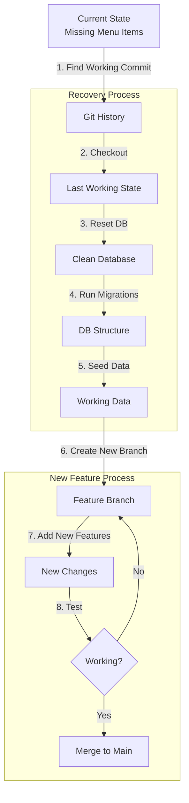
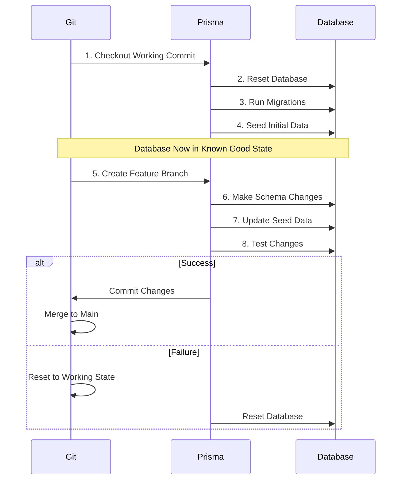
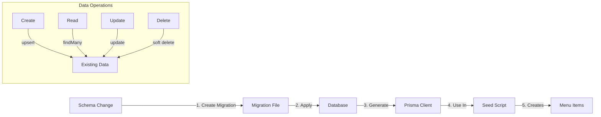
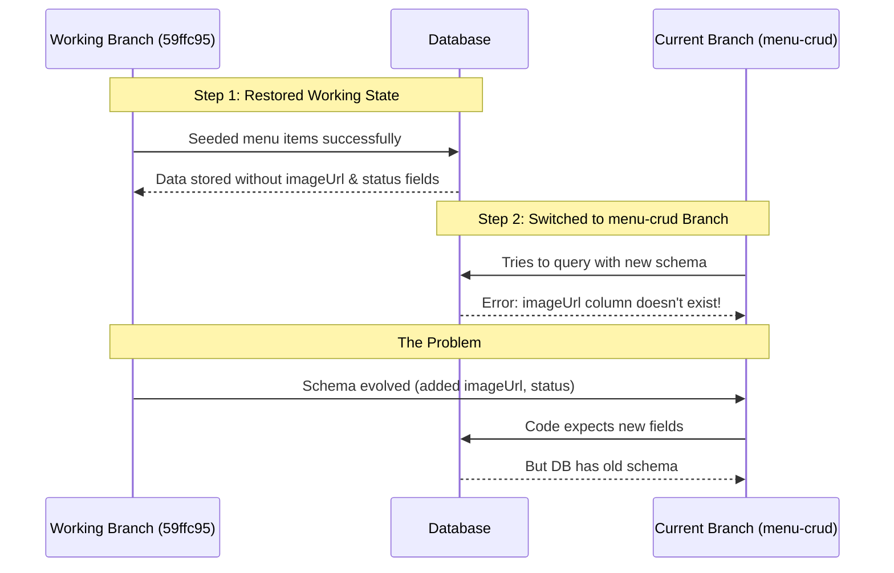
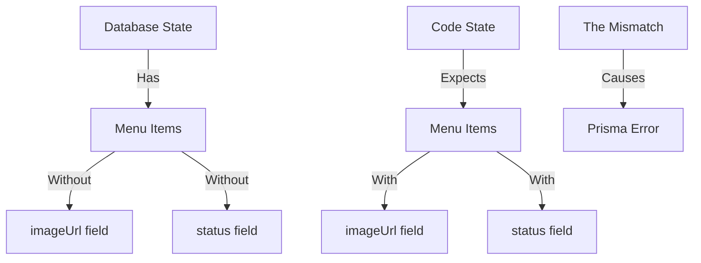
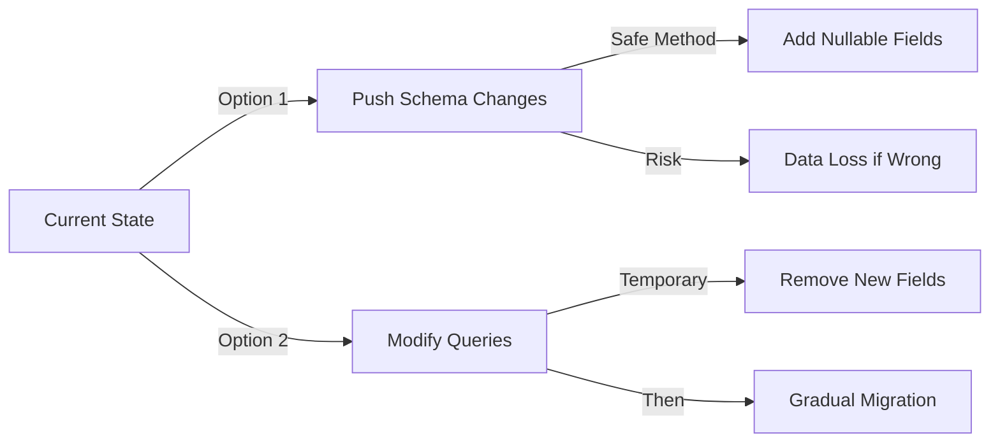
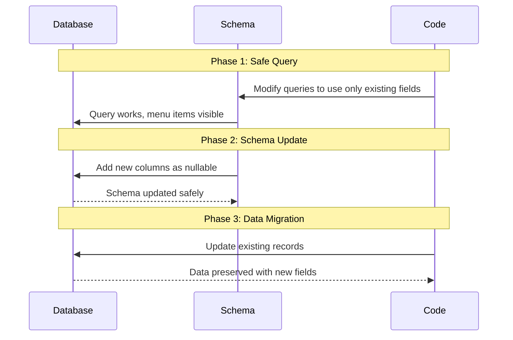

# Prisma Database Troubleshooting Guide

## Current Situation
- We had a working database with menu items
- Recent changes have caused data loss
- Seeding attempts aren't persisting data

## How Prisma Works
1. **Schema Definition** (`schema.prisma`)
   - Defines our database structure
   - Contains models (tables) and their relationships
   - Located in `my_app/prisma/schema.prisma`

2. **Database URL** (`.env`)
   - Tells Prisma where our database is
   - Currently using Prisma Accelerate: `DATABASE_URL="prisma+postgres://accelerate.prisma-data.net/?api_key=..."`

3. **Migrations**
   - Track database structure changes
   - Located in `my_app/prisma/migrations`
   - Created with `npx prisma migrate dev`

4. **Seeding** (`seed.ts`)
   - Populates database with initial data
   - Run with `npx prisma db seed`
   - Must be in `my_app` directory to run

## Common Issues
1. **Wrong Directory**
   - Always run Prisma commands from `my_app` directory
   - Not from `152bar` or `prisma` directories

2. **Data Loss Scenarios**
   - `prisma migrate reset` - Wipes database and reapplies migrations
   - `prisma db push` - Can cause data loss if schema changes
   - Our seed script has `deleteMany()` which clears existing data

3. **Connection Issues**
   - Prisma Accelerate vs direct connection
   - Need proper API key in .env
   - Need to be in correct directory

## Recovery Steps
1. Check Current State:
   ```bash
   cd my_app
   npx prisma studio
   ```

2. If No Data:
   ```bash
   cd my_app
   npx prisma db seed
   ```

3. If Still No Data:
   ```bash
   cd my_app
   npx prisma migrate reset --skip-seed
   npx prisma db seed
   ```

## Prevention
1. Always run commands from `my_app` directory
2. Backup data before schema changes
3. Remove `deleteMany()` from seed script if you want to preserve data
4. Use `upsert` instead of `create` to update existing records

## Next Steps
1. Review git history to find last working state
2. Consider restoring from backup if available
3. Modify seed script to preserve existing data

## Database Recovery Workflow



## Step-by-Step Recovery Process

1. **Find Last Working Commit**
   ```bash
   git log --oneline
   # Find commit where menu items were working
   ```

2. **Checkout Working State**
   ```bash
   git checkout <commit-hash>
   ```

3. **Reset Database**
   ```bash
   cd my_app
   npx prisma migrate reset
   ```

4. **Verify Data**
   ```bash
   npx prisma studio
   ```

5. **Create New Branch**
   ```bash
   git checkout -b feature/menu-status
   ```

## Database Operations Flow



## Current Recovery Plan

1. **Find Last Working State**
   - Look for commit where menu items were working
   - This was before we added the `status` field

2. **Reset to Working State**
   ```bash
   git checkout <working-commit>
   cd my_app
   npx prisma migrate reset
   npx prisma db seed
   ```

3. **Verify Data**
   - Check Prisma Studio
   - Verify menu items exist

4. **Create Feature Branch**
   ```bash
   git checkout -b feature/add-menu-status
   ```

5. **Implement Changes**
   - Add status field
   - Update seed script
   - Test changes

## Prevention
1. Always create feature branches for schema changes
2. Test migrations on development database first
3. Backup data before schema changes
4. Use `upsert` instead of `create` to preserve data

## CRUD Operations


Remember:
- Each schema change needs a migration
- Migrations should be reversible
- Always test on development first
- Keep backup of production data 

## Current Issue: Schema and Data Mismatch
The error indicates a schema mismatch between our code and database. Here's what happened:



### What's Happening


### Potential Solutions


### Recommended Recovery Plan


### Key Points
1. Your menu data is safe in the database
2. The error is because the code expects fields that don't exist yet
3. We need to align the schema without losing data
4. The solution needs to be incremental to preserve existing data

Would you like me to propose a specific solution based on these analyses? 