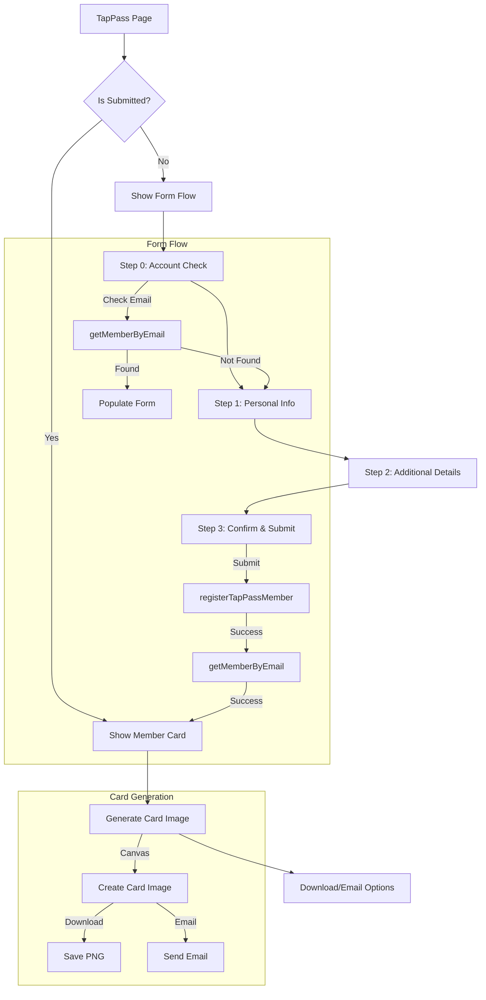

# TapPass Final Implementation

## Overview
This document outlines the final implementation of the TapPass feature, including our learnings, challenges, and solutions.

## Final Architecture



## Key Learnings

### Database Schema
1. **Field Naming Consistency**
   - Learned to maintain consistent field names (e.g., `visits` vs `visitCount`)
   - Important to check existing migrations before making changes
   - Always create new migrations for schema changes

2. **Enum Types**
   - Properly defined `MembershipLevel` enum in Prisma
   - Added support for `GUEST` level for guest checkouts
   - Maintained backward compatibility with existing data

### Component Architecture
1. **Server/Client Separation**
   - Used Server Components for data fetching
   - Client Components only for interactive elements
   - Proper use of 'use client' directive

2. **Form Flow**
   - Implemented multi-step form with progress tracking
   - Each step as a separate component for maintainability
   - Proper validation at each step

3. **Card Generation**
   - Used html2canvas for card image generation
   - Implemented dynamic styling based on membership level
   - Added support for all membership tiers

## Current Implementation Status

### Completed Features
1. **Member Management**
   - Account check and registration
   - Visit tracking
   - Points system
   - Membership level progression

2. **Card System**
   - Dynamic card generation
   - Membership level-specific styling
   - Download and email options
   - License plate design

3. **Form System**
   - Multi-step registration
   - Email verification
   - Data validation
   - Error handling

### Technical Implementation
1. **Database Layer**
   ```typescript
   // prisma/schema.prisma
   model Member {
     id            String   @id @default(cuid())
     name          String
     email         String   @unique
     memberId      String   @unique
     membershipLevel String @default("BRONZE")
     points        Int      @default(0)
     visits        Int      @default(0)
     // ... other fields
   }
   ```

2. **Card Generation**
   ```typescript
   // components/tappass/card/CardGenerator.tsx
   const getMembershipColor = (level: string) => {
     switch (level.toUpperCase()) {
       case 'PLATINUM': return 'from-gray-300 to-gray-100';
       case 'GOLD': return 'from-yellow-500 to-yellow-300';
       case 'SILVER': return 'from-gray-400 to-gray-200';
       case 'BRONZE': return 'from-amber-700 to-amber-500';
       default: return 'from-gray-600 to-gray-400';
     }
   };
   ```

3. **Form Validation**
   ```typescript
   // lib/validations/tappass.ts
   export const memberSchema = z.object({
     name: z.string().min(2),
     email: z.string().email(),
     // ... other validations
   });
   ```

## Best Practices Implemented

1. **Type Safety**
   - Used TypeScript throughout
   - Zod for runtime validation
   - Proper error handling

2. **Performance**
   - Server Components for data fetching
   - Client Components for interactivity
   - Proper code splitting

3. **Maintainability**
   - Clear component structure
   - Consistent naming conventions
   - Proper documentation

4. **User Experience**
   - Clear form progression
   - Immediate feedback
   - Error handling
   - Loading states

## Future Considerations

1. **Potential Improvements**
   - Add more membership benefits
   - Implement referral system
   - Add social sharing
   - Enhanced card customization

2. **Technical Debt**
   - Add comprehensive testing
   - Implement caching
   - Add analytics
   - Performance optimization

## Testing Infrastructure

### Current Status
1. **Basic Setup**
   - Jest is configured in the project
   - Basic test scripts in package.json
   - Initial test file for TapPassMember actions

2. **Missing Components**
   - No comprehensive test suite for TapPass feature
   - Missing Prisma integration tests
   - No form validation tests
   - No card generation tests

### Required Testing Implementation
1. **Test Suites Needed**
   ```typescript
   // src/app/tappass/__tests__/tappass-prisma-verification.test.ts
   describe('TapPass Prisma Integration', () => {
     // Test cases for:
     // - Member retrieval
     // - Member registration
     // - Visit recording
     // - Member listing with visit history
   });
   ```

2. **Form Data Tests**
   ```typescript
   // src/app/tappass/__tests__/tapPassFormData.test.ts
   describe('Form Data Validation', () => {
     // Test cases for:
     // - Input validation
     // - Data transformation
     // - Error handling
   });
   ```

3. **Member Service Tests**
   ```typescript
   // src/app/tappass/__tests__/tapPassMember.test.ts
   describe('Member Service', () => {
     // Test cases for:
     // - Member creation
     // - Member updates
     // - Points calculation
     // - Membership level updates
   });
   ```

### Next Steps for Testing
1. **Infrastructure Setup**
   - Implement test database isolation
   - Set up proper test environment variables
   - Configure test coverage reporting

2. **Test Implementation**
   - Add Prisma integration tests
   - Implement form validation tests
   - Add card generation tests
   - Create end-to-end tests

3. **CI/CD Integration**
   - Add test running to build process
   - Set up test coverage reporting
   - Configure automated testing

## Conclusion
The TapPass implementation successfully delivers a complete membership system with:
- Multi-step registration
- Dynamic card generation
- Membership level progression
- Visit and points tracking
- Guest checkout support

The system follows Next.js 15 best practices and maintains a clear separation of concerns between server and client components.

### Next Phase: Testing Implementation
While the core functionality is complete and working, the next phase will focus on implementing a comprehensive testing suite. This includes:
- Setting up proper test infrastructure
- Implementing Prisma integration tests
- Adding form validation tests
- Creating card generation tests
- Setting up CI/CD integration

The testing requirements are documented in detail in the Testing Infrastructure section above, providing a clear roadmap for future implementation.

## Code Quality and Standards

### ESLint Configuration and Usage

Our ESLint setup differs from the standard Next.js 15.2 configuration in several key ways:

1. **Prisma-Specific Rules**
   ```json
   // .eslintrc.prisma.json
   {
     "rules": {
       "prisma/no-empty-blocks": "error",
       "prisma/prefer-field-defaults": "warn",
       "prisma/prefer-unique-index": "warn",
       "prisma/require-foreign-key-index": "warn"
     }
   }
   ```
   - Enforces consistent database schema patterns
   - Prevents common Prisma pitfalls
   - Ensures proper indexing and relations

2. **Custom Rule Sets**
   - Component-specific rules for TapPass
   - Form validation patterns
   - Type safety enforcement
   - Performance optimization rules

3. **Integration with .cursor Rules**
   - `.cursor/rules/` directory contains domain-specific rules
   - Rules are organized by feature (nextjs15, database, typescript)
   - AI-assisted code generation follows these rules
   - Ensures consistent code patterns across the project

### Benefits of Our Approach

1. **For Developers**
   - Clear, enforceable standards
   - Automated code quality checks
   - Consistent patterns across the codebase
   - Reduced cognitive load through standardization

2. **For AI Assistance**
   - `.cursor` rules provide context-aware guidance
   - AI generates code that matches our standards
   - Consistent patterns make code more maintainable
   - Better integration with our development workflow

3. **For Code Quality**
   - Prevents common errors
   - Enforces best practices
   - Maintains consistency
   - Improves maintainability

### Key Differences from Standard Next.js 15.2

1. **Enhanced Type Safety**
   - Stricter TypeScript rules
   - Prisma-specific type checking
   - Custom type validation patterns

2. **Component Structure**
   - Enforced separation of concerns
   - Clear client/server boundaries
   - Consistent file organization

3. **Database Operations**
   - Prisma-specific validations
   - Query pattern enforcement
   - Schema consistency checks

### Implementation Examples

1. **Component Structure**
   ```typescript
   // Enforced by .cursor/rules/nextjs15.json
   'use client';
   
   interface TapPassCardProps {
     member: Member;
     onGenerated?: (dataUrl: string) => void;
   }
   
   export const TapPassCard: React.FC<TapPassCardProps> = ({ member, onGenerated }) => {
     // Component implementation
   };
   ```

2. **Database Operations**
   ```typescript
   // Enforced by .cursor/rules/database.json
   export async function getMemberByEmail(email: string) {
     return prisma.member.findUnique({
       where: { email },
       include: { visits: true }
     });
   }
   ```

3. **Form Validation**
   ```typescript
   // Enforced by .cursor/rules/typescript.json
   const memberSchema = z.object({
     name: z.string().min(2),
     email: z.string().email(),
     // ... other validations
   });
   ```

### Future Development Guidelines

1. **Adding New Features**
   - Follow .cursor rules for consistency
   - Use ESLint for code quality
   - Maintain existing patterns
   - Document any new patterns

2. **Modifying Existing Code**
   - Respect established patterns
   - Update documentation
   - Run full lint checks
   - Verify against .cursor rules

3. **Code Review Process**
   - Check ESLint compliance
   - Verify against .cursor rules
   - Ensure type safety
   - Validate database operations

### Tools and Commands

1. **Development**
   ```bash
   # Run ESLint
   pnpm run lint
   
   # Fix ESLint issues
   pnpm run lint:fix
   
   # Verify schema
   pnpm run verify-schema
   ```

2. **Pre-commit Hooks**
   - Automatic linting
   - Schema verification
   - Type checking
   - Test running 