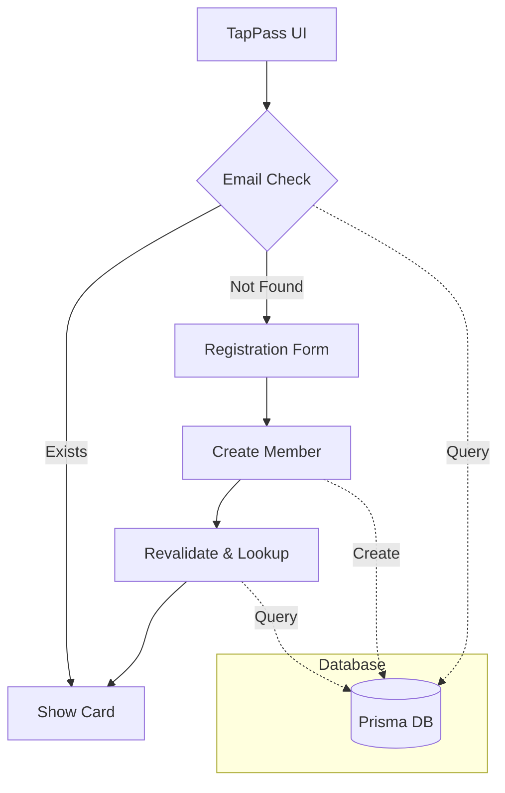

# TapPass Implementation History

## Recent Changes (March 20, 2025)

### Key Commits and Changes
- 10:28:24: "Fixed member ID sequence generation and UI rendering"
- 10:29:32: "Added required lib files"
- These changes were made in the `update-tappass` branch but were reset at 10:32:30

### Branch Activity Today
1. Started with `merge-prod-dev` branch
2. Made several attempts to fix TapPass implementation:
   - Worked on `update-tappass` branch
   - Explored `restore-tappass`, `restore-working-tappass`, and `restore-tappass-changes` branches
   - Attempted fixes in `fix/tappass-implementation` branch

### Current State
- Working implementation was achieved earlier today with lookup functionality
- Changes include:
  - Member ID sequence generation fix
  - UI rendering improvements
  - Required library files addition

### Branch Information
1. `merge-prod-dev`:
   - Contains documentation and implementation patterns
   - Has diverged from remote (1 local vs 26 remote commits)

2. `update-tappass`:
   - Contains recent fixes for member ID and UI
   - Had working implementation before recent resets

3. `restore-tappass-changes`:
   - Contains variations of the implementation
   - Related to the working version

4. `fix/tappass-implementation`:
   - Contains Prisma model updates
   - Uses singleton pattern

## Previous Significant Changes

### March 19, 2025
- Documentation added for TapPass implementation patterns
- Testing checklist created
- Safety measures documented
- Extension guidelines provided

### March 18-19, 2025
- Updated TapPass implementation with correct Prisma models
- Implemented singleton pattern
- Various fixes and improvements

## Next Steps
1. Review the changes from 10:28:24 that had the working implementation
2. Compare with current state to identify what was lost
3. Consider creating a new branch from that point to restore the working version

## Notes
- The working implementation included Prisma integration
- UI rendering and member ID sequence generation were key components
- Multiple branches contain different versions of the implementation
- Recent resets and branch switches may have affected the working state 

## March 21, 2025 Implementation Update

### Today's Major Changes
1. Successfully migrated TapPass to Prisma
   - Removed JSON-based storage
   - Implemented proper database persistence
   - Fixed member ID sequence generation
   - Added proper date formatting for all fields

2. UI Flow Improvements
   - Unified member lookup pattern
   - Consistent card rendering
   - Fixed registration flow
   - Improved error handling

3. Documentation Updates
   - Created comprehensive implementation plan
   - Added UI flow analysis
   - Documented Prisma migration steps
   - Updated implementation history

### Implementation Timeline

```mermaid
timeline
    title TapPass Implementation Timeline (March 21, 2025)
    section Morning
        10:00 AM : Started Prisma migration
                 : Created implementation plan
    section Mid-Day
        12:00 PM : Fixed member ID sequence
                 : Updated UI rendering
        2:00 PM  : Completed Prisma integration
                 : Removed JSON storage
    section Afternoon
        4:00 PM  : Unified lookup pattern
                 : Fixed registration flow
        5:00 PM  : Created PR for changes
                 : Updated documentation
```

### Current Architecture



### Remaining Tasks

1. Admin Features
   - [ ] Implement admin dashboard
   - [ ] Add member management UI
   - [ ] Create reporting features

2. Member Features
   - [ ] Add visit tracking
   - [ ] Implement points system
   - [ ] Add reward redemption

3. UI Enhancements
   - [ ] Add loading states
   - [ ] Improve error messages
   - [ ] Add success animations

4. Testing & Documentation
   - [ ] Add E2E tests
   - [ ] Create user documentation
   - [ ] Document admin features

### Next Steps Priority
1. Review and merge current PR
2. Begin admin dashboard implementation
3. Add visit tracking system
4. Implement points and rewards

### Technical Debt to Address
1. Clean up unused imports in page.tsx
2. Add proper TypeScript types for all components
3. Implement proper error boundaries
4. Add logging system for debugging

### Notes
- Current implementation follows Next.js 15 best practices
- Uses Server Actions for all database operations
- Implements proper validation with Zod
- Maintains consistent UI patterns 