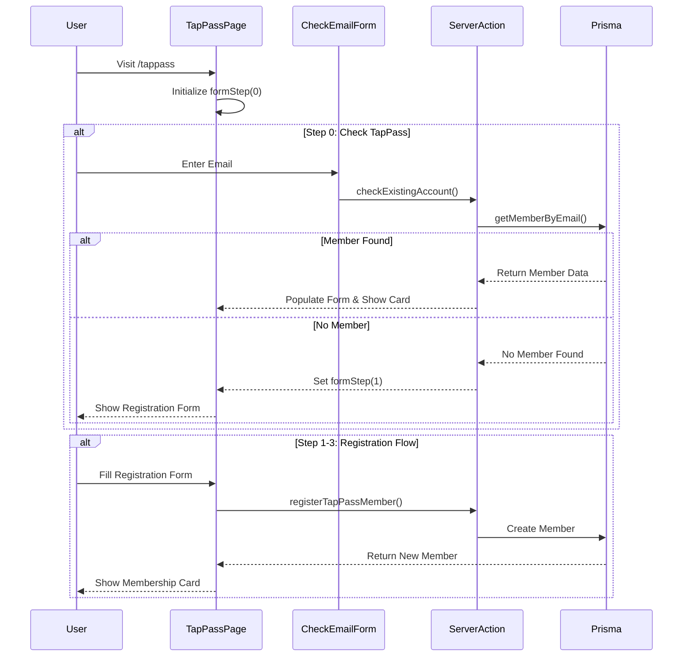
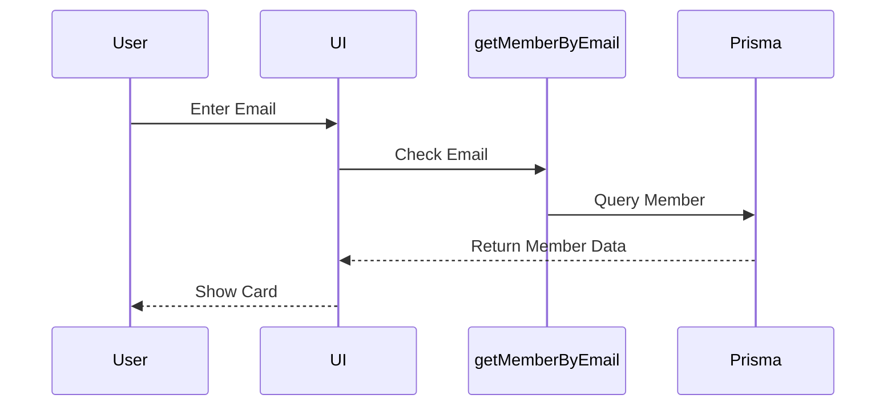
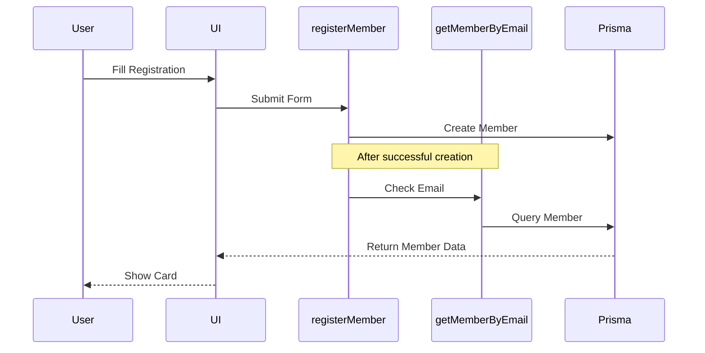

# TapPass UI Flow Analysis

## Current Implementation Analysis

### UI Flow Diagram


## Issue Identification

1. **Working Flow (Check TapPass)**
   - Email entry works correctly
   - Member lookup functions properly
   - Card rendering works for existing members

2. **Issue in Registration Flow**
   - Not using the same lookup/render pattern as Check TapPass
   - Creating new implementation instead of reusing working code
   - Prisma model mismatch with visits field

## Analysis from Working Commit (74c6676)

Based on the git history, commit 74c6676 had:
1. Working UI flow using single email entry
2. Proper member lookup and card rendering
3. Consistent function usage between check and create

## Next.js 15 Best Practices Review

From the Next.js 15 documentation:
1. Server Actions should revalidate paths after mutations
2. Use same data fetching pattern for consistency
3. Implement proper error handling and user feedback

## Proposed Solution

1. **Unify Member Lookup**
   ```mermaid
   flowchart TD
       A[Email Entry] --> B{Check Member}
       B -->|Exists| C[Show Card]
       B -->|Not Found| D[Registration Form]
       D --> E[Create Member]
       E --> F[Revalidate Path]
       F --> C
   ```

2. **Implementation Steps**
   - Use getMemberByEmail for both check and create flows
   - Ensure consistent card rendering logic
   - Implement proper revalidation
   - Fix Prisma model issues

3. **Key Points**
   - Single source of truth for member data
   - Consistent UI rendering pattern
   - Proper error handling
   - Follow Next.js 15 server action patterns

## Verification Plan

1. Test email lookup flow
2. Verify card rendering consistency
3. Check member creation process
4. Validate Prisma model integration
5. Confirm revalidation works

## Next Steps

1. Review commit 74c6676 for working implementation
2. Compare current UI flow with working version
3. Document differences in implementation
4. Create PR with unified approach

DO NOT MAKE CHANGES until full review and approval of this analysis.

## Simpler Solution: Reuse Working Email Check

### Current Working Flow


### Proposed Simple Fix


### Why This Works
1. The email check/card display is already working correctly
2. Instead of creating new card rendering logic:
   - After creating member, use the same email check flow
   - This ensures consistent data and UI rendering
   - Reuses the working code path

### Implementation Concept
```typescript
// In registerTapPassMember:
try {
  // Create member in Prisma...
  
  // After successful creation, instead of returning memberId
  // use the working getMemberByEmail function
  const memberResult = await getMemberByEmail(email);
  
  // This will return the same format that the check flow uses
  return memberResult;
} catch (error) {
  // Error handling...
}
```

### Benefits
1. No new code paths to maintain
2. Uses the proven working flow
3. Consistent data format
4. Same card rendering logic
5. Follows Next.js 15 best practices for data fetching

### Testing Steps
1. Verify email check still works
2. Test member creation
3. Confirm card displays same way for both flows
4. Check error handling

NO CHANGES NEEDED TO:
- Card rendering logic
- UI components
- Data format
- Error handling

Just reuse the working email check after member creation. 