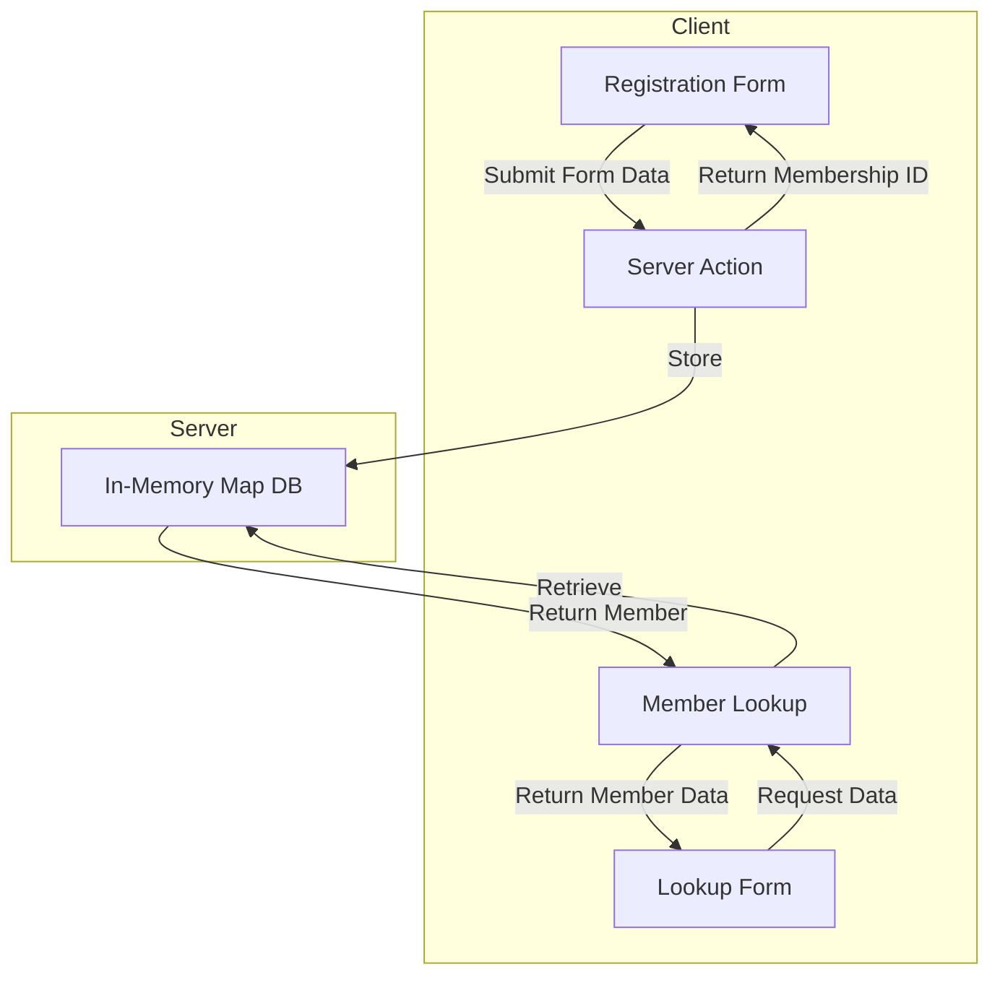
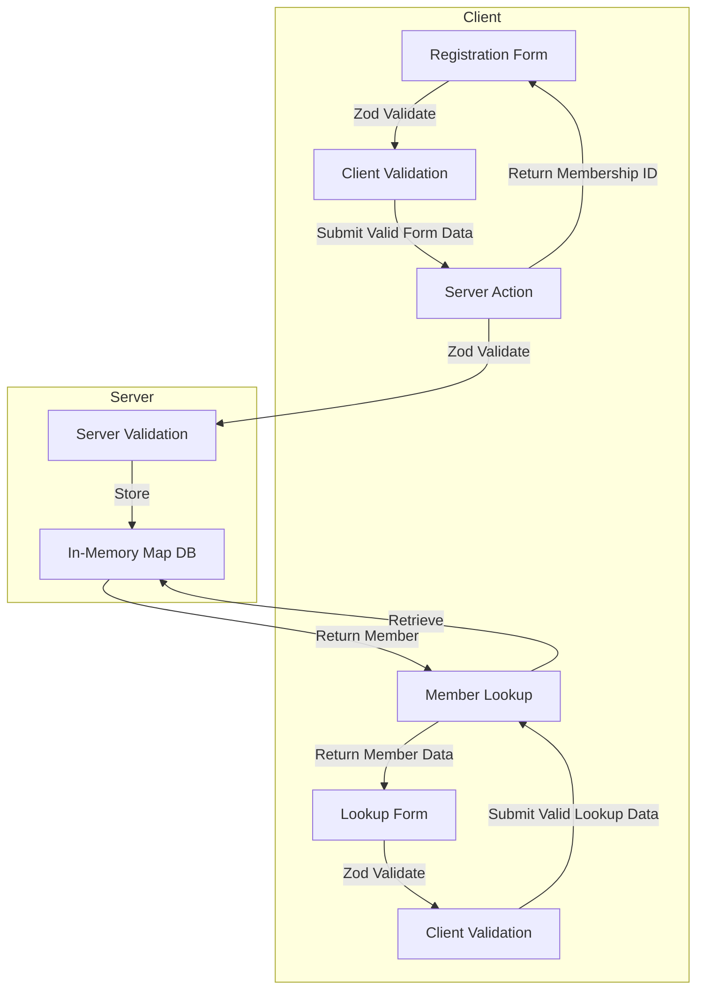

# TapPass Data Flow Analysis: Before and After Zod Implementation

## Overview

This document explains the TapPass data flow, specifically focusing on how member data is stored and retrieved. It compares the previous implementation with the current Zod validation implementation to identify why the lookup functionality isn't working properly.

## Data Flow Diagrams

### Previous Implementation (Without Zod)



### Current Implementation (With Zod)



## Detailed Explanation

### Data Storage System

Our TapPass system uses an in-memory Map for data storage during the current session:

```typescript
// In-memory database for demo purposes
const MEMBERS_DB = new Map<string, MemberRecordType>();
```

#### Key Aspects:

1. **Storage Keys**: Members are stored with two keys:
   - Email address: `MEMBERS_DB.set(email, member)`
   - Phone number with prefix: `MEMBERS_DB.set('phone:${phoneNumber}', member)`

2. **Data Persistence**: Being an in-memory database, data is lost when the server restarts. This is expected behavior in the current implementation.

### The Issue with Member Lookup

After analyzing the code, there are several potential issues that could explain why the lookup functionality isn't working properly:

#### 1. Duplicate Action Implementations

**Critical Issue**: There are two different implementations of the lookup functions:

1. **In `/app/tappass/actions.ts`** (the one we're using with Zod validation):
   ```typescript
   // Looks up in the in-memory Map
   export async function getMemberByPhone(phoneNumber: string): Promise<MemberLookupResponse> {
     // ... 
     const member = MEMBERS_DB.get(`phone:${phoneNumber}`);
     // ...
   }
   ```

2. **In `/app/actions.ts`** (older implementation):
   ```typescript
   // Looks up in a completely different data structure
   export async function getMemberByPhone(phoneNumber: string): Promise<{ success: boolean; member: TapPassMember | null; error?: string }> {
     try {
       const members = getMembers();
       const member = members.find(m => m.phoneNumber === phoneNumber);
       // ...
     }
   }
   ```

These functions have the same name but work with completely different data storage mechanisms:
- The `/app/tappass/actions.ts` version uses the in-memory Map
- The `/app/actions.ts` version uses a different data source accessed via `getMembers()`

#### 2. Server Restart Data Loss

The next likely issue is that **the server has been restarted** since the members were registered. The TapPass system uses an in-memory Map (`MEMBERS_DB`) which is initialized as an empty Map on every server restart:

```typescript
const MEMBERS_DB = new Map<string, MemberRecordType>();
```

This means that any members you registered in a previous server session are gone once the server restarts. This is evidenced by the terminal output showing server restart:

```
markcarpenter@MacBookPro ~/152bar/my_app % pnpm run dev 
> my_app@0.1.0 dev /Users/markcarpenter/152bar/my_app
> next dev --turbopack
   ▲ Next.js 15.2.2 (Turbopack)
```

#### 3. Phone Number Formatting Inconsistency

Another potential issue is with phone number formatting between registration and lookup:

In the registration form:
```typescript
// From RegistrationForm.tsx
if (name === 'phoneNumber') {
  // Only keep digits for storage
  const digits = value.replace(/\D/g, '').substring(0, 10);
  
  setFormData({
    ...formData,
    phoneNumber: digits,
  });
}
```

In the lookup form:
```typescript
// From LookupForm.tsx
const handlePhoneChange = (e: React.ChangeEvent<HTMLInputElement>) => {
  const input = e.target.value;
  // Only extract digits for storing in state
  const digits = input.replace(/\D/g, '').substring(0, 10);
  
  setPhoneData({
    ...phoneData,
    phoneNumber: digits,
  });
};
```

While the storage is consistent:
```typescript
// From actions.ts
MEMBERS_DB.set(`phone:${phoneNumber}`, member);
```

And the retrieval is also consistent:
```typescript
// From actions.ts
const member = MEMBERS_DB.get(`phone:${phoneNumber}`);
```

#### 4. Import Confusion with Multiple Action Files

The TapPass page imports actions from the tappass directory:

```typescript
// In tappass/page.tsx
import { registerTapPassMember, emailMembershipCard, getMemberByEmail, getMemberByPhone } from './actions';
```

But there might be confusion with similarly named functions in the app-level actions.ts file.

## Implementation Comparison

### Previous Implementation:

- Simple form data collection without validation
- Direct storage in the Map with email and phone keys
- Lookup using raw input values

### Current Implementation (with Zod):

- Client-side validation of inputs before submission
- Server-side validation before storage
- Formatting of phone numbers for display (using `formatPhoneNumber` from membership-utils)
- Stripping non-digit characters from phone numbers for storage
- Additional type safety with Zod schemas and inferred types

## Root Cause Analysis

The most likely scenarios in order of probability:

1. **Action Import Confusion**: Using the wrong implementation of the lookup functions
   - **Evidence**: There are two different implementations with the same names
   - **Solution**: Ensure consistent imports and merge duplicate implementations

2. **Server Restart Issue**: The in-memory database is empty after server restart
   - **Evidence**: The terminal shows the server has been restarted
   - **Solution**: Re-register a user after server restart before attempting lookup

3. **Registration Not Completing**: The registration might not be completing successfully
   - **Verification**: Check server logs for successful registration messages
   - **Solution**: Ensure registration completes without errors

## Troubleshooting Steps

1. **Confirm Which Action Is Being Used**:
   - Add distinct console.log messages to both implementations of `getMemberByPhone`
   - This will help identify which implementation is actually being executed

   ```typescript
   // In /app/tappass/actions.ts
   export async function getMemberByPhone(phoneNumber: string): Promise<MemberLookupResponse> {
     console.log("USING TAPPASS ACTIONS - getMemberByPhone");
     // ...
   }

   // In /app/actions.ts
   export async function getMemberByPhone(phoneNumber: string): Promise<{ success: boolean; member: TapPassMember | null; error?: string }> {
     console.log("USING APP ACTIONS - getMemberByPhone");
     // ...
   }
   ```

2. **Confirm Data Persistence Issue**:
   - Register a new user in the current server session
   - Immediately try to look up the same user by email and phone
   - This will confirm if the issue is with data persistence or lookup logic

3. **Debug with Console Logs**:
   - Add these console logs to the relevant functions:

   ```typescript
   // In registerTapPassMember
   console.log("Storing member with email key:", email);
   console.log("Storing member with phone key:", `phone:${phoneNumber}`);
   
   // In getMemberByPhone
   console.log("Looking up member with phone key:", `phone:${phoneNumber}`);
   console.log("All DB keys:", [...MEMBERS_DB.keys()]);
   ```

4. **Check Form Submission**:
   - Monitor network requests during registration to ensure the form is submitted correctly
   - Verify the server response indicates successful registration

## Next Steps

1. **Consolidate Duplicate Implementations**:
   - Choose one source of truth for member data (preferably the Zod-validated version)
   - Remove or rename duplicate action implementations
   - Ensure consistent imports throughout the application

2. **Consider Persistent Storage**:
   - For development purposes, implement a more persistent storage solution:
     - Use localStorage on the client side to simulate persistent storage
     - Implement a simple JSON file-based storage on the server
     - Connect to a real database for more robust development

3. **Add Better Error Handling**:
   - Display clear messages when lookup fails
   - Add more verbose logging to trace the data flow

4. **Create a Debug View**:
   - A simple page that shows all currently registered members
   - Options to manually add test data 