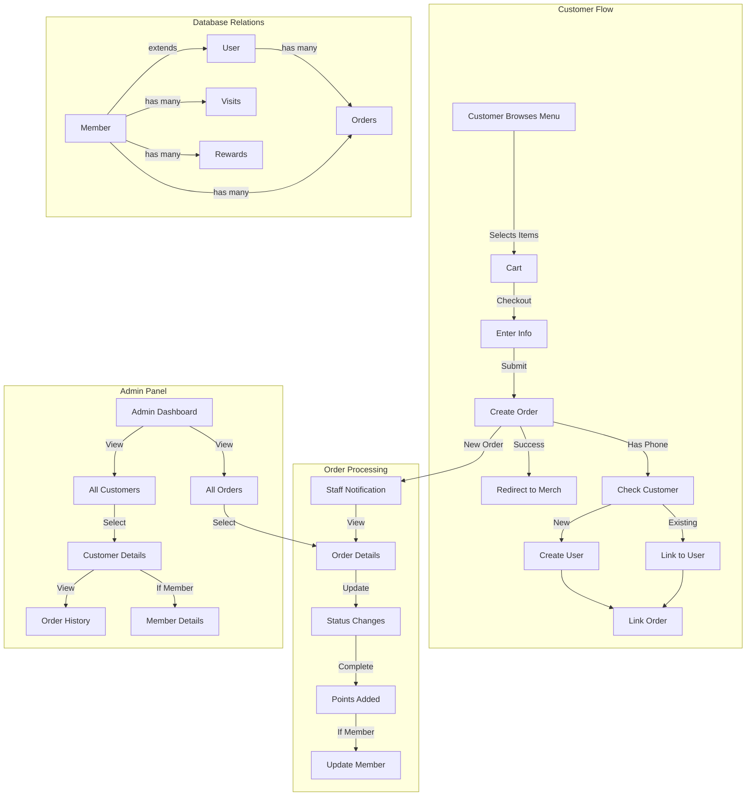

```mermaid
erDiagram
    User ||--o{ Order : "places"
    User {
        string id PK
        string name
        string email UK
        string phoneNumber UK
        datetime emailVerified
        string image
    }

    Member ||--o{ Order : "places"
    Member ||--o{ Visit : "records"
    Member ||--o{ Reward : "earns"
    Member {
        string id PK
        string memberId UK
        string name
        string email UK
        string phoneNumber
        datetime birthday
        enum membershipLevel
        int points
        int visitCount
        datetime lastVisit
    }

    Order {
        string id PK
        json items
        float total
        string status
        string memberId FK
        string customerId FK
        string phoneNumber IDX
        string customerName
        boolean marketingConsent
        int points
    }

    Visit {
        string id PK
        string memberId FK
        datetime visitDate
        float amount
        int points
    }

    Reward {
        string id PK
        string memberId FK
        string rewardType
        string description
        float value
        boolean isRedeemed
        datetime redeemedAt
        datetime expiresAt
    }

    MenuItem ||--o{ Category : "belongs to"
    MenuItem {
        string id PK
        string name
        string description
        string price
        string imageUrl
        boolean isActive
        int sortOrder
        string categoryId FK
        enum status
    }

    Category {
        string id PK
        string name UK
        string description
        int sortOrder
    }
``` 