# Menu Ordering System Documentation

## Current System State

### Core Components
1. **Public Menu Interface** ✅
   - Menu display with item selection
   - Cart management with quantity controls
   - Order submission
   - Member detection and integration

2. **Order Processing** ✅
   - Order creation with customer/member linking
   - Points system for members
   - Order status tracking
   - Customer history

3. **Admin Dashboard** ✅
   - Order management
   - Customer viewing
   - Member management
   - Order status updates

## Current Implementation

### 1. Menu Display
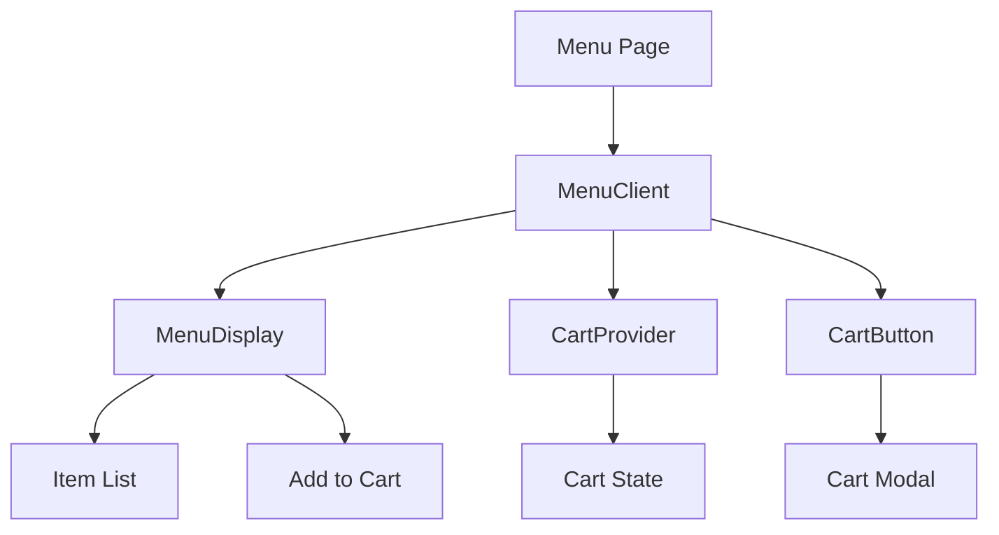

### 2. Order Flow
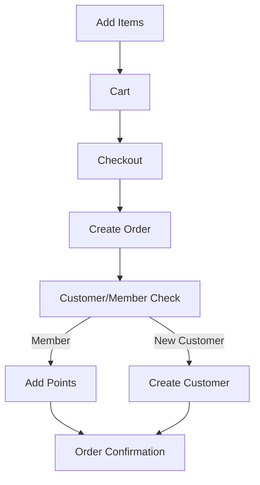

### 3. Admin View
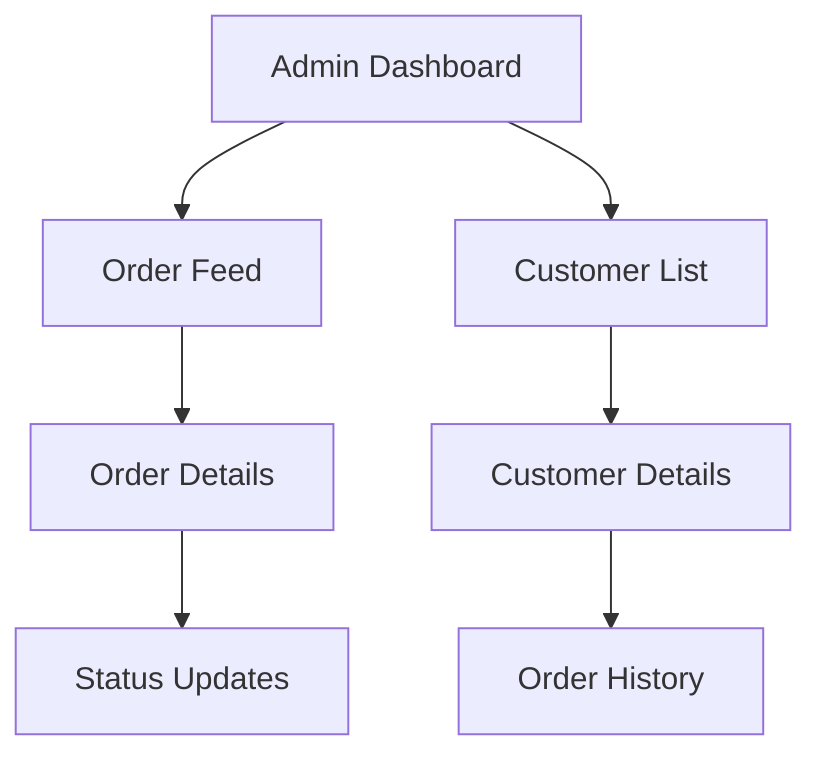

## Technical Implementation

### Components
1. **MenuClient**
   - Client-side wrapper
   - Cart provider
   - Menu display
   - Cart button

2. **MenuDisplay**
   - Item listing
   - Category grouping
   - Add to cart functionality
   - Search/filter capabilities

3. **Cart System**
   - Cart state management
   - Item quantity controls
   - Order submission
   - Member integration

### Data Flow
1. **Order Creation**
   ```typescript
   // Order creation flow
   createOrder({
     items,
     total,
     memberId,
     phoneNumber,
     customerName,
     marketingConsent
   })
   ```

2. **Member Integration**
   ```typescript
   // Member detection and points
   if (member) {
     points = POINTS_PER_ORDER;
     memberId = member.id;
   }
   ```

3. **Customer Management**
   ```typescript
   // Customer creation/lookup
   customer = await prisma.customer.findUnique({
     where: { phoneNumber }
   });
   ```

## Current Status

### Working Features
1. **Menu System** ✅
   - Item display
   - Category organization
   - Search functionality
   - Cart management

2. **Order System** ✅
   - Order creation
   - Customer linking
   - Member integration
   - Points system

3. **Admin Features** ✅
   - Order viewing
   - Status management
   - Customer details
   - Member tracking

### Next Steps
1. **Enhancements**
   - [ ] Real-time order updates
   - [ ] Push notifications
   - [ ] Order analytics
   - [ ] Customer communication

2. **Testing**
   - [ ] Order flow testing
   - [ ] Member integration testing
   - [ ] Admin functionality testing
   - [ ] Error handling testing

3. **Documentation**
   - [ ] API documentation
   - [ ] Component documentation
   - [ ] Database schema updates
   - [ ] Deployment guide

## System Overview

### Core Components
1. **Public Menu Interface**
   - Menu display with item selection
   - Quick checkout process
   - Optional member signup after purchase
   - Real-time order status updates

2. **Kitchen/Bar Staff Feed**
   - Real-time order notifications
   - Order status management
   - Push notifications for new orders
   - Order priority system

3. **Admin Dashboard**
   - Order history and analytics
   - Menu item management
   - Staff management
   - System configuration

## User Flows

### 1. Customer Ordering Flow
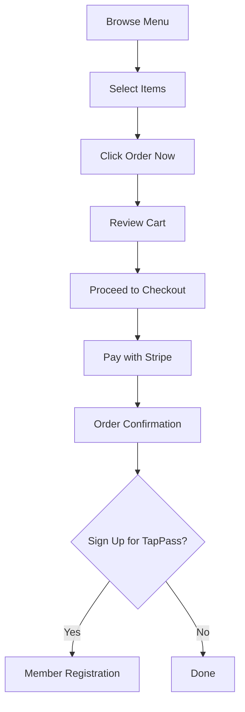

#### Key Features
- One-click item selection
- Real-time cart updates
- Streamlined checkout process
- Post-purchase member conversion
- Order status tracking

### 2. Kitchen/Bar Staff Flow
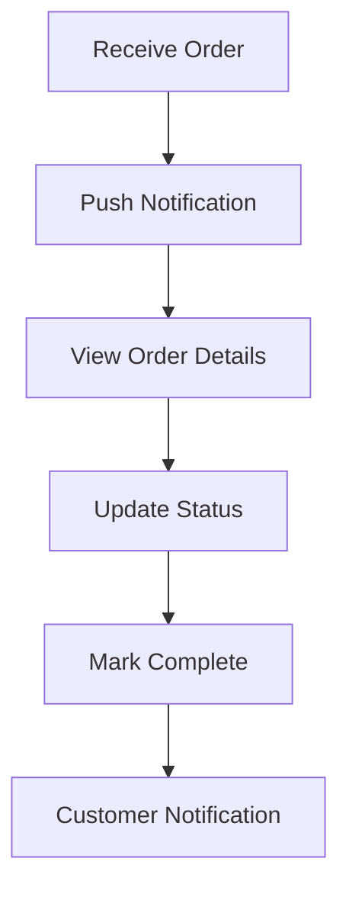

#### Key Features
- Push notifications for new orders
- Clear order priority system
- Quick status updates
- Real-time customer updates
- Order history access

### 3. Admin Management Flow
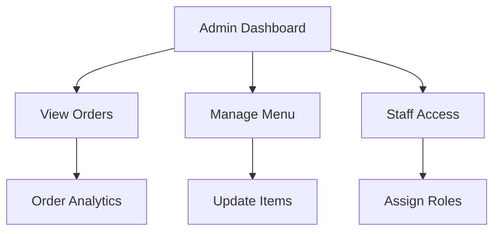

## Technical Architecture

### Component Structure
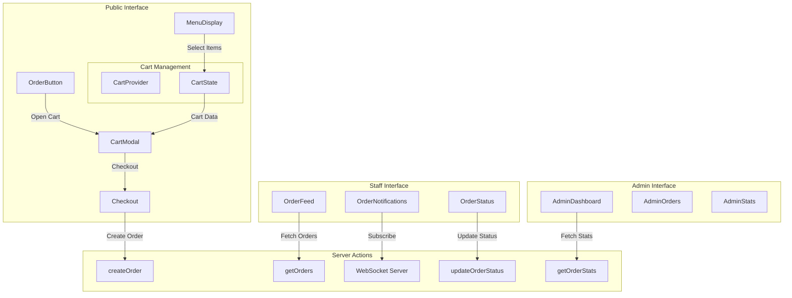

### Server Actions Implementation

```typescript
// src/actions/orders/public.ts
export async function createOrder(data: OrderData): Promise<ApiResponse<Order>> {
  'use server'
  // Create order
  // Process payment
  // Return order details
}

export async function getOrderStatus(orderId: string): Promise<ApiResponse<OrderStatus>> {
  'use server'
  // Fetch order status
  // Return status details
}

// src/actions/orders/staff.ts
export async function getActiveOrders(): Promise<ApiResponse<Order[]>> {
  'use server'
  // Fetch active orders
  // Return filtered list
}

export async function updateOrderStatus(
  orderId: string, 
  status: OrderStatus
): Promise<ApiResponse<Order>> {
  'use server'
  // Update status
  // Trigger notifications
}

// src/actions/orders/admin.ts
export async function getOrderStats(): Promise<ApiResponse<OrderStats>> {
  'use server'
  // Calculate statistics
  // Return analytics data
}
```

### Component Hierarchy

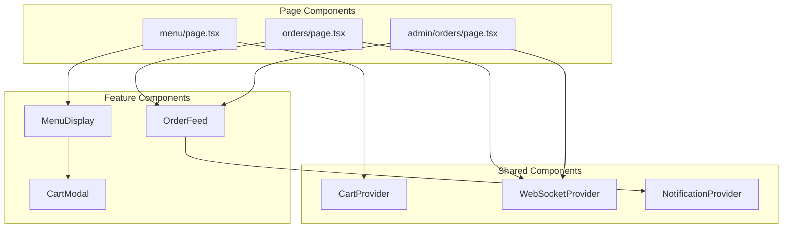

### Data Flow

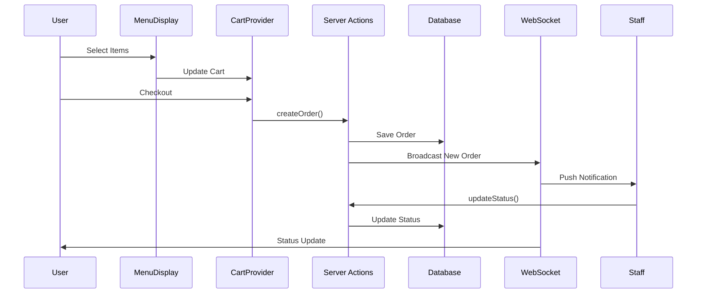

### Implementation Details

#### 1. Cart Management
```typescript
// src/components/menu/cart/CartProvider.tsx
interface CartState {
  items: CartItem[];
  total: number;
  addItem: (item: MenuItem) => void;
  removeItem: (itemId: string) => void;
  clearCart: () => void;
}

// Usage in components
const CartProvider: React.FC = ({ children }) => {
  // Cart state implementation
}
```

#### 2. Order Processing
```typescript
// src/lib/orders/processor.ts
interface OrderProcessor {
  validateOrder: (cart: CartState) => Promise<boolean>;
  processPayment: (amount: number) => Promise<PaymentResult>;
  createOrder: (data: OrderData) => Promise<Order>;
  notifyStaff: (order: Order) => Promise<void>;
}
```

#### 3. Real-time Updates
```typescript
// src/lib/websocket/orderSocket.ts
interface OrderSocket {
  subscribe: (orderId: string) => void;
  unsubscribe: (orderId: string) => void;
  onStatusChange: (callback: StatusCallback) => void;
  onNewOrder: (callback: OrderCallback) => void;
}
```

### API Routes Structure

```
src/app/api/
├── orders/
│   ├── route.ts           # POST /api/orders
│   ├── [orderId]/
│   │   └── route.ts       # GET, PATCH /api/orders/[orderId]
│   └── status/
│       └── route.ts       # GET /api/orders/status
├── staff/
│   ├── orders/
│   │   └── route.ts       # GET /api/staff/orders
│   └── notifications/
│       └── route.ts       # GET /api/staff/notifications
└── admin/
    └── orders/
        ├── route.ts       # GET /api/admin/orders
        └── stats/
            └── route.ts   # GET /api/admin/orders/stats
```

### WebSocket Events

```typescript
interface WebSocketEvents {
  NEW_ORDER: 'order:new';
  STATUS_UPDATE: 'order:status';
  PAYMENT_COMPLETE: 'order:paid';
  ORDER_COMPLETE: 'order:complete';
}

interface WebSocketPayloads {
  'order:new': { orderId: string; items: CartItem[] };
  'order:status': { orderId: string; status: OrderStatus };
  'order:paid': { orderId: string; amount: number };
  'order:complete': { orderId: string };
}
```

### Push Notification Structure

```typescript
interface PushNotification {
  title: string;
  body: string;
  data: {
    orderId: string;
    type: 'new' | 'update' | 'complete';
    url: string;
  };
  actions: {
    action: string;
    title: string;
  }[];
}
```

This technical architecture provides a complete picture of:
- Component relationships and hierarchy
- Server action implementations
- Data flow between components
- Real-time communication
- Push notification system
- API route structure

Would you like me to:
1. Start implementing any specific part of this architecture?
2. Provide more detail about any component?
3. Adjust any part of the design?

## Business Benefits

### 1. Customer Experience
- Fast, intuitive ordering
- Clear order status updates
- Optional membership benefits
- Multiple payment options
- Mobile-friendly interface

### 2. Operational Efficiency
- Streamlined order processing
- Real-time staff notifications
- Clear order prioritization
- Reduced order errors
- Quick status updates

### 3. Business Growth
- Customer data collection
- Order analytics
- Member conversion
- Inventory tracking
- Performance metrics

## Implementation Timeline

### Phase 1: Core Ordering System (Week 1-2)
- [x] Menu display
- [x] Item selection
- [ ] Cart functionality
- [ ] Checkout process
- [ ] Order creation

### Phase 2: Staff Interface (Week 3)
- [ ] Order feed
- [ ] Push notifications
- [ ] Status management
- [ ] Order tracking

### Phase 3: Admin Features (Week 4)
- [ ] Order analytics
- [ ] Staff management
- [ ] System configuration
- [ ] Performance monitoring

## Testing Strategy

### 1. User Testing
- Menu navigation
- Item selection
- Checkout process
- Order tracking
- Mobile responsiveness

### 2. Staff Testing
- Order notifications
- Status updates
- Priority system
- History access

### 3. Admin Testing
- Analytics accuracy
- Menu management
- Staff access
- System configuration

## Security Considerations

### 1. Payment Processing
- Secure Stripe integration
- PCI compliance
- Transaction encryption
- Error handling

### 2. Data Protection
- Customer information security
- Staff access controls
- Audit logging
- GDPR compliance

## Maintenance Plan

### 1. Regular Updates
- Menu item updates
- Price adjustments
- Staff role management
- System optimization

### 2. Monitoring
- Order success rates
- System performance
- Staff response times
- Customer feedback

## Support Documentation

### 1. Customer Guide
- How to order
- Payment options
- Order tracking
- Member benefits

### 2. Staff Guide
- Accessing order feed
- Managing orders
- Status updates
- Priority system

### 3. Admin Guide
- System configuration
- Menu management
- Staff management
- Analytics review

## Future Enhancements

### Phase 1
- Advanced analytics
- Loyalty program integration
- Inventory management
- Staff scheduling

### Phase 2
- Mobile app development
- Kitchen display system
- Advanced reporting
- AI-powered insights

## Contact Information

### Technical Support
- System Administrator: [Contact]
- Developer Team: [Contact]
- Emergency Support: [Contact]

### Business Support
- Operations Manager: [Contact]
- Customer Service: [Contact]
- Training Support: [Contact]

## Progress Update - March 27, 2024 5:00 PM

### Recent Implementation: Order Flow Completion 🔄

#### ✅ Just Completed
1. **Order Creation & Redirection**
   ```mermaid
   sequenceDiagram
       participant C as Customer
       participant Cart as CartSummary
       participant SA as Server Actions
       participant DB as Database
       participant Admin as Admin Panel
       
       C->>Cart: Add Items
       Cart->>Cart: Calculate Totals
       C->>Cart: Click Checkout
       Cart->>SA: createOrder()
       SA->>DB: Save Order
       SA-->>Cart: Success Response
       Cart->>C: Redirect to /merch
       DB-->>Admin: Order Available
   ```

2. **Admin Panel Integration**
   ```mermaid
   graph TD
       A[Admin Orders Page] -->|Server Component| B[getOrders Action]
       B -->|Fetch| C[Database]
       C -->|Return| D[OrderTable Component]
       D -->|Display| E[Order List]
       D -->|Link| F[Customer Details]
   ```

#### Current Status

1. **Working Features**
   - ✅ Menu item selection
   - ✅ Cart management
   - ✅ Order creation
   - ✅ Basic validation
   - ✅ Admin order viewing
   - ✅ Customer redirection
   - ✅ Order history table

2. **Admin Panel Capabilities**
   - View all orders
   - See order status
   - Access customer details
   - Track order timing
   - View order totals
   - Link to customer profiles

3. **Customer Experience**
   - Add items to cart
   - Enter contact info
   - Complete order
   - Automatic redirection to merch page
   - Order confirmation

#### 🚧 Still Needed
1. **Order Processing**
   - [ ] Real-time status updates
   - [ ] Staff notifications
   - [ ] Order prioritization
   - [ ] Kitchen display system

2. **Customer Features**
   - [ ] Order tracking
   - [ ] Status notifications
   - [ ] Order history view
   - [ ] Reorder functionality

3. **Admin Features**
   - [ ] Order filtering
   - [ ] Search functionality
   - [ ] Export capabilities
   - [ ] Analytics dashboard

4. **Integration Points**
   - [ ] SMS notifications
   - [ ] Email confirmations
   - [ ] Member points system
   - [ ] Marketing consent

### Next Steps Priority 🎯

1. **Immediate Tasks**
   - [ ] Implement order status updates
   - [ ] Add staff notifications
   - [ ] Set up order tracking
   - [ ] Create customer order history

2. **Technical Improvements**
   - [ ] Add real-time updates
   - [ ] Implement search/filter
   - [ ] Set up analytics
   - [ ] Add export functionality

3. **User Experience**
   - [ ] Add order confirmation page
   - [ ] Implement status notifications
   - [ ] Create customer dashboard
   - [ ] Add reorder feature

### Questions to Resolve ❓

1. **Technical Decisions**
   - [ ] How to handle real-time updates?
   - [ ] Which notification system to use?
   - [ ] How to implement order tracking?
   - [ ] What analytics are needed?

2. **Business Rules**
   - [ ] Order status workflow
   - [ ] Notification preferences
   - [ ] Customer communication
   - [ ] Staff response times

Would you like me to:
1. Start implementing order status updates?
2. Set up the notification system?
3. Create the customer order history?
4. Add the admin analytics dashboard?

Let me know which component you'd like to tackle next!

## System Implementation Update - March 27, 2024 6:00 PM

### Database Schema & Relationships

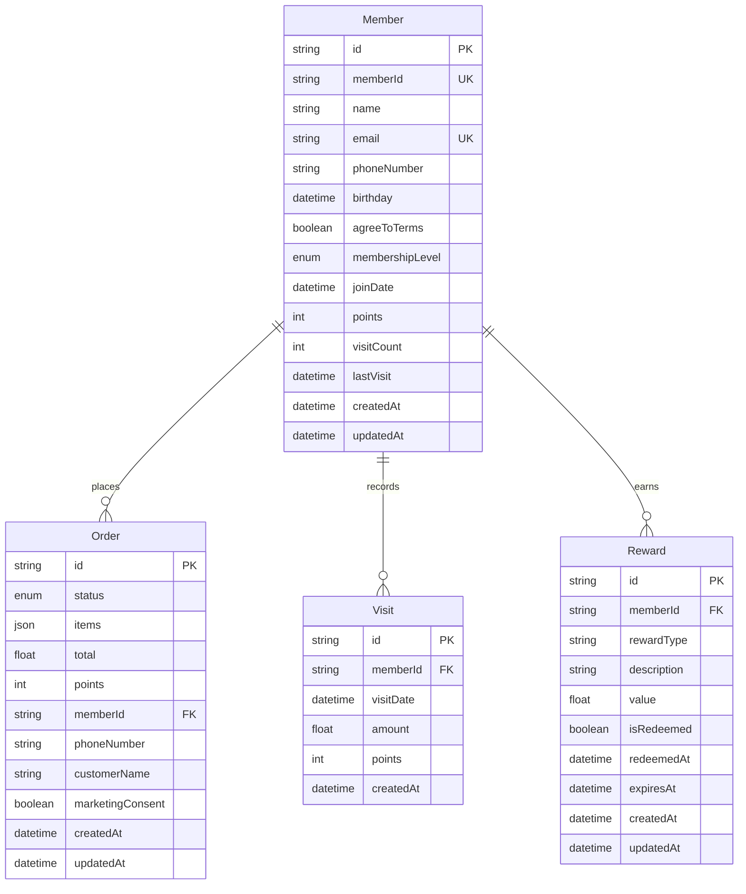

### Route Structure & Purpose

```mermaid
graph TD
    subgraph "Customer Management"
        A[/admin/customers] --> B[List All Customers]
        A --> C[/[customerId\]]
        C --> D[View Customer Details]
        D --> E[Member Details]
        D --> F[Non-Member Details]
        D --> G[Order History]
    end

    subgraph "Order Management"
        H[/admin/menu/orders] --> I[List All Orders]
        H --> J[/[orderId\]]
        J --> K[Order Details]
        K --> L[Customer Link]
        K --> M[Status Updates]
    end
```

### Customer Flow Types

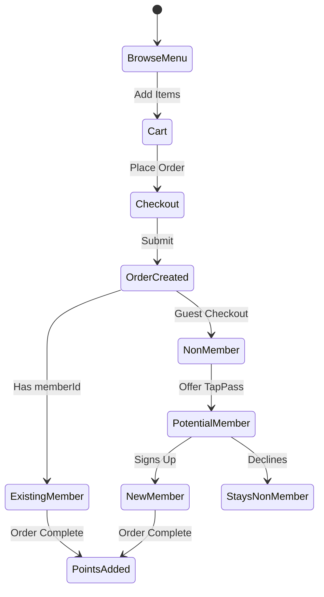

### Admin Panel Workflow

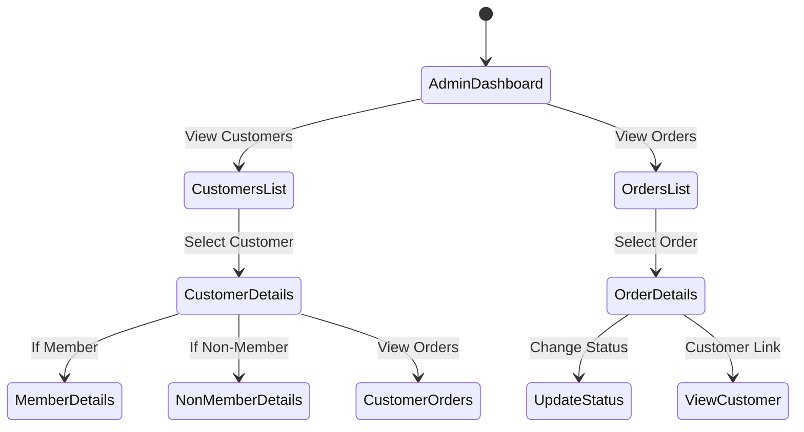

### Implementation Details

#### 1. Customer Identification Strategy
- Use `customerId` in routes to handle both members and non-members
- `customerId` can be either:
  - For members: Their `Member.id` (CUID)
  - For non-members: Generated from order data (phone + name hash)

#### 2. Data Access Patterns
```typescript
// Example of how we handle both member and non-member data
interface CustomerResponse {
  id: string;
  name: string;
  phoneNumber: string;
  type: 'member' | 'non-member';
  orders: Order[];
  memberDetails?: {
    memberId: string;
    points: number;
    visits: number;
    lastVisit: Date;
    membershipLevel: MembershipLevel;
  };
}

// How we fetch customer data
async function getCustomer(customerId: string): Promise<ApiResponse<CustomerResponse>> {
  // First try to find as member
  const member = await prisma.member.findUnique({
    where: { id: customerId },
    include: {
      orders: true,
      visitHistory: true,
    },
  });

  if (member) {
    return {
      success: true,
      data: {
        id: member.id,
        name: member.name,
        phoneNumber: member.phoneNumber,
        type: 'member',
        orders: member.orders,
        memberDetails: {
          memberId: member.memberId,
          points: member.points,
          visits: member.visitCount,
          lastVisit: member.lastVisit,
          membershipLevel: member.membershipLevel,
        },
      },
    };
  }

  // If not a member, find by order history
  const orders = await prisma.order.findMany({
    where: {
      OR: [
        { customerName: customerId },
        { phoneNumber: customerId },
      ],
    },
  });

  if (orders.length > 0) {
    const firstOrder = orders[0];
    return {
      success: true,
      data: {
        id: `${firstOrder.phoneNumber}-${firstOrder.customerName}`,
        name: firstOrder.customerName,
        phoneNumber: firstOrder.phoneNumber,
        type: 'non-member',
        orders: orders,
      },
    };
  }

  return {
    success: false,
    error: 'Customer not found',
  };
}
```

### Current Implementation Status

#### Completed Features
1. **Order System** ✅
   - Cart management
   - Order creation
   - Basic customer info collection
   - Order history viewing

2. **Customer Management** ✅
   - Customer listing
   - Basic customer details
   - Order history per customer
   - Member vs non-member handling

3. **Admin Interface** ✅
   - Order listing
   - Customer listing
   - Basic status management
   - Navigation between orders and customers

#### Pending Implementation
1. **Real-time Features** 🚧
   - Order status updates
   - Staff notifications
   - Kitchen display system
   - Customer notifications

2. **Member Features** 🚧
   - Points calculation
   - Visit tracking
   - Reward management
   - Member conversion flow

3. **Analytics & Reporting** 🚧
   - Order analytics
   - Customer insights
   - Member engagement metrics
   - Revenue tracking

### Next Steps Priority

1. **Route Consolidation**
   - Standardize on `[customerId]` for customer routes
   - Remove duplicate `[memberid]` routes
   - Update order routes to link correctly

2. **Member Integration**
   - Implement member conversion flow
   - Add points tracking
   - Set up visit recording
   - Enable reward management

3. **Real-time Features**
   - Add WebSocket connections
   - Implement status updates
   - Set up notifications
   - Create staff interface

### Why This Approach?

1. **Unified Customer Handling**
   - Using `customerId` as the main identifier allows us to handle both members and non-members through the same interface
   - Enables smooth transition from non-member to member
   - Maintains order history across conversion

2. **Flexible Data Model**
   - Member model contains full loyalty program data
   - Order model works independently of membership
   - Visit tracking separate from orders for accurate point calculation

3. **Progressive Enhancement**
   - Start with basic order functionality
   - Add member features progressively
   - Enable real-time features last for proper testing

4. **Admin-First Development**
   - Build admin tools first for business operations
   - Add customer-facing features after core functionality
   - Ensure proper monitoring and management capabilities

Would you like me to:
1. Start implementing any specific feature?
2. Provide more detail about any component?
3. Focus on a particular integration point? 