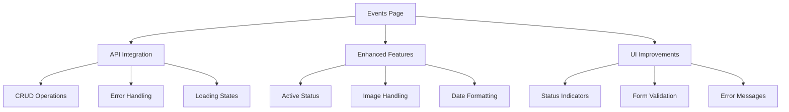
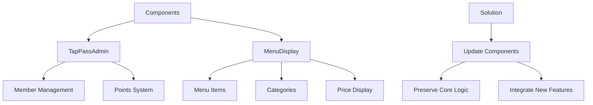

# Merge Conflict Analysis: merge-prod-dev → main

## Overview
This document outlines the conflicts between `merge-prod-dev` and `main` branches, their implications, and proposed solutions.

## Progress Status
✅ Completed
- pnpm-lock.yaml: Resolved by regenerating lock file
- package.json: Kept main branch version with newer dependencies
- src/app/admin/menu/page.tsx: Kept main branch implementation with server components
- src/app/admin/events/page.tsx: Kept merge-prod-dev implementation with API integration

🔄 In Progress
- API Route Conflicts
- Component Conflicts

## Conflict Files

### 1. `my_app/pnpm-lock.yaml` ✅
**Type:** Dependency Conflict
**Status:** RESOLVED
**Solution Applied:** 
- Deleted lock file
- Regenerated with `pnpm install`
- Kept newer versions from main branch

### 2. `my_app/package.json` ✅
**Type:** Dependency Conflict
**Status:** RESOLVED
**Solution Applied:**
- Kept main branch version
- Maintained newer package versions
- Preserved all required dependencies

### 3. `my_app/src/app/admin/menu/page.tsx` ✅
**Type:** Code Conflict
**Status:** RESOLVED
**Solution Applied:**
- Kept main branch implementation
- Preserved server components
- Maintained server actions
- Kept proper separation of concerns

### 4. `my_app/src/app/admin/events/page.tsx` ✅
**Type:** Code Conflict
**Status:** RESOLVED
**Solution Applied:**
- Kept merge-prod-dev implementation
- Added API integration
- Enhanced features:
  - Active/inactive status
  - Improved error handling
  - Better state management
  - Enhanced UI components
- Renamed imageUrl to image for consistency
- Added proper loading and error states

**Implementation Details:**


### 5. API Route Conflicts 🔄
**Files:**
- `my_app/src/app/api/events/[id]/route.ts`
- `my_app/src/app/api/events/route.ts`

**Type:** File Deletion/Modification
**Status:** IN PROGRESS
**Current Implementation:**
- RESTful endpoints
- Prisma integration
- Zod validation

**Solution Strategy:**
```mermaid
graph TD
    A[API Routes] --> B[Events Endpoints]
    B --> C[GET /api/events]
    B --> D[GET /api/events/[id]]
    B --> E[POST /api/events]
    B --> F[PUT /api/events/[id]]
    
    G[Solution] --> H[Keep New Routes]
    H --> I[Update Validation]
    H --> J[Ensure Prisma Integration]
```

### 6. Component Conflicts 🔄
**Files:**
- `my_app/src/components/admin/TapPassAdmin.tsx`
- `my_app/src/components/menu/MenuDisplay.tsx`

**Type:** Code Conflict
**Status:** IN PROGRESS
**Current Implementation:**
- TapPass member management
- Menu display logic
- Price formatting

**Solution Strategy:**


## Implementation Plan

### Phase 1: Dependency Resolution ✅
1. ✅ Update pnpm-lock.yaml
2. ✅ Verify dependency compatibility
3. ✅ Run test suite

### Phase 2: Core Functionality 🔄
1. 🔄 Resolve API route conflicts
2. 🔄 Update validation schemas
3. 🔄 Ensure Prisma model compatibility

### Phase 3: UI Components 🔄
1. 🔄 Merge TapPassAdmin changes
2. 🔄 Update MenuDisplay component
3. 🔄 Verify price formatting

### Phase 4: Testing & Validation ⏳
1. ⏳ Run unit tests
2. ⏳ Test API endpoints
3. ⏳ Verify UI functionality
4. ⏳ Check price calculations

## Risk Assessment

### High Risk Areas
1. Price handling changes
2. API route modifications
3. Validation schema updates

### Mitigation Strategies
1. Comprehensive testing
2. Backup of current state
3. Gradual feature rollout

## Success Criteria
1. All tests passing
2. No TypeScript errors
3. Working price calculations
4. Functional API endpoints
5. Consistent UI behavior

## Rollback Plan
If issues arise:
1. Revert to backup branch
2. Document issues encountered
3. Plan alternative approach

## Next Steps
1. ✅ Begin with dependency resolution
2. 🔄 Proceed with API route conflicts
3. 🔄 Address component conflicts
4. ⏳ Implement comprehensive testing 