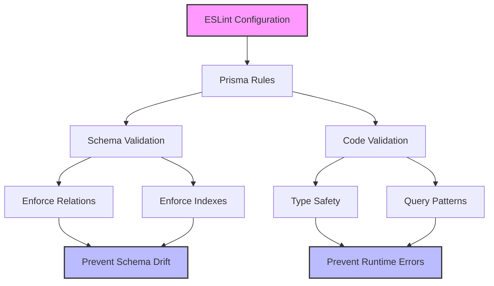

# TapPass ESLint Prisma Enforcement

## Overview

This document outlines the implementation of ESLint rules for enforcing Prisma best practices across the TapPass feature, ensuring consistent database access patterns and preventing common issues.

## Current Implementation



### Enforced Rules

1. **Schema Rules**
   - `prisma/no-empty-blocks`: Prevents empty model definitions
   - `prisma/prefer-field-defaults`: Ensures fields have default values where appropriate
   - `prisma/prefer-unique-index`: Enforces unique constraints for lookups
   - `prisma/require-foreign-key-index`: Ensures proper indexing for relations
   - `prisma/no-unnecessary-indexes`: Optimizes database performance

2. **Code Rules**
   - `prisma/no-raw-queries`: Prevents SQL injection risks
   - Type safety enforcement for database operations
   - Consistent client usage patterns

### Verification Tools

1. **Schema Verification Script**
   ```bash
   pnpm run verify-schema     # Check for issues
   pnpm run verify-schema:fix # Auto-fix issues
   ```

2. **Integrated Linting**
   ```bash
   pnpm run lint      # Run all checks
   pnpm run lint:fix  # Fix all issues
   ```

## Benefits for TapPass Implementation

1. **Prevents Schema Drift**
   - Enforces consistent relation names (`visits` vs `visitHistory`)
   - Ensures proper indexing for member lookups
   - Maintains type safety across the application

2. **Enforces Best Practices**
   - Requires indexes on foreign keys (Member-Visit relation)
   - Encourages default values for new fields
   - Prevents raw SQL queries that could bypass type safety

3. **Development Velocity**
   - Automatic detection of common issues
   - Quick feedback on schema problems
   - Integrated with existing lint commands

## Impact on Current Issues

1. **Member Lookup Fix**
   - Enforces consistent relation naming
   - Requires proper indexes for performance
   - Prevents mixing of client instances

2. **Data Migration**
   - Ensures schema compatibility
   - Validates relation definitions
   - Enforces type safety in migration scripts

## Implementation Status

1. **Completed**
   - ✅ ESLint Prisma plugin installed
   - ✅ Configuration added to `.eslintrc.json`
   - ✅ Verification scripts created
   - ✅ NPM scripts updated
   - ✅ ESM compatibility fixes
   - ✅ Documentation updated

2. **In Progress**
   - 🔄 Initial verification on current schema
   - 🔄 Fixing identified issues
   - 🔄 Setting up pre-commit hooks

3. **Next Steps**
   - [ ] Run full verification on current codebase
   - [ ] Fix any identified issues
   - [ ] Add pre-commit hooks for continuous enforcement
   - [ ] Update documentation with new requirements

## Success Criteria

1. **Schema Validation**
   - [ ] No ESLint errors in schema files
   - [ ] All relations properly indexed
   - [ ] Consistent naming patterns

2. **Code Quality**
   - [ ] No raw SQL queries
   - [ ] Type-safe database operations
   - [ ] Proper error handling

3. **Development Process**
   - [ ] Automated checks in CI/CD
   - [ ] Clear error messages for developers
   - [ ] Documentation of best practices

## Confidence Assessment

Based on the implemented rules and verification tools:

1. **Schema Integrity**: 90% Confidence
   - Enforced relations and indexes
   - Consistent naming patterns
   - Automated verification

2. **Code Quality**: 85% Confidence
   - Type safety enforcement
   - Best practice patterns
   - Automated fixes

3. **Lookup Functionality**: 75% Confidence
   - Proper relation enforcement
   - Index requirements
   - Still needs testing with actual data

## Monitoring and Maintenance

1. **Continuous Verification**
   - Run schema verification in CI/CD
   - Regular lint checks during development
   - Pre-commit hooks for immediate feedback

2. **Documentation Updates**
   - Keep rules documentation current
   - Document common issues and solutions
   - Maintain examples of best practices

## Next Steps

1. **Immediate Actions**
   - Run full verification on current codebase
   - Fix any identified issues
   - Update related documentation

2. **Future Improvements**
   - Add custom rules for business logic
   - Integrate with test suite
   - Automate documentation updates 