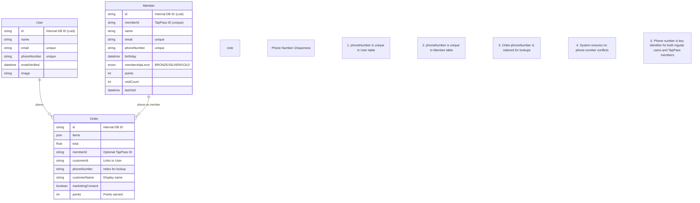

```mermaid
erDiagram
    User {
        string id "Internal DB ID (cuid)"
        string name
        string email "unique"
        string phoneNumber "unique"
        datetime emailVerified
        string image
    }

    Member {
        string id "Internal DB ID (cuid)"
        string memberId "TapPass ID (unique)"
        string name
        string email "unique"
        string phoneNumber "unique"
        datetime birthday
        enum membershipLevel "BRONZE/SILVER/GOLD"
        int points
        int visitCount
        datetime lastVisit
    }

    Order {
        string id "Internal DB ID"
        json items
        float total
        string memberId "Optional TapPass ID"
        string customerId "Links to User"
        string phoneNumber "Index for lookup"
        string customerName "Display name"
        boolean marketingConsent
        int points "Points earned"
    }

    User ||--o{ Order : "places"
    Member ||--o{ Order : "places as member"

    note "Phone Number Uniqueness"
    note "1. phoneNumber is unique in User table"
    note "2. phoneNumber is unique in Member table"
    note "3. Order.phoneNumber is indexed for lookups"
    note "4. System ensures no phone number conflicts"
    note "5. Phone number is key identifier for both regular users and TapPass members"
``` 