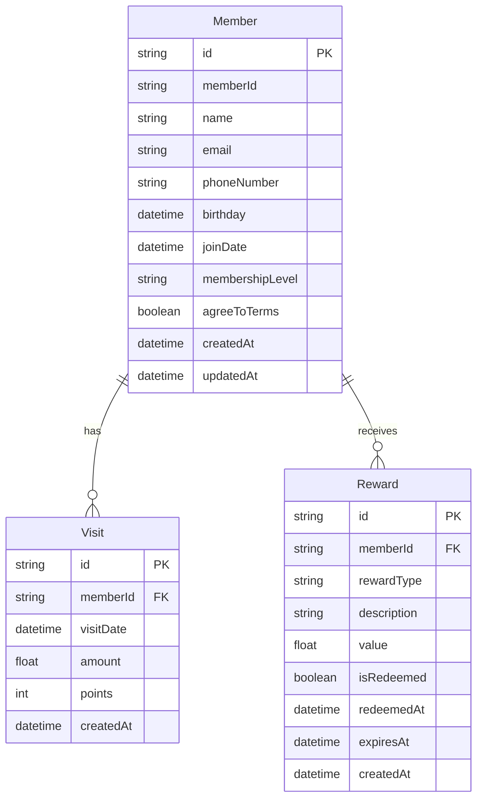

# TapPass Prisma Implementation Plan

## Overview

This document outlines the step-by-step plan for migrating the TapPass feature from in-memory storage to a Prisma-backed database solution. This will resolve the persistence issues we were experiencing with the current implementation and provide a more robust member management system.

## Prerequisites

1. ✅ Prisma and @prisma/client packages are installed
2. ✅ Schema has been created in `/prisma/schema.prisma`
3. ✅ Database URL has been added to `.env.local`
4. ✅ Database service files have been created in `/src/lib/db`

## Implementation Steps

### 1. Initialize Git Branch

```bash
git checkout -b feature/tappass-prisma
```

### 2. Initialize Prisma Database

```bash
# Generate Prisma client
npx prisma generate

# Push schema to database 
npx prisma db push

# Optional: Seed database with initial data
npx prisma db seed
```

### 3. Replace Server Actions

1. **Current Scenario**:
   - We have identified a duplicate implementation problem with server actions
   - `/app/actions.ts` - Original implementation using different storage
   - `/app/tappass/actions.ts` - Current implementation using in-memory Map

2. **Solution**:
   - Rename `/app/tappass/actions.ts` to `/app/tappass/actions-old.ts` for backup
   - Move `/app/tappass/actions-prisma.ts` to `/app/tappass/actions.ts` 
   - This ensures imports continue to work while replacing the implementation

### 4. Update Type Definitions

1. Ensure the `types.ts` file is compatible with Prisma response types
2. Add necessary type mappings between Prisma models and existing types

### 5. Test Migration

1. Run the application and test the TapPass feature
2. Register a new member and verify it's stored in the database
3. Look up the member by email and phone to verify lookup functionality
4. Restart the server and verify the data persists

### 6. Clean Up Legacy Code

1. After successful testing, remove `/app/actions.ts` duplicate functions
2. Consider moving all TapPass related functions to `/app/tappass/actions.ts`
3. Delete backup `/app/tappass/actions-old.ts` file

### 7. Enhance with Additional Features

1. Add admin dashboard to view all members
2. Implement member upgrade functionality
3. Add visit tracking and reward management UI

## Database Overview



## Future Improvements

1. **Authentication Integration**:
   - Connect TapPass member accounts with NextAuth for login capabilities

2. **Points System**:
   - Implement a point calculation and redemption system
   - Track point history and allow redemption for rewards

3. **Membership Tier Management**:
   - Automated tier upgrades based on visit frequency and spending

4. **Analytics Dashboard**:
   - Member growth over time
   - Visit frequency analysis
   - Revenue per member insights

## Monitoring and Maintenance

1. Set up Prisma Studio for database management
   ```bash
   npx prisma studio
   ```

2. Add database migration scripts for future schema changes
   ```bash
   npx prisma migrate dev --name [migration-name]
   ```

3. Implement error logging and monitoring

## Conclusion

This migration will significantly improve the TapPass feature by adding persistent storage, removing duplicate code, and enabling more powerful member management capabilities. The implementation follows Next.js 15 best practices with proper separation of concerns and strong typing throughout. 