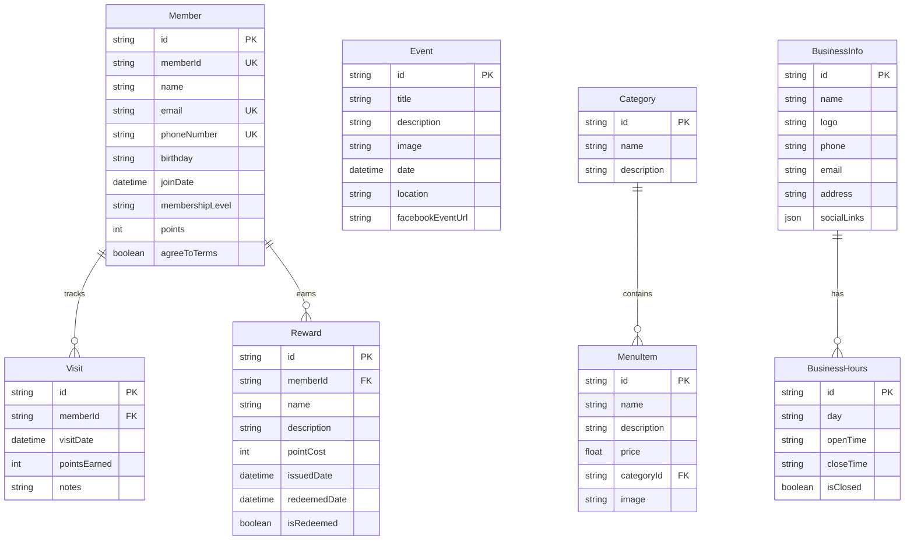
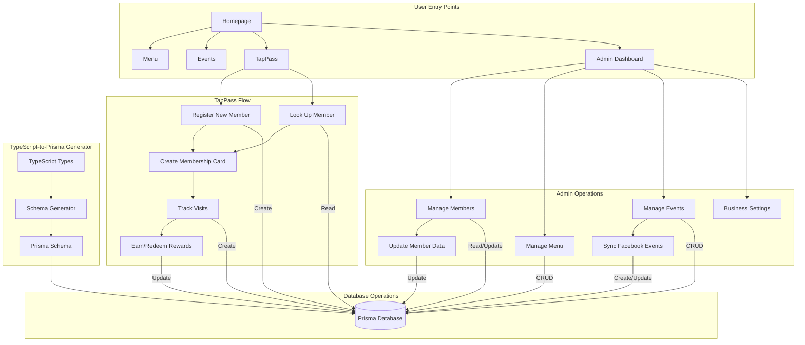

# What's Working ✅
**Last Updated: March 15, 2025**

This document tracks the current working features and components of our application, serving as a reference for the development team.

## Core Features

### Next.js 15 Implementation
- ✅ App Router setup with route groups
- ✅ Server and Client components properly implemented
- ✅ Server Actions for form handling
- ✅ Metadata API for SEO optimization
- ✅ Proper error handling and loading states
- ✅ Streaming enabled for improved UX

### Authentication
- ✅ NextAuth.js integration with multiple providers
- ✅ Protected routes with middleware
- ✅ Role-based access control
- ✅ Session management
- ✅ User model fully integrated with Prisma (NEW!)

### Database
- ✅ Prisma ORM integration
- ✅ TypeScript-to-Prisma Schema Generator (ENHANCED!)
- ✅ Migration workflows
- ✅ Seeding scripts for development
- ✅ Database service abstraction layer
- ✅ PostgreSQL integration with proper array and JSON support (NEW!)
- ✅ Initial database migration created and applied (NEW!)

### UI/UX
- ✅ Responsive design with Tailwind CSS
- ✅ Shadcn/UI component library integration
- ✅ Dark/light mode support
- ✅ Animations and transitions
- ✅ Form validation with Zod

## Feature Modules

### TapPass Membership System
- ✅ Member registration with validation
- ✅ Member lookup by email/phone
- ✅ Digital membership cards
- ✅ Visit tracking
- ✅ Reward system
- ✅ Member tiers (Bronze, Silver, Gold, Platinum)
- ✅ Database models fully integrated with Prisma (NEW!)
- 🚧 Server actions migration to Prisma (IN PROGRESS)

### Event Management
- ✅ Event creation and listing
- ✅ Event details page
- ✅ Facebook Events integration
- ✅ Image uploads for events
- ✅ Fully integrated with Prisma models (NEW!)

### Menu Management
- ✅ Menu categories and items
- ✅ Admin controls for menu updates
- ✅ Public menu display
- ✅ Fully integrated with Prisma models (NEW!)

## Development Tools

### Documentation
- ✅ Developer documentation in _DEV_MAN directory
- ✅ Implementation plans and guides
- ✅ API documentation
- ✅ Component architecture diagrams
- ✅ Database schema diagrams
- ✅ Completed task tracking with detailed completion summaries (NEW!)

### DevOps
- ✅ CI/CD pipeline with GitHub Actions
- ✅ Linting and formatting automation
- ✅ Type checking in the build process
- ✅ Automated testing setup

### Developer Experience
- ✅ TypeScript-to-Prisma Schema Generator (ENHANCED!)
  - ✅ Full support for PostgreSQL features (NEW!)
  - ✅ Improved watch mode with reliable polling (NEW!)
  - ✅ Better error handling and reporting (NEW!)
  - ✅ NPM package ready for publishing as @prisma-ts-generator/core (NEW!)
  - ✅ Comprehensive documentation with examples (NEW!)
- ✅ Mermaid diagram generation scripts
- ✅ Git utilities and workflow scripts
- ✅ Custom ESLint rules
- ✅ Specialized TypeScript configurations
- ✅ File watching with chokidar for schema updates (ENHANCED!)

## Tech Stack Summary

### Frontend
- ✅ Next.js 15
- ✅ React 19
- ✅ Tailwind CSS
- ✅ TypeScript
- ✅ Shadcn/UI components

### Backend/Data
- ✅ Next.js API Routes and Server Components
- ✅ Prisma ORM
- ✅ TS2Prisma (custom tool)
- ✅ PostgreSQL (migrated from SQLite)
- ✅ NextAuth.js

### Tooling
- ✅ pnpm
- ✅ ESLint
- ✅ Prettier
- ✅ GitHub Actions
- ✅ Chokidar watch utilities

## Challenges & Solutions

### TypeScript-Prisma Workflow
- **Challenge**: Keeping TypeScript and Prisma schema in sync
- **Solution**: Created ts2prisma tool for automatic conversion and packaged it for reuse

### Watch Mode Issues
- **Challenge**: Chokidar watching sometimes reports "No directories watched"
- **Solution**: 
  1. Using explicit absolute directory paths
  2. Implemented polling strategy for reliable file detection
  3. Added logging and error handling for improved debugging

### PostgreSQL Compatibility
- **Challenge**: SQLite limitations with arrays and JSON fields
- **Solution**:
  1. Migrated to PostgreSQL for better type support
  2. Updated schema generator to handle PostgreSQL-specific features
  3. Modified connection string in .env.local for Prisma Data Accelerator

### Database Migration
- **Challenge**: Switching database providers required resetting migration history
- **Solution**:
  1. Created fresh migration with PostgreSQL provider
  2. Updated environment variables to use the correct connection string
  3. Successfully applied migrations to new database

## Application Architecture 📊

### Data Structure and Database Schema

The following diagram illustrates our application's data model and how entities relate to each other. This schema is automatically generated and kept in sync with our TypeScript interfaces using our TypeScript-to-Prisma Schema Generator.



### User Experience and Application Flow

This diagram shows how users interact with our application, from the entry points to key features and the database operations that support them:



### CRUD Operations and Data Flow

This diagram illustrates how our data flows through the application and how CRUD operations are handled:

```mermaid
flowchart LR
    subgraph "Client Components"
        CForm[Forms with React]
        CDisplay[Display Components]
    end
    
    subgraph "Server Components"
        SData[Data Fetching Components]
        SRender[Rendering Components]
    end
    
    subgraph "Server Actions"
        SA[Server Actions]
    end
    
    subgraph "Database Service Layer"
        DS[Database Services]
    end
    
    subgraph "Prisma ORM"
        PO[Prisma Client]
    end
    
    subgraph "Database"
        DB[(PostgreSQL)]
    end
    
    subgraph "Validation"
        ZOD[Zod Schemas]
    end
    
    subgraph "TypeScript Types"
        TS[TypeScript Interfaces]
    end
    
    subgraph "Schema Generator"
        SG[TypeScript-to-Prisma Generator]
    end
    
    % Create/Update Flow
    CForm -->|Submit Data| SA
    SA -->|Validate| ZOD
    SA -->|Call Service| DS
    DS -->|Use Client| PO
    PO -->|Execute Query| DB
    
    % Read Flow
    SData -->|Request Data| DS
    DS -->|Query| PO
    PO -->|Fetch| DB
    SData -->|Pass Props| SRender
    SRender -->|Render| CDisplay
    
    % Type Synchronization
    TS -->|Analyzed by| SG
    SG -->|Generates| PO
    ZOD -->|Aligned with| TS
```

## Current Development Status

### ✅ Completed Tasks:

1. **TypeScript-to-Prisma Generator Enhancement**
   - Full PostgreSQL support including arrays and JSON fields
   - Improved watch mode with reliable polling
   - Comprehensive documentation and examples
   - NPM package preparation with proper structure
   - Fixed validation issues with complex schemas

2. **Database Infrastructure**
   - Migrated from SQLite to PostgreSQL
   - Full schema generated with proper relationships
   - Initial migration created and applied
   - Authentication models fully integrated

3. **TapPass Database Integration**
   - TapPass models defined in TypeScript
   - Models successfully included in Prisma schema
   - Database tables created for TapPass functionality

### 🚧 In Progress:

1. **TapPass Server Actions Migration**
   - Replacing in-memory actions with Prisma-backed implementations
   - Testing data persistence across server restarts
   - Integrating Zod validation with Prisma

2. **Enhanced Developer Experience**
   - Consolidating development documentation
   - Organizing remaining pending issues
   - Better error handling in server actions

3. **Production Preparation**
   - Implementing proper caching strategies
   - Adding missing indexes for performance
   - Enhancing security features

## Path to Production

To make the application fully production-ready, we need to complete the following steps:

1. **Finish TapPass Migration**: Complete the migration from in-memory storage to Prisma-backed database operations.

2. **Enhance Testing**: Implement comprehensive testing for critical paths.

3. **Performance Optimization**: Implement caching and optimize database queries.

4. **Security Audit**: Conduct a thorough security audit and address any findings.

5. **Documentation**: Complete user and developer documentation.

The current focus is on completing the TapPass migration to ensure all features are persisted properly in the database.

## Next Steps

Our immediate next steps are:

1. Update the server actions in TapPass to use Prisma
2. Test data persistence across server restarts
3. Fix any issues with the Zod validation integration
4. Enhance error handling in the server actions
5. Add comprehensive testing for the TapPass functionality

---

*This document is updated regularly as new features are implemented and existing features are improved.* 