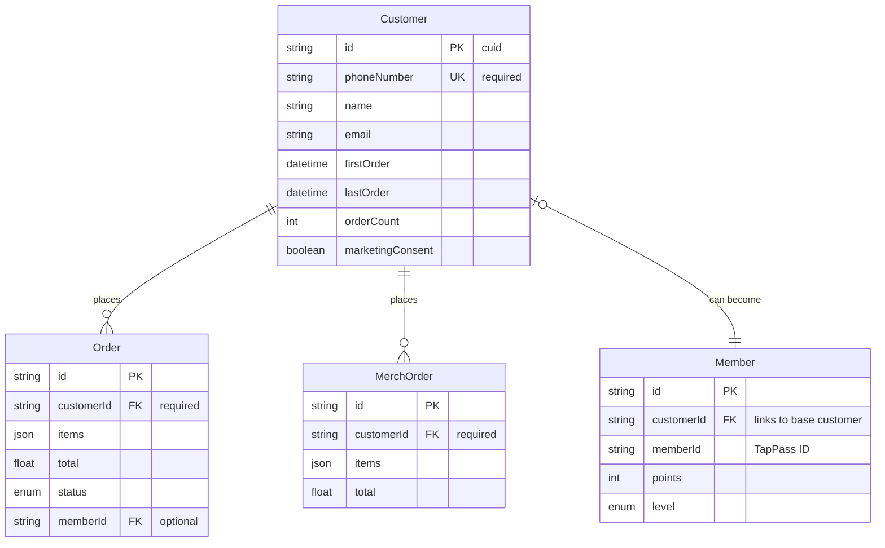

# Customer System Design



## Proposed Flow

1. **New Customer Creation**
   ```mermaid
   sequenceDiagram
       participant C as Customer
       participant S as System
       participant DB as Database
       
       C->>S: Places first order
       S->>DB: Check phone number
       alt New Customer
           S->>DB: Create Customer record
           DB-->>S: Return customerId
       else Existing Customer
           DB-->>S: Return existing customerId
       end
       S->>DB: Create Order with customerId
   ```

2. **Member Conversion**
   ```mermaid
   sequenceDiagram
       participant C as Customer
       participant S as System
       participant DB as Database
       
       C->>S: Signs up for TapPass
       S->>DB: Check existing Customer
       S->>DB: Create Member record
       S->>DB: Link to Customer record
       S->>DB: Update Order history
   ```

## Key Changes Needed

1. Create new `Customer` table:
```sql
CREATE TABLE "Customer" (
    id TEXT PRIMARY KEY,
    phoneNumber TEXT UNIQUE NOT NULL,
    name TEXT,
    email TEXT,
    firstOrder TIMESTAMP,
    lastOrder TIMESTAMP,
    orderCount INTEGER DEFAULT 0,
    marketingConsent BOOLEAN DEFAULT false,
    createdAt TIMESTAMP DEFAULT NOW(),
    updatedAt TIMESTAMP
);
```

2. Update `Order` table:
```sql
ALTER TABLE "Order"
ADD COLUMN customerId TEXT NOT NULL,
ADD CONSTRAINT fk_customer
FOREIGN KEY (customerId)
REFERENCES "Customer"(id);
```

3. Update `Member` table:
```sql
ALTER TABLE "Member"
ADD COLUMN customerId TEXT UNIQUE,
ADD CONSTRAINT fk_customer
FOREIGN KEY (customerId)
REFERENCES "Customer"(id);
```

## Benefits

1. **Unified Customer Tracking**
   - One customer ID across all systems
   - Complete order history (food & merch)
   - Easy conversion to TapPass member

2. **Better Data Organization**
   - Phone number as unique identifier
   - Track customer engagement
   - Marketing consent management

3. **Simplified Queries**
   - Find all orders by customer
   - Track customer value
   - Member conversion opportunities

Would you like me to:
1. Create the migration for these changes?
2. Update the order creation logic?
3. Add customer lookup functions? 