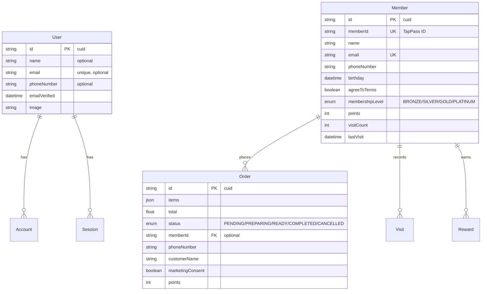
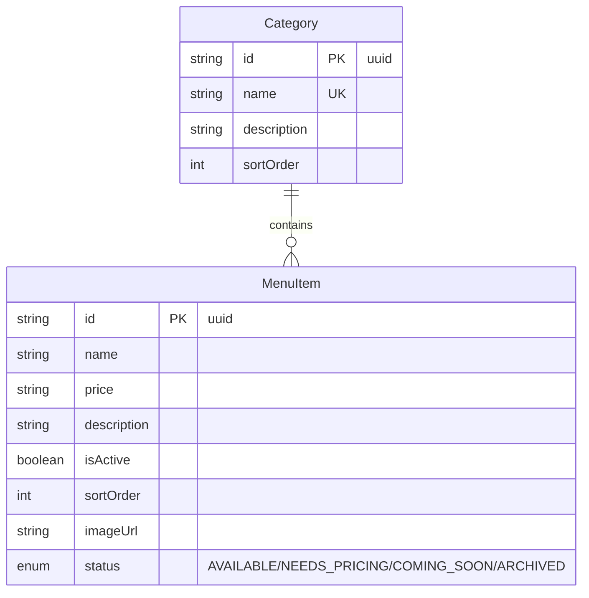
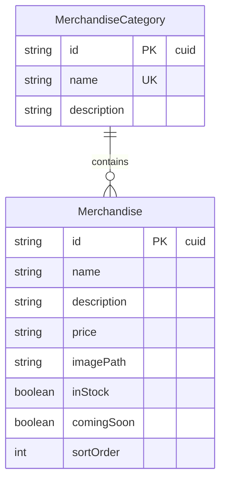
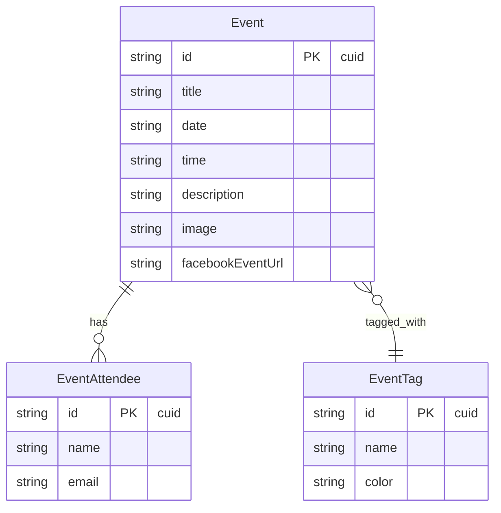
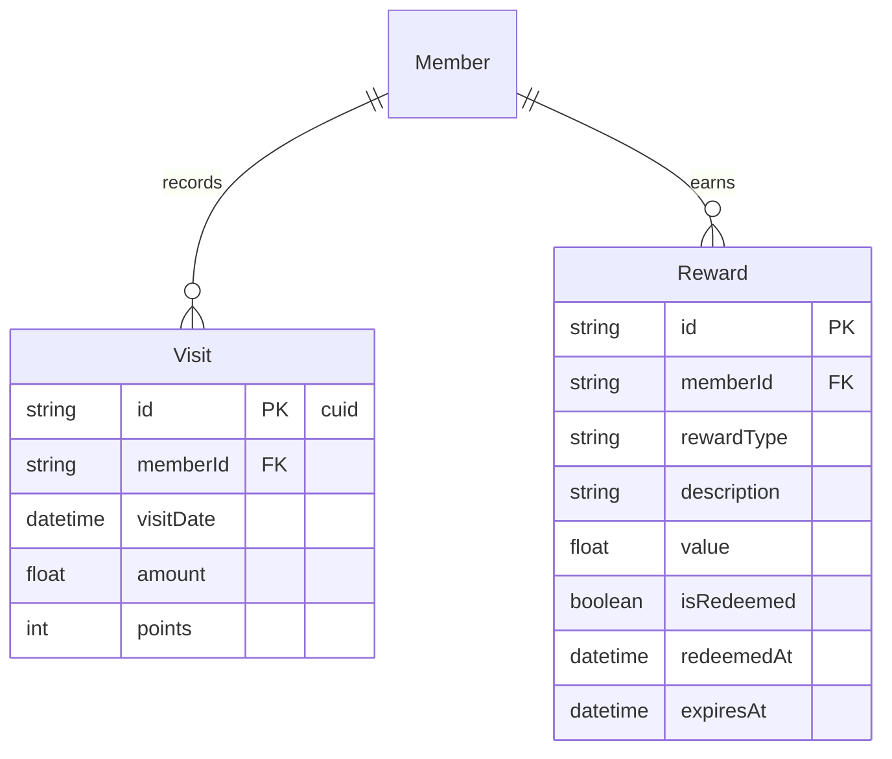

# Database Schema Documentation

## Core Models Relationship

## Menu System

## Merchandise System

## Events System

## Rewards & Visits

## Key Points

1. **Authentication & Users**
   - Base `User` model for authentication
   - Extended `Member` model for TapPass members
   - Secure session handling with `Account` and `Session` models

2. **Order System**
   - Orders can be linked to Members (TapPass) optionally
   - All orders require phone number and customer name
   - Points system integrated with orders

3. **Menu Management**
   - Hierarchical menu with categories
   - Detailed item status tracking
   - Price and availability management

4. **Merchandise System**
   - Separate from menu items
   - Category-based organization
   - Stock and availability tracking

5. **Events & Attendance**
   - Event management with tagging
   - Attendee tracking
   - Social media integration

6. **Loyalty System**
   - Visit tracking with points
   - Reward management
   - Member levels (BRONZE to PLATINUM)

## Current Schema Status

- All models have proper timestamps (`createdAt`/`updatedAt`)
- Unique constraints on critical fields
- Proper indexing on foreign keys
- Enum types for status fields
- JSON storage for order items

## Proposed Improvements

1. **Phone Number Handling**
   - Make phone numbers unique in Member model
   - Add phone number validation
   - Standardize phone number format

2. **Order-Customer Relationship**
   - Add direct link between Orders and Users
   - Maintain phone number for quick lookups
   - Improve customer history tracking

3. **Points System Enhancement**
   - Add points calculation rules
   - Implement points expiry
   - Track points history

Would you like me to:
1. Detail any specific part of the schema?
2. Create migration files for the proposed improvements?
3. Add more documentation about specific features? 