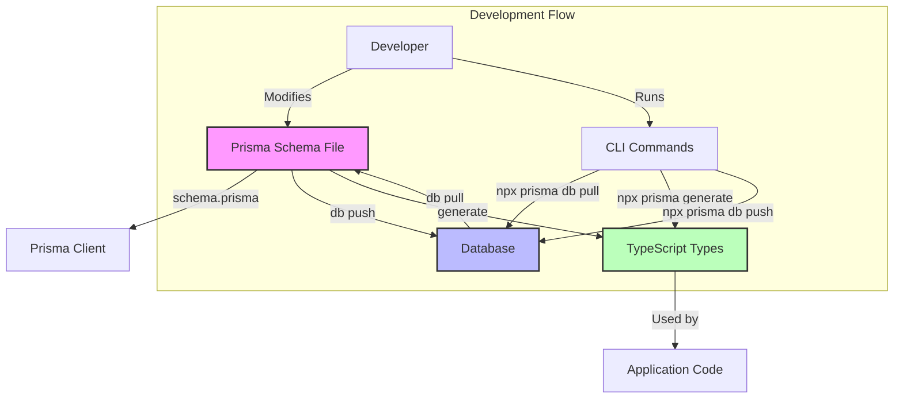

- For Prisma integration details, see [PRISMA_INTEGRATION.md](./PRISMA_INTEGRATION.md)
- For issue tracking, refer to the [ISSUES](./ISSUES) directory

## Prisma CLI Commands

### Database Schema Synchronization

#### Key Commands Explained

1. **`npx prisma db pull`**
   - Reads the current database schema
   - Updates `schema.prisma` file to match the database
   - Useful when database changes are made outside Prisma
   - Helps maintain schema synchronization

2. **`npx prisma generate`**
   - Creates TypeScript types from schema
   - Updates Prisma Client with latest schema
   - Required after schema changes

3. **`npx prisma db push`**
   - Pushes schema changes to database
   - Updates database structure to match schema
   - Used for development and prototyping

4. **`npx prisma migrate dev`**
   - Creates migration files
   - Applies migrations to database
   - Regenerates Prisma Client
   - Used for production-ready changes

#### Common Use Cases

- **Schema Synchronization**: When database changes are made outside Prisma
- **Type Generation**: After schema modifications
- **Development**: Quick schema updates during development
- **Production**: Safe database schema changes with migrations 