# ONE-52 Bar & Grill - User Flows

## Overview
This document outlines the primary user flows for both customers and administrators of the ONE-52 Bar & Grill web application. It provides a clear understanding of how users interact with the system and how different components work together.

## Customer User Flows

### Website Navigation

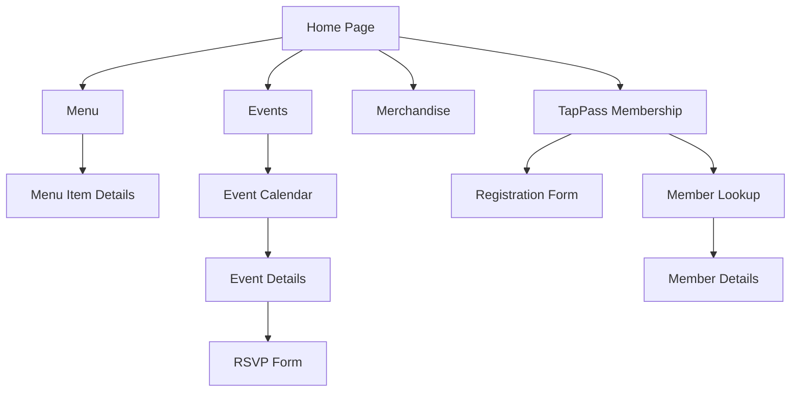

### TapPass Membership Flow

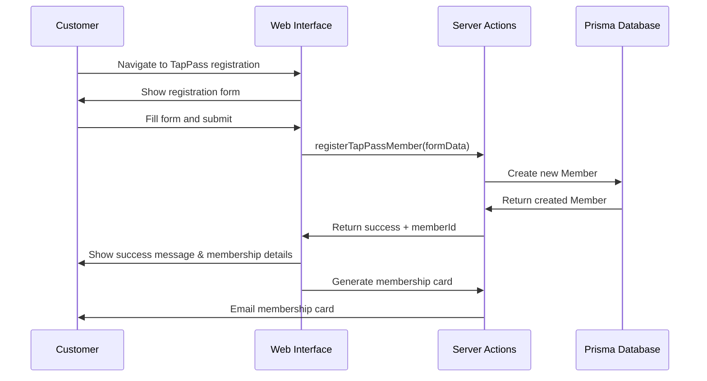

### Menu Browsing Flow

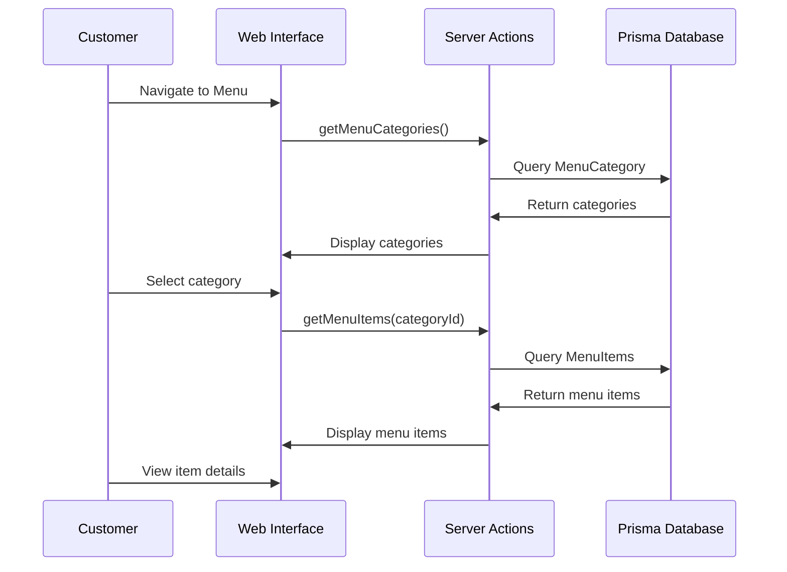

### Event RSVP Flow

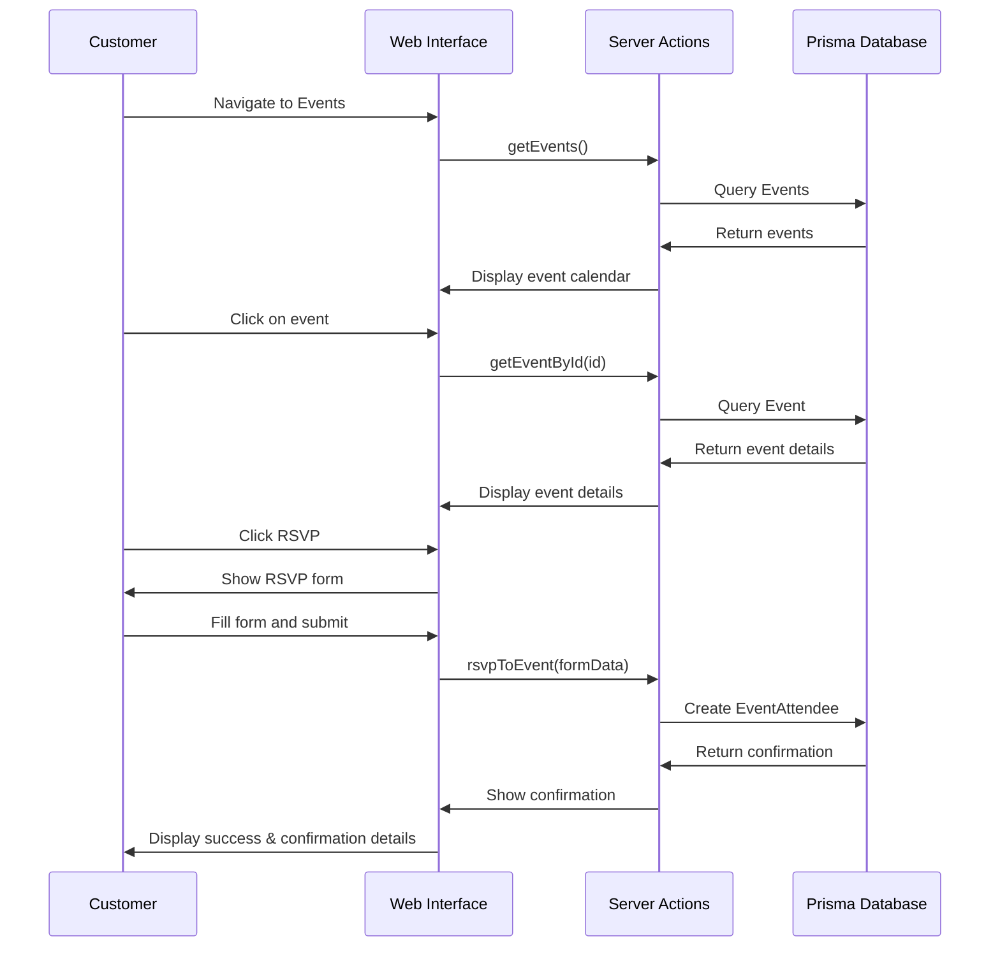

### Merchandise Browsing Flow

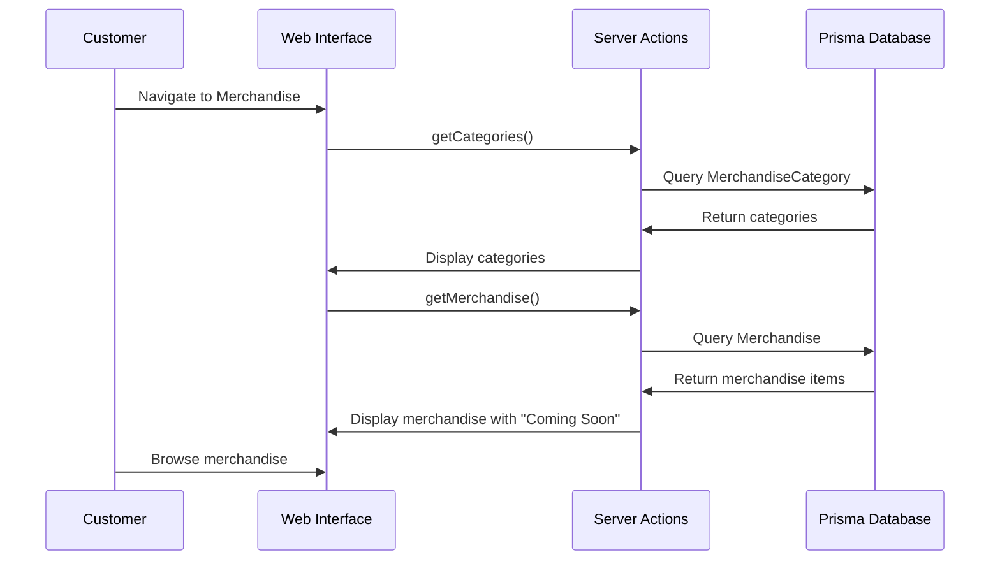

## Admin User Flows

### Admin Navigation

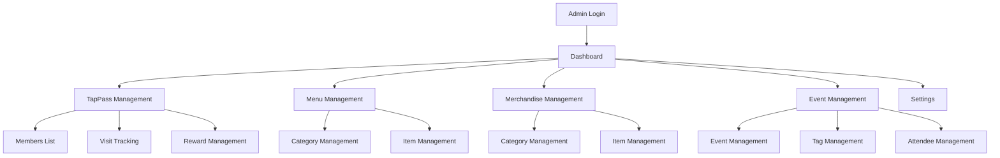

### TapPass Member Management Flow

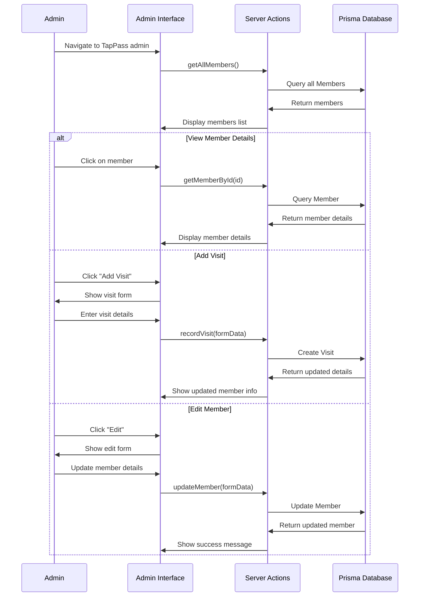

### Menu Management Flow

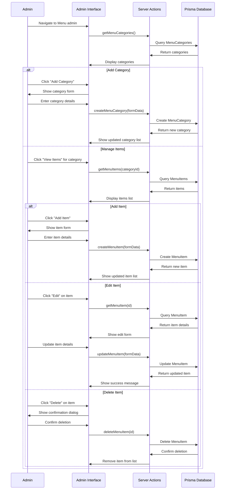

### Merchandise Management Flow

```mermaid
sequenceDiagram
    participant Admin
    participant UI as Admin Interface
    participant ServerAction as Server Actions
    participant DB as Prisma Database
    
    Admin->>UI: Navigate to Merchandise admin
    UI->>ServerAction: getCategories()
    ServerAction->>DB: Query MerchandiseCategories
    DB->>ServerAction: Return categories
    ServerAction->>UI: Display categories tab
    
    UI->>ServerAction: getMerchandise()
    ServerAction->>DB: Query Merchandise
    DB->>ServerAction: Return items
    ServerAction->>UI: Display items tab
    
    alt Manage Categories
        Admin->>UI: View Categories tab
        
        alt Add Category
            Admin->>UI: Click "Add Category"
            UI->>Admin: Show category form
            Admin->>UI: Enter category details
            UI->>ServerAction: createCategory(formData)
            ServerAction->>DB: Create MerchandiseCategory
            DB->>ServerAction: Return new category
            ServerAction->>UI: Show updated category list
        else Edit Category
            Admin->>UI: Click "Edit" on category
            UI->>ServerAction: getCategoryById(id)
            ServerAction->>DB: Query Category
            DB->>ServerAction: Return category details
            ServerAction->>UI: Show edit form
            Admin->>UI: Update category details
            UI->>ServerAction: updateCategory(formData)
            ServerAction->>DB: Update Category
            DB->>ServerAction: Return updated category
            ServerAction->>UI: Show success message
        else Delete Category
            Admin->>UI: Click "Delete" on category
            UI->>Admin: Show confirmation dialog
            Admin->>UI: Confirm deletion
            UI->>ServerAction: deleteCategory(id)
            ServerAction->>DB: Check if category has items
            ServerAction->>UI: Show error if items exist
            ServerAction->>DB: Delete Category if no items
            DB->>ServerAction: Confirm deletion
            ServerAction->>UI: Update category list
        end
    else Manage Items
        Admin->>UI: View Items tab
        
        alt Add Item
            Admin->>UI: Click "Add Item"
            UI->>Admin: Show item form
            Admin->>UI: Enter item details
            UI->>ServerAction: createMerchandise(formData)
            ServerAction->>DB: Create Merchandise
            DB->>ServerAction: Return new item
            ServerAction->>UI: Show updated item list
        else Edit Item
            Admin->>UI: Click "Edit" on item
            UI->>ServerAction: getMerchandiseById(id)
            ServerAction->>DB: Query Merchandise
            DB->>ServerAction: Return item details
            ServerAction->>UI: Show edit form
            Admin->>UI: Update item details
            UI->>ServerAction: updateMerchandise(formData)
            ServerAction->>DB: Update Merchandise
            DB->>ServerAction: Return updated item
            ServerAction->>UI: Show success message
        else Delete Item
            Admin->>UI: Click "Delete" on item
            UI->>Admin: Show confirmation dialog
            Admin->>UI: Confirm deletion
            UI->>ServerAction: deleteMerchandise(id)
            ServerAction->>DB: Delete Merchandise
            DB->>ServerAction: Confirm deletion
            ServerAction->>UI: Remove item from list
        else Bulk Update
            Admin->>UI: Select multiple items
            Admin->>UI: Click "Update Status"
            UI->>Admin: Show status options
            Admin->>UI: Select status (Coming Soon/In Stock)
            UI->>ServerAction: updateMerchandiseStatus(ids, status)
            ServerAction->>DB: Update multiple items
            DB->>ServerAction: Confirm updates
            ServerAction->>UI: Show updated status
        end
    end
```

### Event Management Flow

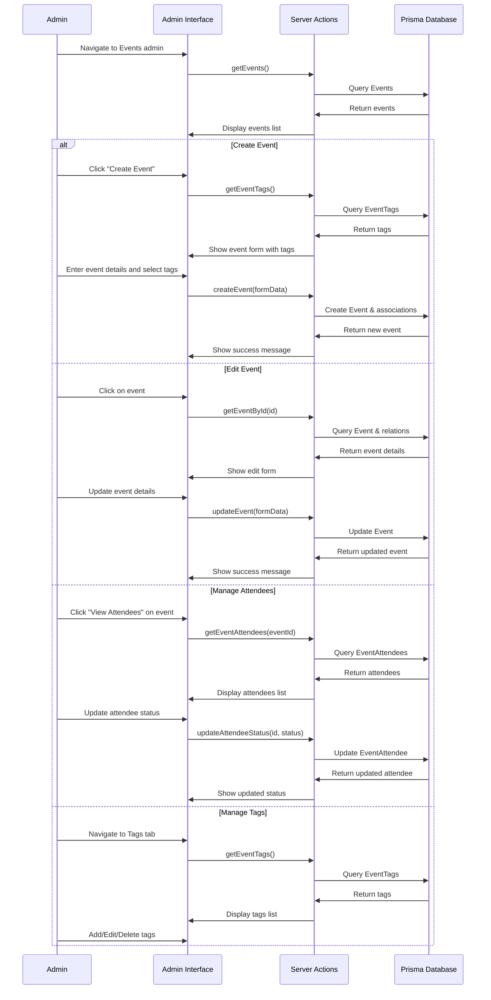

## Data Flow & Relationships

### Primary Data Relationships

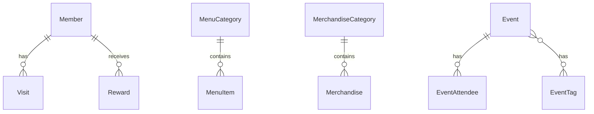

### Integration Points

The following diagram shows how different parts of the application integrate:

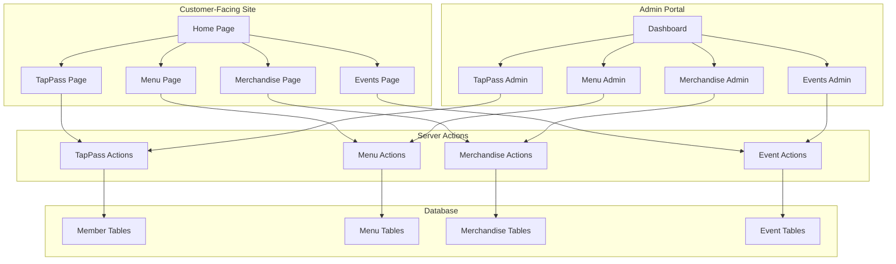

## Summary of System Interactions

1. **Customer Interactions**:
   - Browse menu items by category
   - View merchandise items (marked as "Coming Soon")
   - Register for TapPass membership
   - View and RSVP to upcoming events
   - Receive membership cards via email

2. **Admin Interactions**:
   - Manage TapPass members and track visits
   - Create and update menu categories and items
   - Manage merchandise inventory and categories
   - Create and publish events
   - Track event attendees and RSVPs
   - Configure site settings (future)

3. **System Processes**:
   - Email delivery of membership cards
   - Points calculation for member visits
   - Reward issuance based on points (future)
   - Event calendar generation
   - Image upload and management

## Conclusion

This document provides a comprehensive overview of the user flows in the ONE-52 Bar & Grill application. It outlines how different components interact and how data flows through the system. By understanding these flows, developers can ensure that new features integrate properly with the existing system, and staff can better understand how the application supports their business operations. 