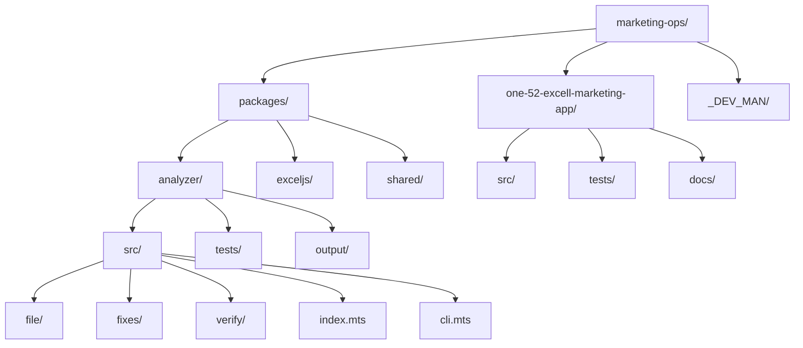

# ONE52 Bar & Grill Marketing Operations

A comprehensive suite of marketing operations tools for ONE52 Bar & Grill, including campaign calculators, Excel generators, and analytics tools.

## Directory Structure



## Core Components

### ExcelJS Analyzer
A comprehensive analysis and fix tool for ExcelJS workbooks, providing:
- Type analysis and fixes
- Style standardization
- Worksheet structure validation
- Campaign data formatting
- Code quality improvements

### Marketing App
The main application for marketing operations, including:
- Campaign calculators
- Excel generators
- Analytics tools
- Data visualization

### Development Manual
Documentation and guidelines for:
- Architecture decisions
- Development workflows
- Best practices
- Testing procedures

## Project Evolution


## Key Features

1. **ExcelJS Analyzer**
   - Comprehensive workbook analysis
   - Automated fixes for common issues
   - Style standardization
   - Type validation
   - Code quality improvements

2. **Marketing Operations**
   - Campaign calculations
   - Revenue projections
   - Cost analysis
   - Break-even calculations
   - Data visualization

3. **Type Safety**
   - TypeScript interfaces
   - Zod validation
   - Runtime type checking
   - Comprehensive error handling

4. **Excel Generation**
   - Multiple worksheet support
   - Custom styling
   - Formula support
   - Data validation

## Dependencies

- TypeScript
- ExcelJS
- Zod
- Jest
- ESLint
- Prettier
- pnpm (package manager)

## Getting Started

For detailed usage instructions, please refer to [HOW_TO_USE.md](./HOW_TO_USE.md).

1. Install dependencies:
   ```bash
   pnpm install
   ```

2. Build the project:
   ```bash
   pnpm build
   ```

3. Run tests:
   ```bash
   pnpm test
   ```

4. Generate documentation:
   ```bash
   pnpm docs
   ```

## Development

1. Create a feature branch:
   ```bash
   git checkout -b feature/your-feature
   ```

2. Make your changes

3. Run tests and linting:
   ```bash
   pnpm test
   pnpm lint
   ```

4. Commit your changes:
   ```bash
   git commit -m "feat: your feature description"
   ```

5. Push to your branch:
   ```bash
   git push origin feature/your-feature
   ```

## Contributing

1. Fork the repository
2. Create your feature branch
3. Commit your changes
4. Push to the branch
5. Create a Pull Request

## License

UNLICENSED - All rights reserved by ONE52 Bar & Grill 