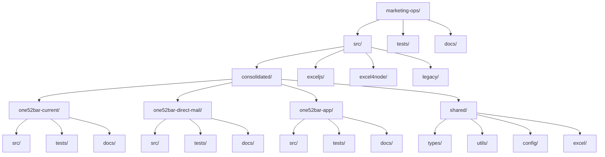
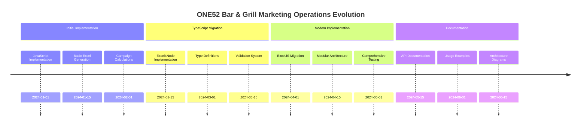

# ONE52 Bar & Grill Marketing Operations

A comprehensive suite of marketing operations tools for ONE52 Bar & Grill, including campaign calculators, Excel generators, and analytics tools.

## Directory Structure



## Implementation Comparison

| Implementation | Total Size | Main File Size | Lines of Code | File Organization |
|----------------|------------|----------------|---------------|-------------------|
| ExcelJS | 10KB | 3.1KB | 86 | Modern, modular |
| Excel4Node | 12KB | 279 lines | 279 | Legacy, monolithic |
| Legacy | 20KB | 480 lines | 480 | Legacy, monolithic |
| JavaScript | 289 lines | 289 lines | 289 | Legacy, monolithic |

## Project Evolution



## Key Features

1. **Multiple Implementations**
   - ExcelJS (modern)
   - Excel4Node (legacy)
   - JavaScript (legacy)
   - Consolidated (new)

2. **Comprehensive Documentation**
   - Architecture diagrams
   - API documentation
   - Usage examples
   - Type definitions

3. **Type Safety**
   - TypeScript interfaces
   - Zod validation
   - Runtime type checking
   - Comprehensive error handling

4. **Excel Generation**
   - Multiple worksheet support
   - Custom styling
   - Formula support
   - Data validation

5. **Business Logic**
   - Campaign calculations
   - Revenue projections
   - Cost analysis
   - Break-even calculations

## Dependencies

- TypeScript
- ExcelJS
- Zod
- Jest
- ESLint
- Prettier

## Getting Started

1. Install dependencies:
   ```bash
   npm install
   ```

2. Build the project:
   ```bash
   npm run build
   ```

3. Run tests:
   ```bash
   npm test
   ```

4. Generate documentation:
   ```bash
   npm run docs
   ```

## Development

1. Create a feature branch:
   ```bash
   git checkout -b feature/your-feature
   ```

2. Make your changes

3. Run tests and linting:
   ```bash
   npm run test
   npm run lint
   ```

4. Commit your changes:
   ```bash
   git commit -m "feat: your feature description"
   ```

5. Push to your branch:
   ```bash
   git push origin feature/your-feature
   ```

## Contributing

1. Fork the repository
2. Create your feature branch
3. Commit your changes
4. Push to the branch
5. Create a Pull Request

## License

UNLICENSED - All rights reserved by ONE52 Bar & Grill 