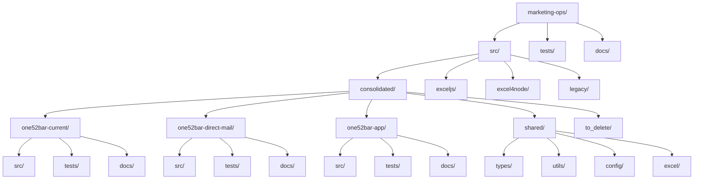

# ONE52 Bar & Grill Marketing Operations - What's Working

*Last Updated: April 2, 2025, 2:23 PM*

This document outlines the current state of the ONE52 Bar & Grill marketing operations project, what's working, and what's been implemented so far.

## Project Structure

## Implemented Components

### Configuration Files

- ✅ `package.json` - Project dependencies and scripts
- ✅ `tsconfig.json` - TypeScript configuration
- ✅ `.eslintrc.json` - ESLint configuration
- ✅ `.prettierrc` - Prettier configuration
- ✅ `jest.config.js` - Jest configuration
- ✅ `.gitignore` - Git ignore rules

### Documentation

- ✅ `README.md` - Main project documentation
- ✅ `WHATS_WORKING.md` - This file
- ✅ `src/consolidated/README.md` - Consolidated implementation documentation
- ✅ `src/consolidated/one52bar-current/README.md` - Current marketing operations documentation
- ✅ `src/consolidated/one52bar-direct-mail/README.md` - Direct mail marketing documentation
- ✅ `src/consolidated/one52bar-app/README.md` - App marketing documentation
- ✅ `src/consolidated/shared/README.md` - Shared components documentation
- ✅ `src/consolidated/to_delete/README.md` - To delete directory documentation
- ✅ `src/consolidated/merged_features.md` - Merged features tracking

### Shared Components

#### Types

- ✅ `src/consolidated/shared/types/campaign.ts` - Campaign parameter types
- ✅ `src/consolidated/shared/types/excel.ts` - Excel generation types
- ✅ `src/consolidated/shared/types/index.ts` - Type exports

#### Configuration

- ✅ `src/consolidated/shared/config/constants.ts` - Global constants
- ✅ `src/consolidated/shared/config/styles.ts` - Excel styles

#### Utilities

- ✅ `src/consolidated/shared/utils/validation.ts` - Data validation utilities
- ✅ `src/consolidated/shared/utils/formatting.ts` - Formatting utilities
- ✅ `src/consolidated/shared/utils/calculations.ts` - Calculation utilities

#### Excel Generation

- ✅ `src/consolidated/shared/excel/generator.ts` - Base Excel generator class

## Legacy Implementations

- ✅ `src/exceljs/` - ExcelJS implementation
- ✅ `src/excel4node/` - Excel4Node implementation
- ✅ `src/legacy/` - Legacy implementation

## Next Steps

### Phase 1: Analysis and Preparation ✅

- ✅ Complete directory structure setup
- ✅ Set up tracking mechanism for merged features
- ✅ Create `merged_features.md` file

### Phase 2: Type System Consolidation

- [ ] Analyze all type definitions from previous implementations
- [ ] Create consolidated type files
- [ ] Validate type coverage

### Phase 3: Business Logic Consolidation

- [ ] Extract calculation logic from previous implementations
- [ ] Consolidate app parameters
- [ ] Implement feature flags

### Phase 4: Excel Generation Consolidation

- [ ] Choose primary Excel library
- [ ] Implement unified Excel generation
- [ ] Add migration utilities

### Phase 5: Testing and Validation

- [ ] Create test suite
- [ ] Validate feature parity
- [ ] Performance testing

### Phase 6: Documentation and Cleanup

- [ ] Update documentation
- [ ] Move merged files to to_delete
- [ ] Final review

### Phase 7: Legacy Cleanup

- [ ] Create backup of all legacy files
- [ ] Move legacy files to `to_delete` directory
- [ ] Verify all functionality is preserved in consolidated implementation
- [ ] Delete legacy files after verification
- [ ] Update documentation to reflect removal of legacy implementations

## Feature Tracking

| Feature | Source | Status | Notes |
|---------|--------|--------|-------|
| Campaign Parameters | Excel4Node | To be migrated | Core parameters |
| Weekly Calculations | Excel4Node | To be migrated | Revenue and cost calculations |
| Monthly Calculations | Excel4Node | To be migrated | Revenue and cost calculations |
| Annual Calculations | Excel4Node | To be migrated | Revenue and cost calculations |
| Additional Revenue | Excel4Node | To be migrated | Repeat customers and word of mouth |
| Break-even Analysis | Excel4Node | To be migrated | Customer and conversion metrics |
| App Parameters | ExcelJS | To be migrated | App-specific metrics |
| Growth Metrics | ExcelJS | To be migrated | Growth projections |
| Validation Checks | ExcelJS | To be migrated | Data validation |
| Excel Styling | ExcelJS | To be migrated | Modern styling system |
| App Marketing | one52bar-app-marketing.ts | To be migrated | Extended marketing features |
| JavaScript Features | generate-marketing-spreadsheet.js | To be migrated | Any unique JavaScript features |

## Current Status

The project is currently in Phase 1 of the consolidation process. We have:

1. ✅ Created the directory structure for the consolidated implementation
2. ✅ Set up configuration files (package.json, tsconfig.json, etc.)
3. ✅ Created comprehensive documentation with mermaid diagrams
4. ✅ Implemented shared components (types, config, utils, excel)
5. ✅ Outlined the consolidation plan
6. ✅ Created feature tracking
7. ✅ Created the to_delete directory for legacy files
8. ✅ Created the merged_features.md file for tracking migrated features

The next steps are to begin Phase 2 of the consolidation process, starting with the type system consolidation.

## Dependencies

- TypeScript
- ExcelJS
- Zod
- Jest
- ESLint
- Prettier

## Scripts

- `npm run build` - Build the project
- `npm test` - Run tests
- `npm run lint` - Run linting
- `npm run format` - Format code with Prettier 