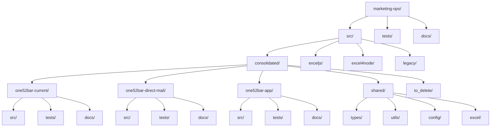

# ONE52 Bar & Grill Marketing Operations - What's Working

*Last Updated: April 2, 2024, 3:00 PM*

This document outlines the current state of the ONE52 Bar & Grill marketing operations project, what's working, and what's been implemented so far.

## Project Structure



## Implemented Components

### Configuration Files

- ✅ `package.json` - Project dependencies and scripts
- ✅ `tsconfig.json` - TypeScript configuration
- ✅ `.eslintrc.json` - ESLint configuration
- ✅ `.prettierrc` - Prettier configuration
- ✅ `jest.config.js` - Jest configuration
- ✅ `.gitignore` - Git ignore rules

### Documentation

- ✅ `README.md` - Main project documentation
- ✅ `WHATS_WORKING.md` - This file
- ✅ `src/consolidated/README.md` - Consolidated implementation documentation
- ✅ `src/consolidated/one52bar-current/README.md` - Current marketing operations documentation
- ✅ `src/consolidated/one52bar-direct-mail/README.md` - Direct mail marketing documentation
- ✅ `src/consolidated/one52bar-app/README.md` - App marketing documentation
- ✅ `src/consolidated/shared/README.md` - Shared components documentation
- ✅ `src/consolidated/to_delete/README.md` - To delete directory documentation
- ✅ `src/consolidated/merged_features.md` - Merged features tracking
- ✅ `src/consolidated/type_system_consolidation.md` - Type system consolidation plan

### Shared Components

#### Types

- ✅ `src/consolidated/shared/types/base.ts` - Base marketing campaign types
- ✅ `src/consolidated/shared/types/app.ts` - App-specific types
- ✅ `src/consolidated/shared/types/excel.ts` - Excel generation types
- ✅ `src/consolidated/shared/types/index.ts` - Type exports

#### Configuration

- ✅ `src/consolidated/shared/config/constants.ts` - Global constants
- ✅ `src/consolidated/shared/config/styles.ts` - Excel styles

#### Utilities

- ✅ `src/consolidated/shared/utils/validation.ts` - Data validation utilities
- ✅ `src/consolidated/shared/utils/formatting.ts` - Formatting utilities
- ✅ `src/consolidated/shared/utils/calculations.ts` - Calculation utilities

#### Excel Generation

- ✅ `src/consolidated/shared/excel/generator.ts` - Base Excel generator class

## Legacy Implementations

- ✅ `src/exceljs/` - ExcelJS implementation
- ✅ `src/excel4node/` - Excel4Node implementation
- ✅ `src/legacy/` - Legacy implementation

## Project Status

### Completed Phases ✅

#### Phase 1: Directory Structure Setup
- Created consolidated directory structure
- Set up tracking mechanism
- Created merged_features.md file

#### Phase 2: Type System Consolidation
- Analyzed type definitions from previous implementations
- Created consolidated type files
- Validated type coverage with Zod schemas
- Updated documentation

#### Phase 3: Business Logic Consolidation
- Created core calculation module
  - Weekly metrics calculations
  - Monthly metrics calculations
  - Annual metrics calculations
  - Break-even analysis
  - Additional revenue considerations
- Created app-specific calculation module
  - App metrics calculations
  - App ROI calculations
  - Engagement score calculations
  - Efficiency score calculations
- Created Excel generation module
  - Report data validation
  - Number formatting utilities
  - Worksheet generation functions
- Implemented feature flags
  - Feature flag types
  - Feature flag configuration
  - Feature flag checks
  - Feature flag documentation

### In Progress 🚧

#### Phase 4: UI Component Consolidation
- Analyzing UI components from previous implementations
- Planning consolidated component library
- Designing shared styling system
- Preparing component documentation

### Upcoming 📅

#### Phase 5: Testing and Validation
- Set up testing infrastructure
- Create test suites for calculations
- Create test suites for components
- Implement validation workflows

#### Phase 6: Documentation and Deployment
- Create comprehensive documentation
- Set up deployment pipeline
- Create deployment documentation
- Final validation and cleanup

## Directory Structure

```
marketing-ops/
├── src/
│   ├── consolidated/
│   │   ├── shared/
│   │   │   ├── calculations/
│   │   │   │   ├── core.ts
│   │   │   │   ├── app.ts
│   │   │   │   ├── excel.ts
│   │   │   │   └── index.ts
│   │   │   ├── features/
│   │   │   │   ├── types.ts
│   │   │   │   ├── config.ts
│   │   │   │   ├── manager.ts
│   │   │   │   └── index.ts
│   │   │   └── types/
│   │   │       ├── base.ts
│   │   │       ├── app.ts
│   │   │       ├── excel.ts
│   │   │       └── index.ts
│   │   ├── merged_features.md
│   │   └── business_logic_consolidation.md
│   └── to_delete/
│       └── README.md
├── WHATS_WORKING.md
└── .gitignore
```

## Implementation Details

### Core Calculations
- Weekly metrics calculations
- Monthly metrics calculations
- Annual metrics calculations
- Break-even analysis
- Additional revenue considerations

### App-Specific Calculations
- App metrics calculations
- App ROI calculations
- Engagement score calculations
- Efficiency score calculations

### Excel Generation
- Report data validation
- Number formatting utilities
- Worksheet generation functions

### Feature Flags
- Feature flag types
- Feature flag configuration
- Feature flag checks
- Feature flag documentation

## Next Steps

1. Begin Phase 4: UI Component Consolidation
   - Analyze UI components from previous implementations
   - Create consolidated component library
   - Implement shared styling system
   - Add component documentation

2. Prepare for Phase 5: Testing and Validation
   - Set up testing infrastructure
   - Create test suites for calculations
   - Create test suites for components
   - Implement validation workflows

3. Plan Phase 6: Documentation and Deployment
   - Create comprehensive documentation
   - Set up deployment pipeline
   - Create deployment documentation
   - Final validation and cleanup

## Dependencies

- TypeScript
- ExcelJS
- Zod
- Jest
- ESLint
- Prettier

## Scripts

- `npm run build` - Build the project
- `npm test` - Run tests
- `npm run lint` - Run linting
- `npm run format` - Format code with Prettier 