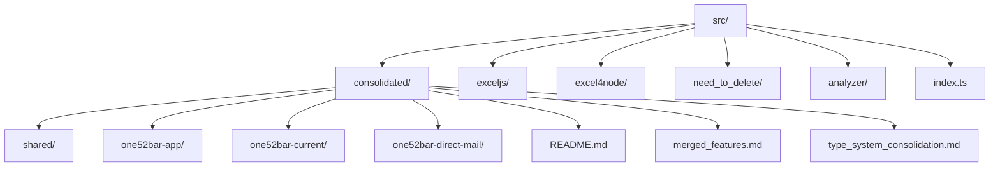

# Marketing Operations Application Flow

## Directory Structure


## Application Flow

### 1. Entry Point
- Application starts at `src/index.ts`
- Currently imports from `exceljs/generate-marketing-spreadsheet`
- Executes main function with error handling

```typescript
// src/index.ts
import { main } from './exceljs/generate-marketing-spreadsheet';

main().catch(error => {
  console.error('Error running the marketing spreadsheet generator:', error);
  process.exit(1);
});
```

### 2. Implementation Status

#### Current Implementation
- Located in `src/exceljs/`
- Handles marketing spreadsheet generation
- Uses ExcelJS library
- Will be replaced by consolidated version

#### Legacy Implementation
- Located in `src/excel4node/`
- Uses Excel4Node library
- To be deprecated and removed
- Code marked for deletion in `need_to_delete/`

#### Target Implementation (Consolidated)
Located in `src/consolidated/`:
- `shared/`: Common utilities and components
- `one52bar-app/`: App-specific implementation
- `one52bar-current/`: Current business logic
- `one52bar-direct-mail/`: Direct mail campaign features

### 3. Documentation Structure
- `consolidated/README.md`: Main implementation documentation
- `consolidated/merged_features.md`: Feature consolidation details
- `consolidated/type_system_consolidation.md`: Type system documentation
- `_DEV_MAN/`: Development and maintenance documentation

### 4. Analysis Tools
- Located in `src/analyzer/`
- Used for:
  - Code analysis
  - Feature comparison
  - Type checking
  - Migration validation

## Consolidation Process

### Current Status
1. Multiple implementations exist:
   - ExcelJS implementation (current)
   - Excel4Node implementation (legacy)
   - Consolidated version (in progress)

### Target State
1. Single consolidated implementation in `consolidated/`
2. Unified type system
3. Consistent API surface
4. Comprehensive documentation

### Migration Steps
1. Use analyzer tools to validate features
2. Follow consolidation plan in documentation
3. Use code fixer for implementation
4. Maintain feature parity
5. Ensure type safety

## Development Guidelines

### Code Changes
1. No direct code modifications
2. Use analyzer tools first
3. Follow consolidation documentation
4. Use code fixer for implementation
5. Update documentation as needed

### Testing Process
1. Run analyzer tools
2. Validate feature parity
3. Check type consistency
4. Run automated tests
5. Document changes

### Documentation Updates
1. Keep `app-flow.md` current
2. Update consolidation docs
3. Maintain type system documentation
4. Document new features
