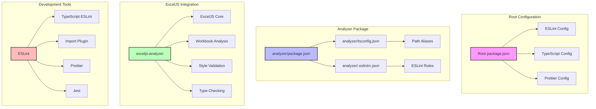
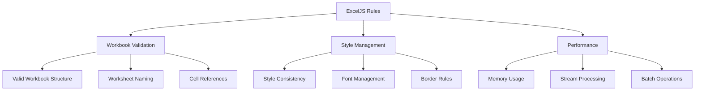
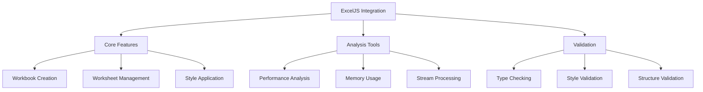
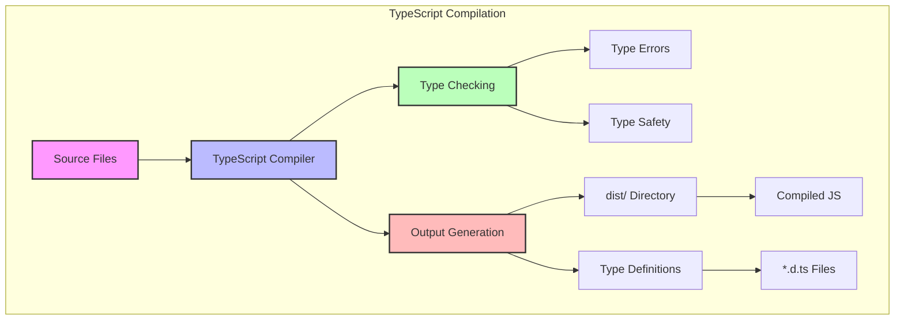
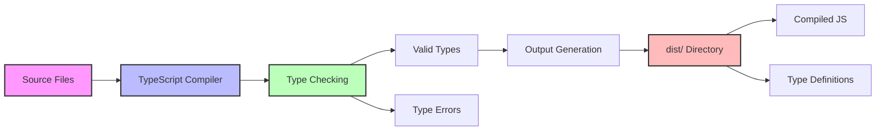

# Configuration Analysis and Recommendations

## Configuration Architecture



## ESLint Configuration Analysis

### ExcelJS-Specific Rules


## Package.json Analysis

### ExcelJS Integration


## Detailed Analysis

### ESLint Configurations

#### ExcelJS-Specific Rules
```json
{
  "rules": {
    "exceljs/valid-workbook": ["warn", {
      "maxWorksheets": 20,
      "maxRows": 1000000,
      "maxColumns": 16384
    }],
    "exceljs/style-consistency": ["warn", {
      "enforceFontFamily": true,
      "enforceBorderStyle": true
    }],
    "exceljs/performance": ["warn", {
      "maxMemoryUsage": "1GB",
      "preferStreaming": true
    }]
  }
}
```

### Package.json Enhancements
```json
{
  "scripts": {
    "excel:analyze": "node --max-old-space-size=4096 scripts/excel-analyzer.js",
    "excel:validate": "node scripts/excel-validator.js",
    "excel:optimize": "node scripts/excel-optimizer.js"
  },
  "dependencies": {
    "exceljs": "^4.4.0",
    "memory-streams": "^0.1.3"
  }
}
```

## Best Practices Implementation

### 1. Workbook Management
- Use streaming for large files
- Implement proper error handling
- Validate workbook structure
- Monitor memory usage

### 2. Style Management
- Maintain consistent styles
- Use style templates
- Validate style rules
- Optimize style application

### 3. Performance Optimization
- Implement streaming for large files
- Use batch operations
- Monitor memory usage
- Optimize style application

## Implementation Plan

1. **Phase 1: Core ExcelJS Integration**
   - Add basic validation rules
   - Implement style management
   - Set up performance monitoring

2. **Phase 2: Advanced Features**
   - Add streaming support
   - Implement batch operations
   - Add memory monitoring

3. **Phase 3: Optimization**
   - Performance tuning
   - Memory optimization
   - Style optimization

## Next Steps

1. Review and implement ExcelJS rules
2. Set up performance monitoring
3. Implement validation tools
4. Add documentation
5. Train team on new practices

Would you like to:
1. Proceed with implementing any specific phase?
2. Add more ExcelJS-specific rules?
3. Create additional documentation for ExcelJS integration?

## TypeScript Compilation Setup



## TypeScript Configuration

```json
{
  "compilerOptions": {
    "outDir": "./dist",
    "rootDir": "./src",
    "declaration": true,
    "declarationMap": true,
    "sourceMap": true,
    "strict": true,
    "noImplicitAny": true,
    "strictNullChecks": true,
    "strictFunctionTypes": true,
    "strictBindCallApply": true,
    "strictPropertyInitialization": true,
    "noImplicitThis": true,
    "alwaysStrict": true,
    "noUnusedLocals": true,
    "noUnusedParameters": true,
    "noImplicitReturns": true,
    "noFallthroughCasesInSwitch": true,
    "moduleResolution": "node",
    "baseUrl": ".",
    "paths": {
      "@/*": ["src/*"],
      "@exceljs/*": ["src/exceljs/*"]
    },
    "types": ["node", "jest"],
    "esModuleInterop": true,
    "skipLibCheck": true,
    "forceConsistentCasingInFileNames": true
  },
  "include": ["src/**/*"],
  "exclude": ["node_modules", "dist", "**/*.test.ts"]
}
```

## Build Process



## Package.json Build Scripts

```json
{
  "scripts": {
    "build": "tsc",
    "build:watch": "tsc -w",
    "build:clean": "rimraf dist",
    "build:prod": "npm run build:clean && tsc",
    "typecheck": "tsc --noEmit",
    "typecheck:watch": "tsc --noEmit --watch"
  }
}
```

## ESLint Configuration for TypeScript

```json
{
  "parser": "@typescript-eslint/parser",
  "parserOptions": {
    "project": "./tsconfig.json",
    "tsconfigRootDir": "."
  },
  "plugins": ["@typescript-eslint"],
  "extends": [
    "eslint:recommended",
    "plugin:@typescript-eslint/recommended",
    "plugin:@typescript-eslint/recommended-requiring-type-checking"
  ],
  "rules": {
    "@typescript-eslint/explicit-function-return-type": "warn",
    "@typescript-eslint/no-explicit-any": "error",
    "@typescript-eslint/no-unused-vars": ["error", { "argsIgnorePattern": "^_" }],
    "@typescript-eslint/no-non-null-assertion": "error"
  }
}
```

## Implementation Steps

1. **Setup TypeScript Configuration**
   - Create/update tsconfig.json
   - Configure output directory
   - Set up type checking rules

2. **Configure Build Process**
   - Add build scripts
   - Set up watch mode
   - Configure clean builds

3. **Type Safety**
   - Enable strict mode
   - Configure type checking
   - Set up declaration files

4. **ESLint Integration**
   - Add TypeScript rules
   - Configure type-aware linting
   - Set up workspace configurations

## Best Practices

1. **Type Safety**
   - Use strict mode
   - Enable all strict type checks
   - Generate declaration files
   - Use type guards

2. **Build Process**
   - Clean builds
   - Watch mode for development
   - Separate type checking
   - Source maps for debugging

3. **Output Management**
   - Clear dist directory before builds
   - Generate source maps
   - Include type definitions
   - Maintain file structure

## Next Steps

1. Implement TypeScript configuration
2. Set up build scripts
3. Configure ESLint for TypeScript
4. Test type safety
5. Document build process

Would you like to:
1. Proceed with implementing these configurations?
2. Add more specific TypeScript rules?
3. Create additional documentation for the build process? 