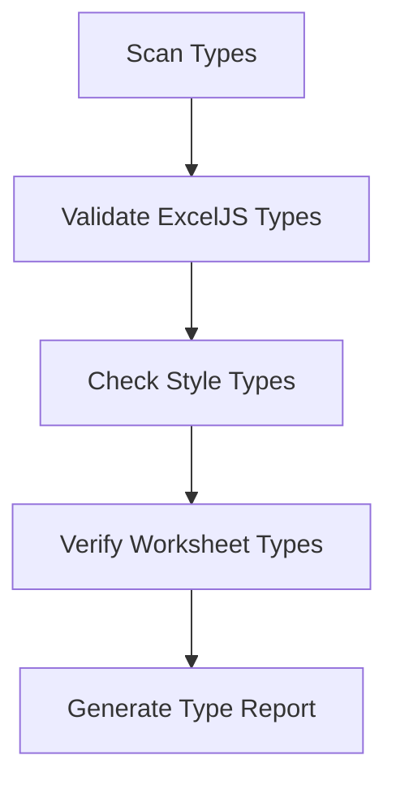
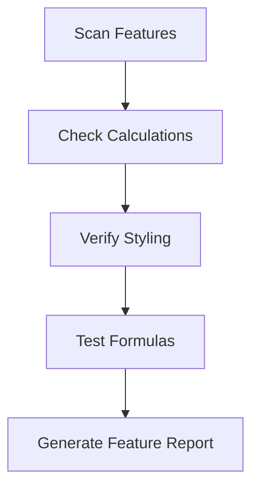
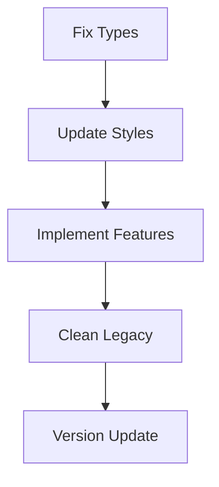

# Analyzer and Code Fixer Plan for ExcelJS Consolidation

## Overview
The analyzer and code fixer will focus solely on consolidating the ExcelJS implementation as per `exceljs-consolidation.md`, removing legacy code, and ensuring the marketing calculator works as specified in the mermaid diagram.

## Analyzer Script Phases

### Phase 1: Type Analysis


1. **Type Validation**
   - Scan `src/consolidated/shared/types`
   - Verify ExcelJS type compatibility
   - Check style type definitions
   - Validate worksheet interfaces

2. **Output**
   - Type compatibility report
   - Missing type definitions
   - Type conflicts to resolve

### Phase 2: Feature Verification


1. **Feature Check**
   - Verify all 6 worksheets implementation
   - Check calculation formulas
   - Validate styling application
   - Test cell references

2. **Output**
   - Feature parity report
   - Missing functionality list
   - Style inconsistencies

### Phase 3: Code Fixer Tasks


1. **Fix Implementation**
   ```typescript
   interface FixerTask {
     phase: 'types' | 'styles' | 'features' | 'cleanup';
     target: string;
     action: 'update' | 'create' | 'delete';
     version: string;
   }
   ```

2. **Version Control**
   - Track changes in `version.json`
   - Maintain change history
   - Enable rollback if needed

## Code Fixer Implementation

### 1. Type System Fix
```typescript
// analyzer/fixes/types.ts
export async function fixTypes() {
  // Update ExcelJS types
  // Fix style interfaces
  // Update worksheet types
  // Generate version update
}
```

### 2. Style System Fix
```typescript
// analyzer/fixes/styles.ts
export async function fixStyles() {
  // Update style definitions
  // Fix style application
  // Implement consistent formatting
  // Track version changes
}
```

### 3. Feature Implementation
```typescript
// analyzer/fixes/features.ts
export async function fixFeatures() {
  // Implement missing features
  // Fix calculations
  // Update formulas
  // Version control
}
```

### 4. Legacy Cleanup
```typescript
// analyzer/fixes/cleanup.ts
export async function cleanupLegacy() {
  // Remove Excel4Node code
  // Clean up old files
  // Update imports
  // Track changes
}
```

## Version Control System

### Version Structure
```json
{
  "version": "1.0.0",
  "changes": [
    {
      "type": "fix",
      "component": "types",
      "description": "Updated ExcelJS types"
    }
  ],
  "timestamp": "ISO-DATE"
}
```

## Execution Flow

1. **Analysis Phase**
   ```bash
   npm run analyze:types
   npm run analyze:features
   npm run analyze:compatibility
   ```

2. **Fix Phase**
   ```bash
   npm run fix:types
   npm run fix:styles
   npm run fix:features
   npm run fix:cleanup
   ```

3. **Verification Phase**
   ```bash
   npm run verify:implementation
   npm run verify:types
   npm run verify:features
   ```

## Success Criteria

1. **Types**
   - All ExcelJS types properly defined
   - Style system types complete
   - Worksheet types validated

2. **Features**
   - All 6 worksheets implemented
   - Calculations working
   - Styles applied correctly

3. **Cleanup**
   - Legacy code removed
   - No unused imports
   - Clean dependency tree

4. **Version**
   - Version file updated
   - Change history maintained
   - Rollback points created

## Output

The analyzer and fixer will generate:
1. Analysis reports
2. Fix summaries
3. Version updates
4. Verification results

All output will be in `marketing-ops/output/` with proper versioning. 