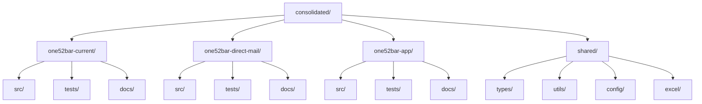
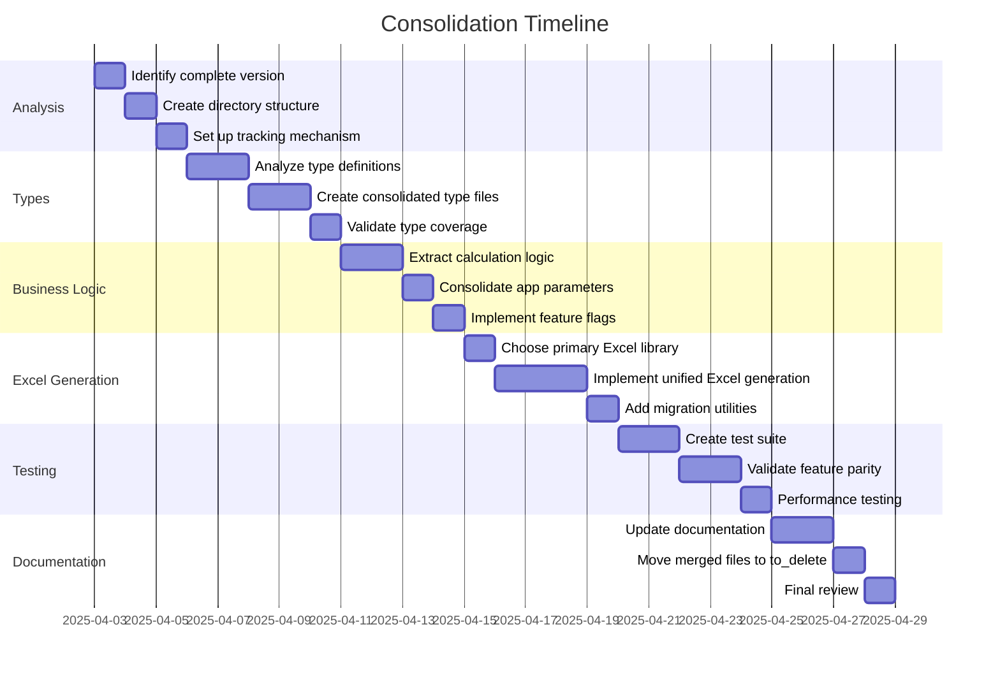

# ONE52 Bar & Grill Marketing Operations - Consolidated Implementation

This directory contains the consolidated implementation of the ONE52 Bar & Grill marketing operations spreadsheet generator, combining the best features from all previous versions.

## Directory Structure



## Separation of Concerns

The consolidated implementation is organized into four main components:

1. **one52bar-current**: Core marketing operations functionality
   - Standard marketing campaign calculations
   - Revenue projections
   - Cost analysis
   - Break-even calculations

2. **one52bar-direct-mail**: Direct mail marketing functionality
   - Postcard campaign calculations
   - Stamp cost analysis
   - Mailing list management
   - Response rate tracking

3. **one52bar-app**: App-specific marketing functionality
   - App signup metrics
   - Push notification costs
   - Organic growth tracking
   - App-specific revenue projections

4. **shared**: Common functionality used across all implementations
   - Type definitions
   - Utility functions
   - Configuration
   - Excel generation logic

## Consolidation Plan

### Phase 1: Analysis and Preparation

1. **Identify the most complete version**
   - Based on file sizes and line counts, the Excel4Node implementation appears to be the most complete (12KB, 279 lines)
   - The ExcelJS implementation is more modern but smaller (3.1KB, 86 lines)
   - The JavaScript implementation has unique features (289 lines)
   - The app marketing calculator has extensive functionality (20KB, 480 lines)

2. **Create directory structure**
   ```
   consolidated/
   ├── one52bar-current/
   │   ├── src/
   │   │   ├── calculations/    # Core marketing calculations
   │   │   └── excel/           # Excel generation for current
   │   ├── tests/               # Test files
   │   └── docs/                # Documentation
   ├── one52bar-direct-mail/
   │   ├── src/
   │   │   ├── calculations/    # Direct mail calculations
   │   │   └── excel/           # Excel generation for direct mail
   │   ├── tests/               # Test files
   │   └── docs/                # Documentation
   ├── one52bar-app/
   │   ├── src/
   │   │   ├── calculations/    # App-specific calculations
   │   │   └── excel/           # Excel generation for app
   │   ├── tests/               # Test files
   │   └── docs/                # Documentation
   └── shared/
       ├── types/               # Combined type definitions
       ├── config/              # Configuration and constants
       ├── utils/               # Utility functions
       └── excel/               # Common Excel generation logic
   ```

3. **Set up tracking mechanism**
   - Create a `merged_features.md` file to track which features have been migrated
   - Create a `to_delete` directory for files that have been safely merged

### Phase 2: Type System Consolidation

1. **Analyze all type definitions**
   - Compare types from ExcelJS, Excel4Node, and legacy implementations
   - Identify any unique types from each implementation
   - Create a comprehensive type system that includes all necessary types

2. **Create consolidated type files**
   - `shared/types/campaign.ts` - Campaign parameters and data structures
   - `shared/types/calculations.ts` - Calculation results and metrics
   - `shared/types/excel.ts` - Excel-specific types
   - `shared/types/index.ts` - Type exports

3. **Validate type coverage**
   - Ensure all types from previous implementations are included
   - Add JSDoc comments for better documentation
   - Create type guards for runtime validation

### Phase 3: Business Logic Consolidation

1. **Extract calculation logic**
   - Identify all calculation functions from each implementation
   - Create unified calculation modules for each concern
   - Ensure all formulas and business rules are preserved

2. **Consolidate app parameters**
   - Combine all app parameters from different implementations
   - Organize by category (marketing, operations, finance)
   - Add validation and documentation

3. **Implement feature flags**
   - Add configuration options to enable/disable features
   - Ensure backward compatibility with previous implementations

### Phase 4: Excel Generation Consolidation

1. **Choose primary Excel library**
   - ExcelJS offers more modern features and better TypeScript support
   - Create abstraction layer to support both ExcelJS and Excel4Node if needed

2. **Implement unified Excel generation**
   - Create a modular Excel generation system
   - Support all worksheet types from previous implementations
   - Preserve all styling and formatting options

3. **Add migration utilities**
   - Create tools to convert between different Excel formats
   - Ensure data can be migrated from old to new format

### Phase 5: Testing and Validation

1. **Create test suite**
   - Test each component individually
   - Test integration between components
   - Compare output with previous implementations

2. **Validate feature parity**
   - Ensure all features from previous implementations are working
   - Document any differences or improvements

3. **Performance testing**
   - Compare performance with previous implementations
   - Optimize where necessary

### Phase 6: Documentation and Cleanup

1. **Update documentation**
   - Document the consolidated implementation
   - Create migration guides for users of previous versions
   - Update usage instructions

2. **Move merged files to to_delete**
   - Only after thorough testing and validation
   - Keep a record of what has been merged

3. **Final review**
   - Ensure no functionality has been lost
   - Verify all tests pass
   - Check documentation completeness

## Implementation Timeline



## Feature Tracking

| Feature | Source | Status | Notes |
|---------|--------|--------|-------|
| Campaign Parameters | Excel4Node | To be migrated | Core parameters |
| Weekly Calculations | Excel4Node | To be migrated | Revenue and cost calculations |
| Monthly Calculations | Excel4Node | To be migrated | Revenue and cost calculations |
| Annual Calculations | Excel4Node | To be migrated | Revenue and cost calculations |
| Additional Revenue | Excel4Node | To be migrated | Repeat customers and word of mouth |
| Break-even Analysis | Excel4Node | To be migrated | Customer and conversion metrics |
| App Parameters | ExcelJS | To be migrated | App-specific metrics |
| Growth Metrics | ExcelJS | To be migrated | Growth projections |
| Validation Checks | ExcelJS | To be migrated | Data validation |
| Excel Styling | ExcelJS | To be migrated | Modern styling system |
| App Marketing | one52bar-app-marketing.ts | To be migrated | Extended marketing features |
| JavaScript Features | generate-marketing-spreadsheet.js | To be migrated | Any unique JavaScript features |

## Next Steps

1. Begin with Phase 1: Analysis and Preparation
2. Create the directory structure
3. Set up the tracking mechanism
4. Start with type system consolidation
5. Proceed step by step through the plan
6. Validate at each step to ensure no functionality is lost 