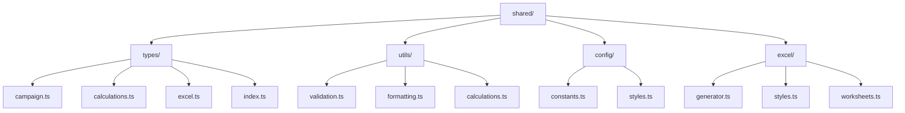
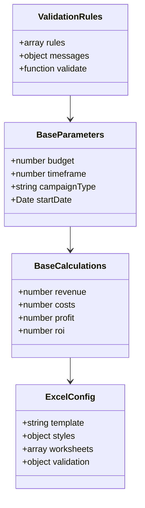
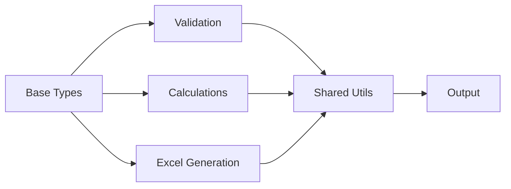

# ONE52 Bar & Grill - Shared Components

This directory contains shared functionality used across all ONE52 Bar & Grill marketing operations implementations.

## Directory Structure

## Type System Overview

## Data Flow

## Key Features

1. **Type Definitions**
   - Base parameter types
   - Calculation interfaces
   - Excel configuration types
   - Validation types

2. **Utility Functions**
   - Data validation
   - Number formatting
   - Date handling
   - Common calculations

3. **Configuration**
   - Global constants
   - Style definitions
   - Worksheet templates
   - Validation rules

4. **Excel Generation**
   - Base generator class
   - Common styles
   - Worksheet templates
   - Data validation

## Dependencies

- TypeScript
- ExcelJS
- Zod (validation)
- Date-fns

## Usage

1. Import shared types
2. Use utility functions
3. Apply configuration
4. Generate Excel reports

## Testing

- Type checking
- Unit tests for utilities
- Integration tests
- Performance benchmarks 