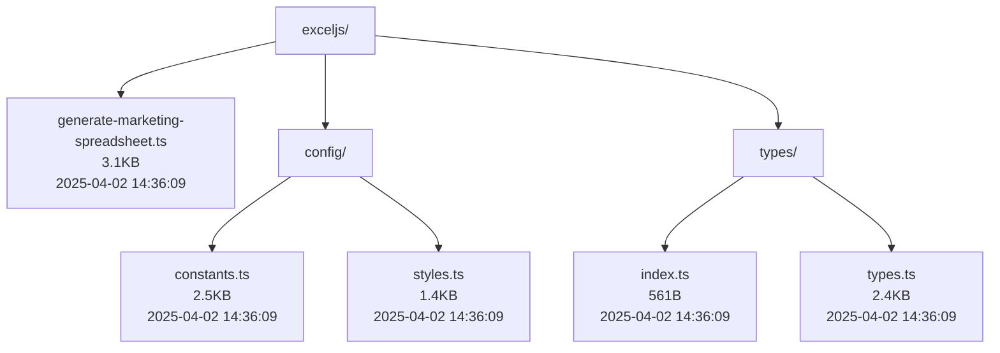
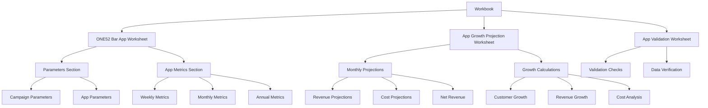
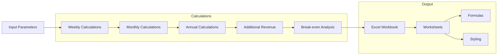
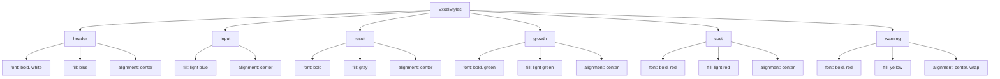

# ExcelJS Marketing Operations Implementation

This directory contains the modern implementation of the ONE52 Bar & Grill marketing operations spreadsheet generator using ExcelJS.

## Directory Structure

## File Size Comparison

| File | Size | Lines | Last Modified | Description |
|------|------|-------|---------------|-------------|
| generate-marketing-spreadsheet.ts | 3.1KB | 86 | 2025-04-02 14:36:09 | Main implementation file containing campaign calculations and Excel generation |
| config/constants.ts | 2.5KB | 47 | 2025-04-02 14:36:09 | Configuration constants and app parameters |
| config/styles.ts | 1.4KB | 33 | 2025-04-02 14:36:09 | Excel styling definitions |
| types/types.ts | 2.4KB | 104 | 2025-04-02 14:36:09 | Core type definitions |
| types/index.ts | 561B | 33 | 2025-04-02 14:36:09 | Type exports |
| **Total** | **10KB** | **303** | 2025-04-02 14:53:24 | Complete implementation |

## Implementation Comparison

| Metric | ExcelJS | Excel4Node |
|--------|---------|------------|
| Total Size | 10KB | 13KB |
| Main File Size | 3.1KB | 12KB |
| Lines of Code | 303 | 323 |
| Files | 6 | 2 |
| Type Definitions | 2 files | 1 file |
| Configuration | Separated | Inline |
| Styling | Modular | Inline |
| Last Modified | 2025-04-02 14:53:24 | 2025-04-02 14:36:09 |

## Type System

```mermaid
classDiagram
    class MarketingCampaignData {
        +CampaignParameters parameters
        +WeeklyCalculations weeklyCalculations
        +MonthlyCalculations monthlyCalculations
        +AnnualCalculations annualCalculations
        +AdditionalRevenueConsiderations additionalRevenueConsiderations
        +BreakEvenAnalysis breakEvenAnalysis
    }

    class CampaignParameters {
        +number availableStamps
        +number costPerStamp
        +number weeklyTargetRecipients
        +number conversionRate
        +number currentWeeklyRevenue
        +number averageCustomerValue
    }

    class WeeklyCalculations {
        +number recipients
        +number newCustomers
        +number weeklyRevenueFromNewCustomers
        +number totalWeeklyRevenueWithNewCustomers
        +number weeklyStampCost
        +number netWeeklyRevenue
    }

    class MonthlyCalculations {
        +number recipients
        +number newCustomers
        +number monthlyRevenueFromNewCustomers
        +number totalMonthlyRevenueWithNewCustomers
        +number monthlyStampCost
        +number netMonthlyRevenue
    }

    class AnnualCalculations {
        +number recipients
        +number newCustomers
        +number annualRevenueFromNewCustomers
        +number totalAnnualRevenueWithNewCustomers
        +number annualStampCost
        +number netAnnualRevenue
    }

    class AdditionalRevenueConsiderations {
        +number repeatCustomerRate
        +number repeatVisitsPerCustomer
        +number additionalAnnualRevenueFromRepeatCustomers
        +number netAnnualRevenueWithRepeatCustomers
        +number wordOfMouthEffect
        +number additionalAnnualRevenueFromWordOfMouth
    }

    class BreakEvenAnalysis {
        +number requiredNewCustomersToBreakEven
        +number requiredConversionRateToBreakEven
    }

    MarketingCampaignData --> CampaignParameters
    MarketingCampaignData --> WeeklyCalculations
    MarketingCampaignData --> MonthlyCalculations
    MarketingCampaignData --> AnnualCalculations
    MarketingCampaignData --> AdditionalRevenueConsiderations
    MarketingCampaignData --> BreakEvenAnalysis
```

## Excel Structure

## Data Flow

## Styling System

## Key Features

1. **Modern Implementation**
   - Uses ExcelJS library
   - Modular TypeScript architecture
   - Separated configuration
   - Total codebase size: 10KB (6 files)

2. **Type Safety**
   - Full TypeScript implementation
   - Strong type checking
   - Interface-based design

3. **Excel Generation**
   - Professional formatting
   - Dynamic formulas
   - Multiple worksheets
   - Custom styling

4. **Business Logic**
   - Campaign calculations
   - Revenue projections
   - Cost analysis
   - Break-even calculations

5. **Data Validation**
   - Parameter validation
   - Formula verification
   - Expected vs. actual checks

## Dependencies
- ExcelJS: ^4.4.0
- TypeScript: ^5.3.3 