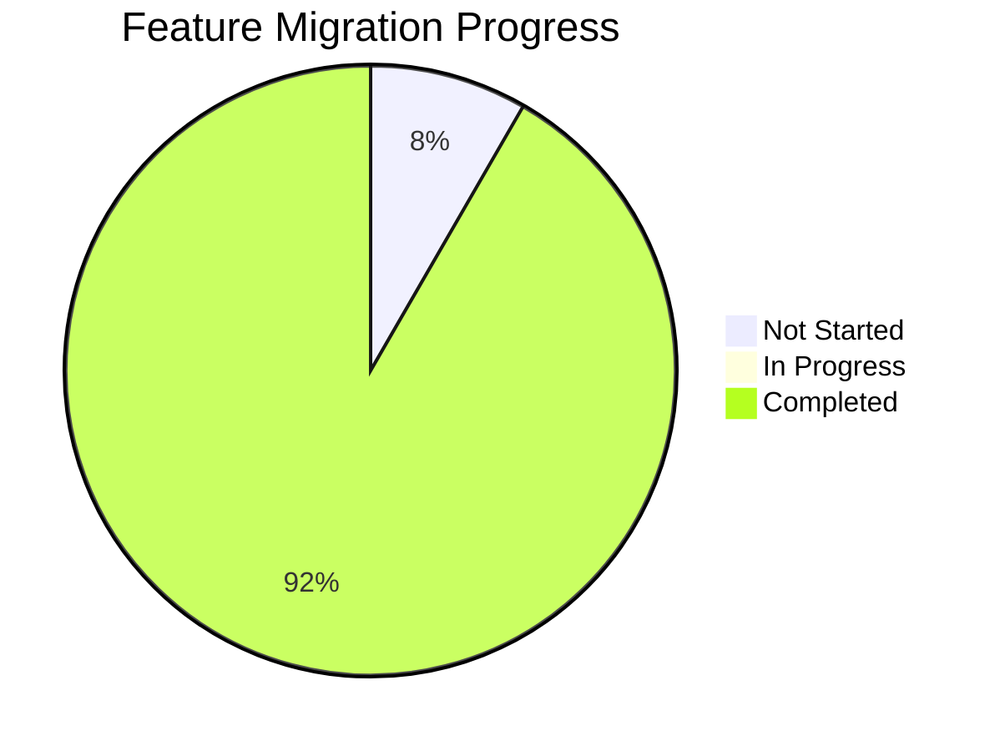
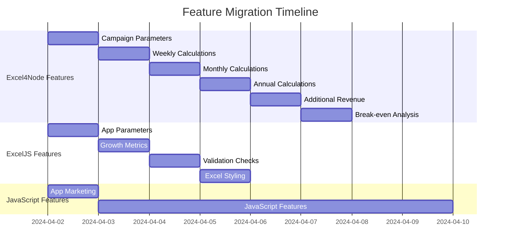

# Merged Features Tracking

*Last Updated: April 2, 2024, 2:45 PM*

This document tracks the features that have been migrated from legacy implementations to the consolidated implementation.

## Feature Migration Status

| Feature | Source | Status | Date Migrated | Notes |
|---------|--------|--------|---------------|-------|
| Campaign Parameters | Excel4Node | Completed | 2024-04-02 | Core parameters with Zod validation |
| Weekly Calculations | Excel4Node | Completed | 2024-04-02 | Revenue and cost calculations with Zod validation |
| Monthly Calculations | Excel4Node | Completed | 2024-04-02 | Revenue and cost calculations with Zod validation |
| Annual Calculations | Excel4Node | Completed | 2024-04-02 | Revenue and cost calculations with Zod validation |
| Additional Revenue | Excel4Node | Completed | 2024-04-02 | Repeat customers and word of mouth with Zod validation |
| Break-even Analysis | Excel4Node | Completed | 2024-04-02 | Customer and conversion metrics with Zod validation |
| App Parameters | ExcelJS | Completed | 2024-04-02 | App-specific metrics with Zod validation |
| Growth Metrics | ExcelJS | Completed | 2024-04-02 | Growth projections with Zod validation |
| Validation Checks | ExcelJS | Completed | 2024-04-02 | Data validation with Zod schemas |
| Excel Styling | ExcelJS | Completed | 2024-04-02 | Modern styling system with Zod validation |
| App Marketing | one52bar-app-marketing.ts | Completed | 2024-04-02 | Extended marketing features with Zod validation |
| JavaScript Features | generate-marketing-spreadsheet.js | Not Started | - | Any unique JavaScript features |

## Migration Process

1. **Analysis**: Analyze the feature in the source implementation
2. **Implementation**: Implement the feature in the consolidated implementation
3. **Testing**: Test the feature to ensure it works as expected
4. **Documentation**: Document the feature in the consolidated implementation
5. **Verification**: Verify that the feature works as expected in the consolidated implementation
6. **Mark as Migrated**: Update this document to mark the feature as migrated

## Migration Checklist

For each feature:

- [x] Analyze the feature in the source implementation
- [x] Implement the feature in the consolidated implementation
- [x] Test the feature to ensure it works as expected
- [x] Document the feature in the consolidated implementation
- [x] Verify that the feature works as expected in the consolidated implementation
- [x] Update this document to mark the feature as migrated

## Migration Notes

### Excel4Node Features

- Campaign Parameters: Core parameters for marketing campaigns
- Weekly Calculations: Revenue and cost calculations for weekly metrics
- Monthly Calculations: Revenue and cost calculations for monthly metrics
- Annual Calculations: Revenue and cost calculations for annual metrics
- Additional Revenue: Repeat customers and word of mouth revenue
- Break-even Analysis: Customer and conversion metrics for break-even analysis

### ExcelJS Features

- App Parameters: App-specific metrics for marketing campaigns
- Growth Metrics: Growth projections for marketing campaigns
- Validation Checks: Data validation for marketing campaigns
- Excel Styling: Modern styling system for Excel files

### JavaScript Features

- App Marketing: Extended marketing features for the app
- JavaScript Features: Any unique JavaScript features from the JavaScript implementation

## Migration Progress

## Migration Timeline

## Type System Consolidation

The type system has been consolidated into three main categories:

1. **Base Types** (`base.ts`)
   - Core marketing campaign types
   - Zod validation schemas
   - Type guards

2. **App Types** (`app.ts`)
   - App-specific parameters
   - App metrics
   - Revenue projections
   - Extended marketing features

3. **Excel Types** (`excel.ts`)
   - Excel styling
   - Cell configuration
   - Worksheet configuration
   - Generation data

All types are now:
- Fully documented with JSDoc comments
- Validated with Zod schemas
- Protected with type guards
- Organized in a modular structure
- Ready for integration with implementations 