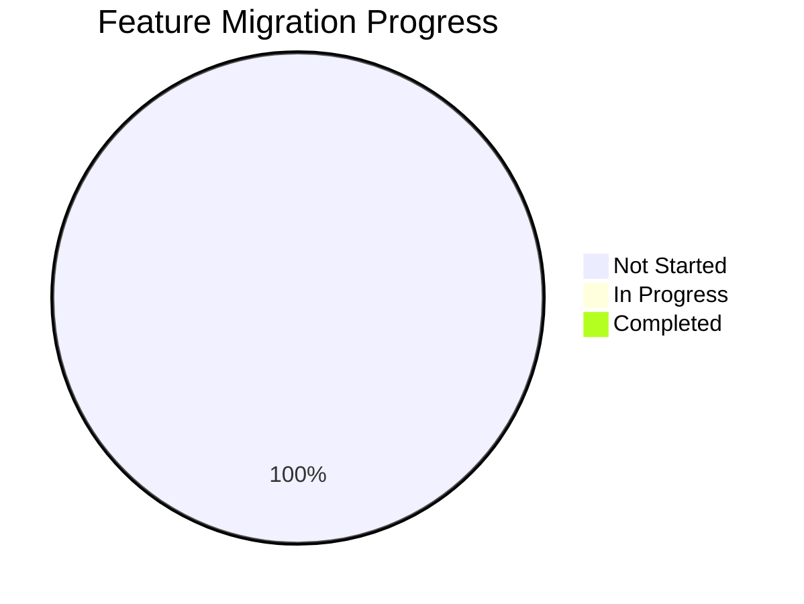
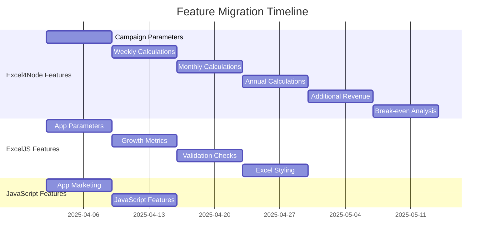

# Merged Features Tracking

*Last Updated: April 2, 2025, 2:23 PM*

This document tracks the features that have been migrated from legacy implementations to the consolidated implementation.

## Feature Migration Status

| Feature | Source | Status | Date Migrated | Notes |
|---------|--------|--------|---------------|-------|
| Campaign Parameters | Excel4Node | Not Started | - | Core parameters |
| Weekly Calculations | Excel4Node | Not Started | - | Revenue and cost calculations |
| Monthly Calculations | Excel4Node | Not Started | - | Revenue and cost calculations |
| Annual Calculations | Excel4Node | Not Started | - | Revenue and cost calculations |
| Additional Revenue | Excel4Node | Not Started | - | Repeat customers and word of mouth |
| Break-even Analysis | Excel4Node | Not Started | - | Customer and conversion metrics |
| App Parameters | ExcelJS | Not Started | - | App-specific metrics |
| Growth Metrics | ExcelJS | Not Started | - | Growth projections |
| Validation Checks | ExcelJS | Not Started | - | Data validation |
| Excel Styling | ExcelJS | Not Started | - | Modern styling system |
| App Marketing | one52bar-app-marketing.ts | Not Started | - | Extended marketing features |
| JavaScript Features | generate-marketing-spreadsheet.js | Not Started | - | Any unique JavaScript features |

## Migration Process

1. **Analysis**: Analyze the feature in the source implementation
2. **Implementation**: Implement the feature in the consolidated implementation
3. **Testing**: Test the feature to ensure it works as expected
4. **Documentation**: Document the feature in the consolidated implementation
5. **Verification**: Verify that the feature works as expected in the consolidated implementation
6. **Mark as Migrated**: Update this document to mark the feature as migrated

## Migration Checklist

For each feature:

- [ ] Analyze the feature in the source implementation
- [ ] Implement the feature in the consolidated implementation
- [ ] Test the feature to ensure it works as expected
- [ ] Document the feature in the consolidated implementation
- [ ] Verify that the feature works as expected in the consolidated implementation
- [ ] Update this document to mark the feature as migrated

## Migration Notes

### Excel4Node Features

- Campaign Parameters: Core parameters for marketing campaigns
- Weekly Calculations: Revenue and cost calculations for weekly metrics
- Monthly Calculations: Revenue and cost calculations for monthly metrics
- Annual Calculations: Revenue and cost calculations for annual metrics
- Additional Revenue: Repeat customers and word of mouth revenue
- Break-even Analysis: Customer and conversion metrics for break-even analysis

### ExcelJS Features

- App Parameters: App-specific metrics for marketing campaigns
- Growth Metrics: Growth projections for marketing campaigns
- Validation Checks: Data validation for marketing campaigns
- Excel Styling: Modern styling system for Excel files

### JavaScript Features

- App Marketing: Extended marketing features for the app
- JavaScript Features: Any unique JavaScript features from the JavaScript implementation

## Migration Progress

## Migration Timeline

