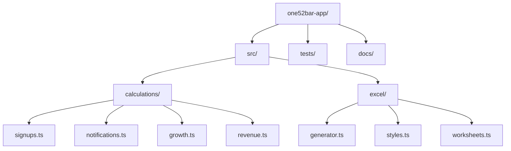
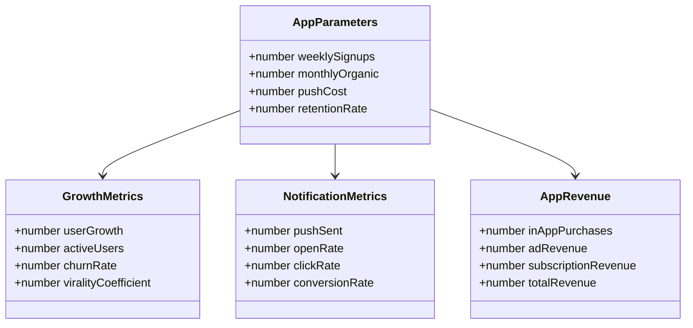
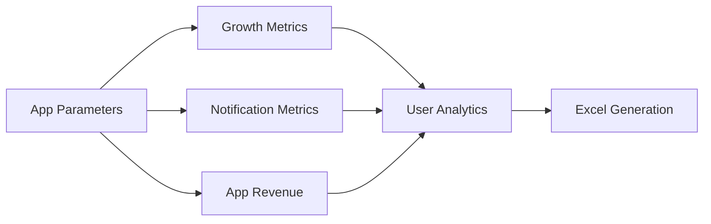

# ONE52 Bar & Grill - App Marketing Operations

This directory contains the app-specific marketing functionality for ONE52 Bar & Grill's mobile application.

## Directory Structure

## Component Overview

## Data Flow

## Key Features

1. **App Signup Analytics**
   - Weekly signup tracking
   - Monthly organic growth
   - User acquisition costs
   - Signup source analysis

2. **Push Notification Management**
   - Notification cost tracking
   - Open rate analysis
   - Click-through rates
   - Conversion tracking

3. **Growth Metrics**
   - User growth rate
   - Active user tracking
   - Churn rate analysis
   - Virality coefficient

4. **Revenue Analysis**
   - In-app purchase tracking
   - Ad revenue monitoring
   - Subscription revenue
   - Total revenue projections

5. **Excel Generation**
   - User analytics dashboard
   - Revenue projections
   - Growth metrics
   - ROI analysis

## Dependencies

- TypeScript
- ExcelJS
- Shared types and utilities
- Testing framework

## Usage

1. Configure app parameters
2. Track user metrics
3. Monitor notifications
4. Generate analytics report

## Testing

- Unit tests for calculations
- Integration tests for Excel generation
- Validation tests for parameters
- Performance benchmarks 