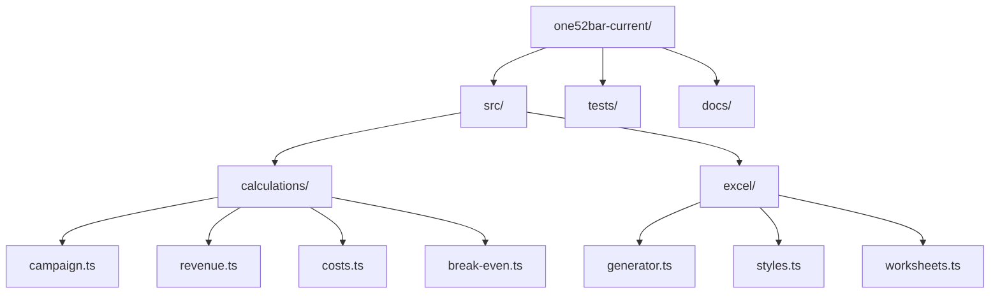
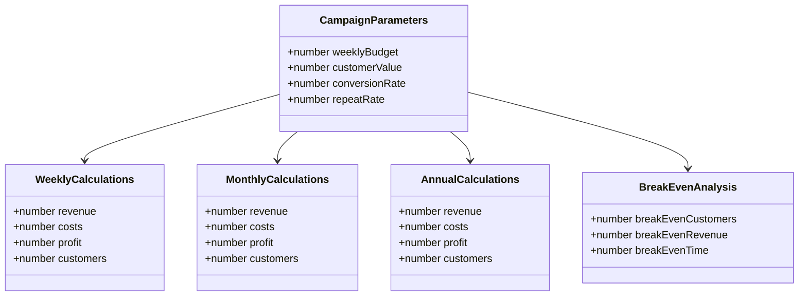
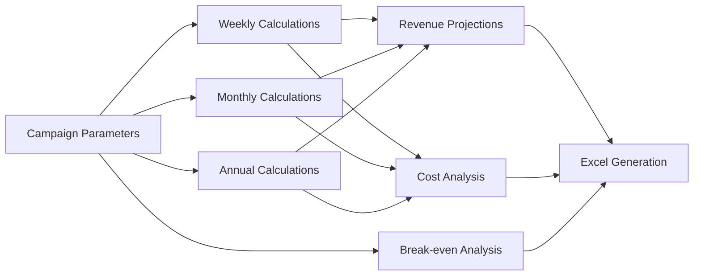

# ONE52 Bar & Grill - Current Marketing Operations

This directory contains the core marketing operations functionality for ONE52 Bar & Grill's current marketing campaigns.

## Directory Structure

## Component Overview

## Data Flow

## Key Features

1. **Campaign Parameters**
   - Weekly budget allocation
   - Customer value estimation
   - Conversion rate tracking
   - Repeat customer rate

2. **Revenue Calculations**
   - Weekly revenue projections
   - Monthly revenue tracking
   - Annual revenue forecasting
   - Additional revenue streams

3. **Cost Analysis**
   - Marketing costs
   - Operational costs
   - Customer acquisition costs
   - Cost per conversion

4. **Break-even Analysis**
   - Customer break-even point
   - Revenue break-even point
   - Time to break-even
   - Profit margins

5. **Excel Generation**
   - Professional formatting
   - Multiple worksheets
   - Data validation
   - Automated calculations

## Dependencies

- TypeScript
- ExcelJS
- Shared types and utilities
- Testing framework

## Usage

1. Import campaign parameters
2. Run calculations
3. Generate Excel report
4. Analyze results

## Testing

- Unit tests for all calculations
- Integration tests for Excel generation
- Validation tests for parameters
- Performance benchmarks 