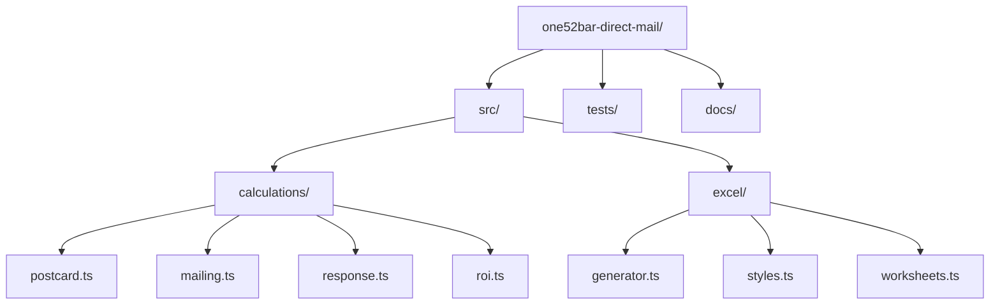
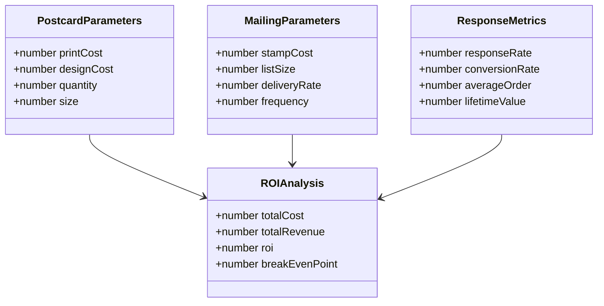
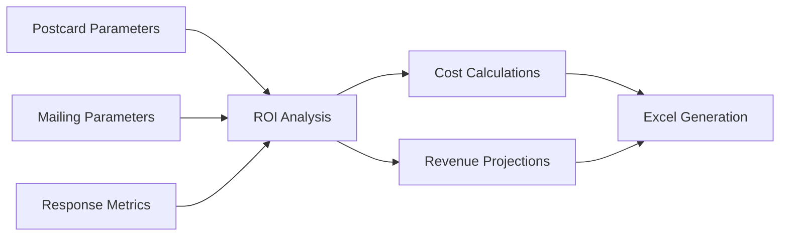

# ONE52 Bar & Grill - Direct Mail Marketing Operations

This directory contains the direct mail marketing functionality for ONE52 Bar & Grill's postcard campaigns.

## Directory Structure

## Component Overview

## Data Flow

## Key Features

1. **Postcard Campaign Management**
   - Print cost calculations
   - Design cost tracking
   - Quantity optimization
   - Size and format options

2. **Mailing List Management**
   - List size tracking
   - Stamp cost calculations
   - Delivery rate monitoring
   - Mailing frequency optimization

3. **Response Tracking**
   - Response rate analysis
   - Conversion rate tracking
   - Average order value
   - Customer lifetime value

4. **ROI Analysis**
   - Total cost calculation
   - Revenue projection
   - ROI calculation
   - Break-even analysis

5. **Excel Generation**
   - Campaign summary
   - Cost breakdown
   - Response analysis
   - ROI projections

## Dependencies

- TypeScript
- ExcelJS
- Shared types and utilities
- Testing framework

## Usage

1. Configure postcard parameters
2. Set up mailing list
3. Track responses
4. Generate ROI report

## Testing

- Unit tests for calculations
- Integration tests for Excel generation
- Validation tests for parameters
- Performance benchmarks 