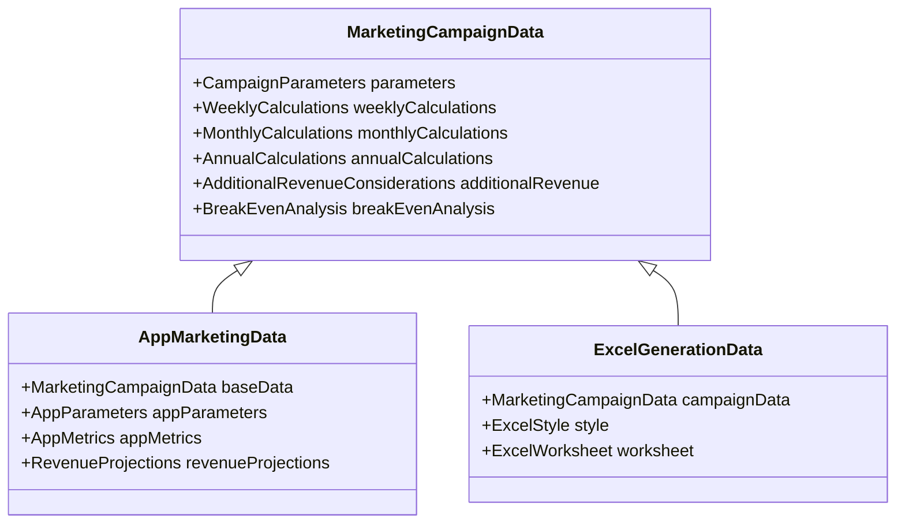

# Type System Consolidation Plan

*Last Updated: April 2, 2024, 2:30 PM*

## Overview

This document outlines the plan for consolidating the type system across all marketing operations implementations. The goal is to create a unified, type-safe system that can be used across all marketing operations features.

## Current Type System Analysis

### 1. Core Marketing Types (src/types/types.ts)
- Campaign Parameters
- Weekly/Monthly/Annual Calculations
- Additional Revenue Considerations
- Break-Even Analysis
- Excel Styling Types

### 2. App Marketing Types (one52bar-app-marketing.ts)
- App-specific Parameters
- App Metrics
- Revenue Projections
- Extended Marketing Features

### 3. Excel Generation Types
- Excel4Node Implementation
- ExcelJS Implementation
- JavaScript Implementation

## Consolidation Strategy

### Phase 1: Core Type System
1. Create base interfaces for all marketing operations
2. Implement Zod schemas for validation
3. Create utility types for common operations
4. Document type usage and relationships

### Phase 2: Feature-Specific Types
1. Extend core types for app-specific features
2. Create specialized types for Excel generation
3. Implement type guards and assertions
4. Add comprehensive JSDoc documentation

### Phase 3: Integration
1. Update all implementations to use new type system
2. Add type tests and validation
3. Create type migration guide
4. Update documentation

## Type System Architecture

## Implementation Plan

### Week 1: Core Type System
- [ ] Create base interfaces
- [ ] Implement Zod schemas
- [ ] Add utility types
- [ ] Write type tests

### Week 2: Feature-Specific Types
- [ ] Extend for app features
- [ ] Create Excel types
- [ ] Add type guards
- [ ] Update documentation

### Week 3: Integration
- [ ] Update implementations
- [ ] Add validation
- [ ] Create migration guide
- [ ] Final documentation

## Type Migration Checklist

For each type:
- [ ] Analyze current usage
- [ ] Create new type definition
- [ ] Add Zod schema
- [ ] Write type tests
- [ ] Update implementations
- [ ] Document changes
- [ ] Verify compatibility

## Type System Guidelines

1. **Naming Conventions**
   - Use PascalCase for interfaces and types
   - Use camelCase for properties
   - Prefix interfaces with 'I' only when necessary
   - Use descriptive names that reflect domain concepts

2. **Type Safety**
   - Avoid `any` type
   - Use strict type checking
   - Implement proper type guards
   - Add runtime validation with Zod

3. **Documentation**
   - Add JSDoc comments to all types
   - Document type relationships
   - Include usage examples
   - Keep documentation up-to-date

4. **Testing**
   - Write type tests
   - Test type guards
   - Verify Zod schemas
   - Check type compatibility

## Next Steps

1. Begin with core type system implementation
2. Create base interfaces and Zod schemas
3. Add utility types and type guards
4. Update documentation
5. Start migration of existing implementations 