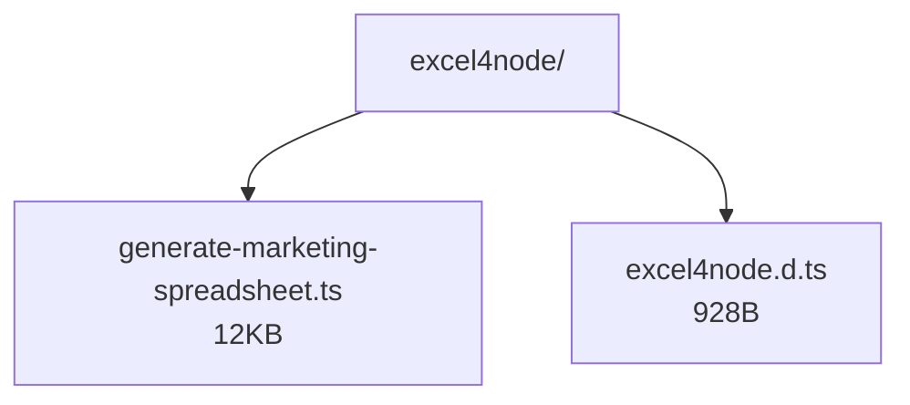
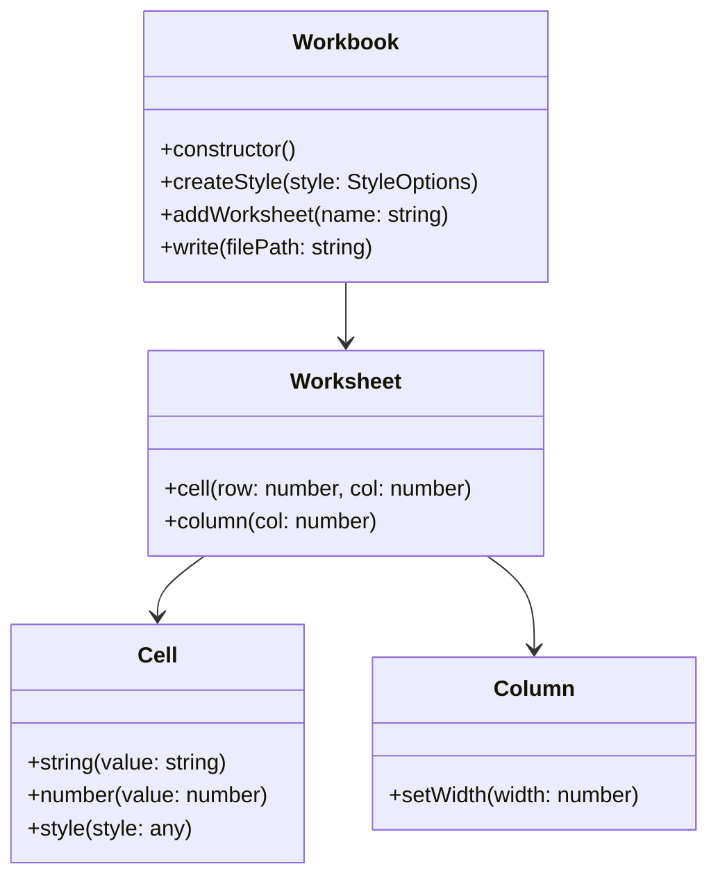
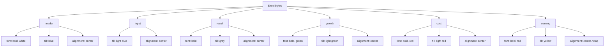

# Excel4Node Marketing Operations Implementation

This directory contains the legacy implementation of the ONE52 Bar & Grill marketing operations spreadsheet generator using Excel4Node.

## Directory Structure

## File Size Comparison

| File | Size | Lines | Description |
|------|------|-------|-------------|
| generate-marketing-spreadsheet.ts | 12KB | 279 | Main implementation file containing campaign calculations and Excel generation |
| excel4node.d.ts | 928B | 44 | TypeScript type definitions for Excel4Node library |

## Type System

```mermaid
classDiagram
    class MarketingCampaignData {
        +CampaignParameters parameters
        +WeeklyCalculations weeklyCalculations
        +MonthlyCalculations monthlyCalculations
        +AnnualCalculations annualCalculations
        +AdditionalRevenueConsiderations additionalRevenueConsiderations
        +BreakEvenAnalysis breakEvenAnalysis
    }

    class CampaignParameters {
        +number availableStamps
        +number costPerStamp
        +number weeklyTargetRecipients
        +number conversionRate
        +number currentWeeklyRevenue
        +number averageCustomerValue
    }

    class WeeklyCalculations {
        +number recipients
        +number newCustomers
        +number weeklyRevenueFromNewCustomers
        +number totalWeeklyRevenueWithNewCustomers
        +number weeklyStampCost
        +number netWeeklyRevenue
    }

    class MonthlyCalculations {
        +number recipients
        +number newCustomers
        +number monthlyRevenueFromNewCustomers
        +number totalMonthlyRevenueWithNewCustomers
        +number monthlyStampCost
        +number netMonthlyRevenue
    }

    class AnnualCalculations {
        +number recipients
        +number newCustomers
        +number annualRevenueFromNewCustomers
        +number totalAnnualRevenueWithNewCustomers
        +number annualStampCost
        +number netAnnualRevenue
    }

    class AdditionalRevenueConsiderations {
        +number repeatCustomerRate
        +number repeatVisitsPerCustomer
        +number additionalAnnualRevenueFromRepeatCustomers
        +number netAnnualRevenueWithRepeatCustomers
        +number wordOfMouthEffect
        +number additionalAnnualRevenueFromWordOfMouth
    }

    class BreakEvenAnalysis {
        +number requiredNewCustomersToBreakEven
        +number requiredConversionRateToBreakEven
    }

    MarketingCampaignData --> CampaignParameters
    MarketingCampaignData --> WeeklyCalculations
    MarketingCampaignData --> MonthlyCalculations
    MarketingCampaignData --> AnnualCalculations
    MarketingCampaignData --> AdditionalRevenueConsiderations
    MarketingCampaignData --> BreakEvenAnalysis
```

## Excel4Node API

## Data Flow

```mermaid
flowchart LR
    A[Input Parameters] --> B[Weekly Calculations]
    B --> C[Monthly Calculations]
    C --> D[Annual Calculations]
    D --> E[Additional Revenue]
    E --> F[Break-even Analysis]
    
    subgraph Calculations
        B
        C
        D
        E
        F
    end
    
    subgraph Excel Generation
        G[Workbook Creation]
        H[Worksheet Setup]
        I[Style Application]
        J[Data Population]
        K[File Writing]
    end
    
    F --> G
    G --> H
    H --> I
    I --> J
    J --> K
```

## Styling System

## Key Features

1. **Legacy Implementation**
   - Uses Excel4Node library
   - TypeScript type definitions
   - Comprehensive calculations
   - Total codebase size: 13KB (12KB + 928B)

2. **Campaign Data Structure**
   - Weekly, monthly, and annual metrics
   - Revenue projections
   - Cost analysis
   - Break-even calculations

3. **Excel Generation**
   - Multiple worksheets
   - Custom styling
   - Formula support
   - Data validation

4. **Business Logic**
   - Marketing campaign calculations
   - Revenue projections
   - Customer acquisition costs
   - ROI analysis

5. **App Parameters**
   - Weekly signups
   - Organic growth
   - Push notification costs
   - Order values
   - Delivery metrics

## Dependencies
- excel4node: Latest version
- TypeScript: ^5.3.3 