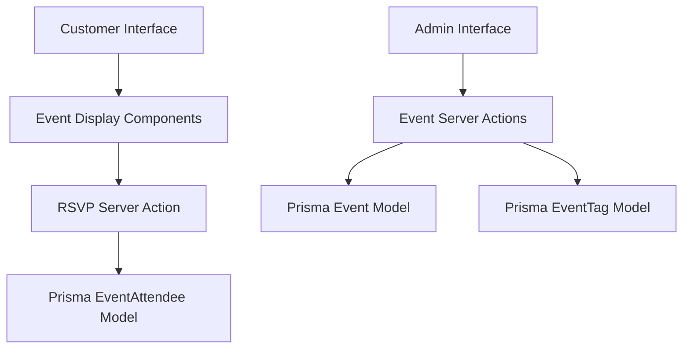

# Events System Implementation Plan

## Overview
This document outlines the plan for implementing the Events system for ONE-52 Bar & Grill. The Events system will allow administrators to create and manage events, while customers can view the event calendar and RSVP to upcoming events. The database models are already in place, but the UI and server actions need to be implemented.

## Current Status
- Database models created (`Event`, `EventTag`, `EventAttendee`)
- Basic structures in place
- No admin UI for event management
- No customer-facing event calendar
- No RSVP functionality

## System Architecture



## Data Models

### Event Model
```prisma
model Event {
  id          String          @id @default(cuid())
  title       String
  description String
  startDate   DateTime
  endDate     DateTime
  location    String
  imagePath   String?
  published   Boolean         @default(false)
  createdAt   DateTime        @default(now())
  updatedAt   DateTime        @updatedAt
  tags        EventTag[]
  attendees   EventAttendee[]
}
```

### EventTag Model
```prisma
model EventTag {
  id        String   @id @default(cuid())
  name      String
  color     String
  createdAt DateTime @default(now())
  updatedAt DateTime @updatedAt
  events    Event[]
}
```

### EventAttendee Model
```prisma
model EventAttendee {
  id        String   @id @default(cuid())
  eventId   String
  name      String
  email     String
  phone     String?
  status    String   // CONFIRMED, PENDING, CANCELLED
  createdAt DateTime @default(now())
  updatedAt DateTime @updatedAt
  event     Event    @relation(fields: [eventId], references: [id])
}
```

## Implementation Tasks

### 1. Server Actions

#### Event Management Actions
Create the following server actions in `/src/actions/eventActions.ts`:

- `getEvents(filters?: EventFilters)`: Get all events with optional filtering
- `getEventById(id: string)`: Get a single event by ID
- `createEvent(formData: FormData)`: Create a new event
- `updateEvent(formData: FormData)`: Update an existing event
- `deleteEvent(id: string)`: Delete an event
- `publishEvent(id: string, publish: boolean)`: Publish or unpublish an event

#### Tag Management Actions
- `getEventTags()`: Get all event tags
- `createEventTag(formData: FormData)`: Create a new event tag
- `updateEventTag(formData: FormData)`: Update an existing tag
- `deleteEventTag(id: string)`: Delete a tag

#### RSVP Actions
- `rsvpToEvent(formData: FormData)`: RSVP to an event
- `getEventAttendees(eventId: string)`: Get attendees for an event
- `updateAttendeeStatus(attendeeId: string, status: string)`: Update attendee status

### 2. Admin Interface

#### Event Management UI
Create the following pages:

- `/admin/events/page.tsx`: Event listing with search, filter, and actions
- `/admin/events/[id]/page.tsx`: Event edit page
- `/admin/events/new/page.tsx`: Create new event page
- `/admin/events/tags/page.tsx`: Tag management page

#### Components
- `EventForm.tsx`: Form for creating/editing events
- `EventList.tsx`: Table of events with actions
- `TagForm.tsx`: Form for creating/editing tags
- `TagList.tsx`: Table of tags with actions
- `AttendeeList.tsx`: Table of attendees with status management

### 3. Customer-Facing UI

#### Event Calendar
- `/events/page.tsx`: Events calendar view
- `/events/[id]/page.tsx`: Single event details page with RSVP form

#### Components
- `EventCalendar.tsx`: Monthly/weekly calendar view of events
- `EventCard.tsx`: Card display for a single event
- `EventDetails.tsx`: Detailed view of an event
- `RSVPForm.tsx`: Form for event registration

### 4. Validation & Error Handling

#### Zod Schemas
Create validation schemas for:
- Event creation/updating
- Tag creation/updating
- RSVP submission

#### Error Handling
- Implement standardized error types
- Add client-side validation
- Create proper error responses

## Implementation Timeline

### Phase 1: Admin Backend (Week 1)
- Day 1-2: Implement event server actions
- Day 3-4: Implement tag server actions
- Day 5: Create and test validation schemas

### Phase 2: Admin UI (Week 2)
- Day 1-2: Create event management UI
- Day 3: Implement tag management UI
- Day 4-5: Add attendee management UI

### Phase 3: Customer-Facing UI (Week 3)
- Day 1-2: Create event calendar view
- Day 3-4: Implement single event view with RSVP
- Day 5: Add search and filtering capabilities

### Phase 4: Testing & Polish (Week 4)
- Day 1-2: Comprehensive testing
- Day 3-4: UI refinement and responsive design
- Day 5: Documentation and deployment preparation

## Technical Considerations

### Image Handling
- Implement image upload for event banners
- Add image optimization

### Date & Time Handling
- Use proper timezone support
- Implement recurring event support (future enhancement)

### Performance
- Implement pagination for event lists
- Add caching for frequently viewed events
- Optimize database queries

## Extensions & Future Enhancements

### Phase 2 Enhancements
- Recurring events
- Event categories
- Event capacity limits
- Waitlist functionality
- Ticket sales integration
- Social sharing

## Conclusion
The Events system will provide a comprehensive solution for managing and displaying events at ONE-52 Bar & Grill. By implementing this plan, we will create a robust feature that allows admins to easily manage events and customers to discover and RSVP to upcoming activities at the venue. The implementation will follow the same patterns established in the TapPass and Merchandise systems for consistency across the application. 