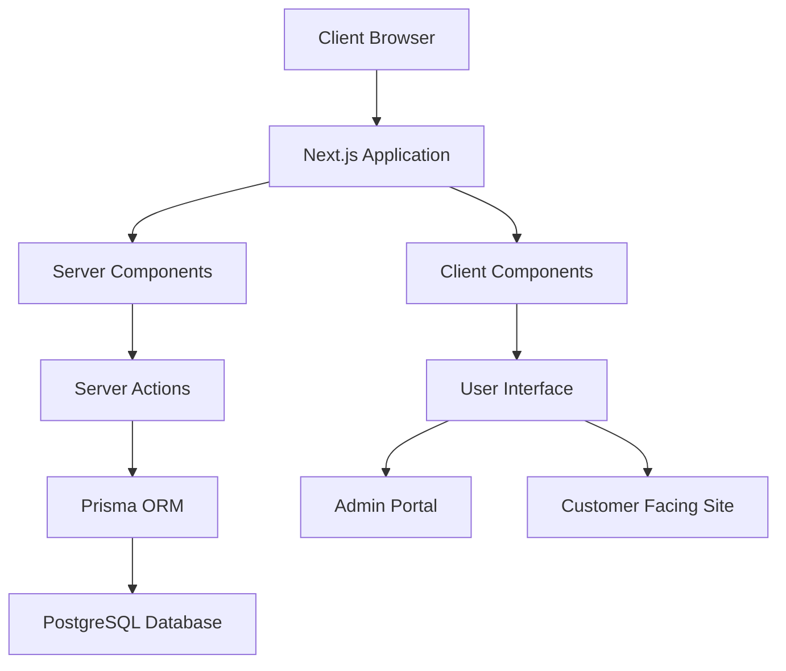
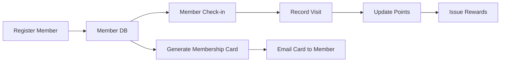
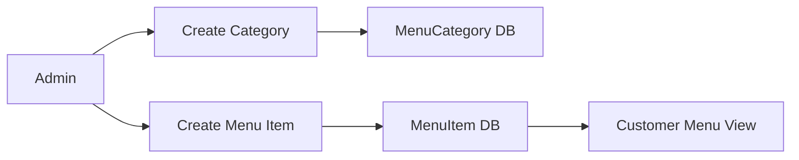
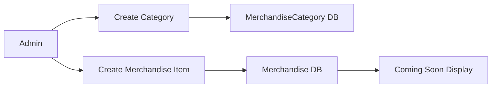
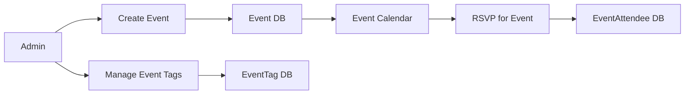

# ONE-52 Bar & Grill - Project Status

## Overview
This document provides a comprehensive overview of the current state of the ONE-52 Bar & Grill web application. It outlines what has been implemented, what is still in progress, and what remains to be done. This document serves as both a technical reference for developers and a simplified guide for staff to understand the system's capabilities.

## Application Architecture



## System Features Status

### Core Features

| Feature | Status | Prisma Model | CRUD Implemented | Notes |
|---------|--------|--------------|-----------------|-------|
| TapPass Membership | ✅ Complete | `Member`, `Visit`, `Reward` | Yes | Fully integrated with Prisma DB |
| Menu System | ✅ Complete | `MenuItem`, `MenuCategory` | Yes | Admin dashboard & customer view |
| Merchandise | ✅ Complete | `Merchandise`, `MerchandiseCategory` | Yes | Admin dashboard & "Coming Soon" display |
| Events | 🟡 In Progress | `Event`, `EventTag`, `EventAttendee` | Partial | Basic models exist, UI in progress |
| User Authentication | 🔴 Not Started | N/A | No | Planned for future phase |
| Settings | 🔴 Not Started | `SiteSettings` | No | Planned for future phase |

### TapPass System



#### Status:

- ✅ Member registration with email and phone validation
- ✅ Database persistence using Prisma
- ✅ Membership card generation
- ✅ Member lookup by email or phone
- ✅ Visit tracking system
- ✅ Points calculation based on visits
- ✅ Admin dashboard for member management
- 🟡 Reward redemption system (model exists, UI not implemented)

### Menu System



#### Status:

- ✅ Menu categories management
- ✅ Menu items with prices, descriptions, and images
- ✅ Admin interface for menu management
- ✅ Customer-facing menu display
- ✅ Filtering by category
- ✅ Featured items highlighting

### Merchandise System



#### Status:

- ✅ Merchandise categories management
- ✅ Merchandise items with prices, descriptions, and images
- ✅ In-stock and Coming Soon status
- ✅ Admin dashboard for merchandise management
- ✅ Customer-facing "Coming Soon" display

### Events System



#### Status:

- ✅ Database models created
- 🟡 Basic event management (partial)
- 🟡 Event calendar display (partial)
- 🔴 RSVP functionality (not started)
- 🔴 Event attendance tracking (not started)

## Database Models

The following models exist in the Prisma schema:

### Core Models

#### Member Model
```prisma
model Member {
  id              String           @id @default(cuid())
  memberId        String           @unique // ONE52-XXXX-YYYY format
  name            String
  email           String           @unique
  phoneNumber     String           @unique
  birthday        DateTime
  joinDate        DateTime         @default(now())
  membershipLevel MembershipLevel  @default(BRONZE)
  agreeToTerms    Boolean
  createdAt       DateTime         @default(now())
  updatedAt       DateTime         @updatedAt
  visits          Visit[]
  rewards         Reward[]
}
```

#### MenuItem Model
```prisma
model MenuItem {
  id          String       @id @default(cuid())
  name        String
  description String
  price       String
  imagePath   String?
  featured    Boolean      @default(false)
  available   Boolean      @default(true)
  categoryId  String
  sortOrder   Int          @default(100)
  createdAt   DateTime     @default(now())
  updatedAt   DateTime     @updatedAt
  category    MenuCategory @relation(fields: [categoryId], references: [id])
}
```

#### Merchandise Model
```prisma
model Merchandise {
  id          String               @id @default(cuid())
  name        String
  description String
  price       String
  imagePath   String?
  inStock     Boolean              @default(false)
  comingSoon  Boolean              @default(true)
  sortOrder   Int                  @default(100)
  categoryId  String
  createdAt   DateTime             @default(now())
  updatedAt   DateTime             @updatedAt
  category    MerchandiseCategory  @relation(fields: [categoryId], references: [id])
}
```

#### Event Model
```prisma
model Event {
  id          String          @id @default(cuid())
  title       String
  description String
  startDate   DateTime
  endDate     DateTime
  location    String
  imagePath   String?
  published   Boolean         @default(false)
  createdAt   DateTime        @default(now())
  updatedAt   DateTime        @updatedAt
  tags        EventTag[]
  attendees   EventAttendee[]
}
```

## Remaining Tasks

### High Priority
1. **Complete Events System**
   - Implement event creation/editing admin interface
   - Create event calendar display
   - Add RSVP functionality
   - Implement attendance tracking

2. **Improve Error Handling**
   - Standardize error types and formats
   - Implement consistent error handling in server actions
   - Add client-side error handling components
   - Improve error messages for better user experience

3. **Clean Up Prisma Schema**
   - Remove test models automatically generated
   - Organize schema with proper comments
   - Ensure all relationships are properly defined

### Medium Priority
1. **Implement User Authentication**
   - Add NextAuth.js integration
   - Create user roles (admin, staff, customer)
   - Secure admin routes
   - Add login/logout functionality

2. **Deploy to Production**
   - Set up production database
   - Configure environment variables
   - Set up CI/CD pipeline
   - Implement SSL

3. **Enhance UI/UX**
   - Improve responsive design
   - Add loading states
   - Implement dark/light mode
   - Add animations

### Low Priority
1. **Analytics Dashboard**
   - Track page views
   - Monitor TapPass usage
   - Generate sales reports
   - Visualize member growth

2. **Email Notifications**
   - Event reminders
   - Special promotions
   - Birthday rewards
   - Membership updates

## Implementation Plans

### Events System Completion
1. Create admin interface for event management
2. Implement event calendar with filtering
3. Add RSVP functionality with confirmation emails
4. Implement attendance tracking at check-in

### Prisma Schema Cleanup
1. Identify and remove unused test models
2. Organize related models together
3. Add proper documentation to all models
4. Ensure consistent naming conventions

### User Authentication
1. Install NextAuth.js and dependencies
2. Create User model with role-based permissions
3. Implement login/signup pages
4. Secure admin routes with middleware

## Development Guidelines

### Code Structure
- Server actions in `/src/actions/`
- UI components in `/src/components/`
- Pages in `/src/app/`
- Database models in `/prisma/schema.prisma`

### Best Practices
- Always use Zod for form validation
- Implement proper error handling
- Use TypeScript for type safety
- Document complex functions
- Include unit tests for critical functionality

## Conclusion
The ONE-52 Bar & Grill application has made significant progress with core features like TapPass, Menu, and Merchandise systems fully implemented. The Events system is partially complete, and several planned features are still to be implemented. By focusing on the high-priority tasks, we can move toward a production-ready application in the near future.

This document will be updated as development progresses to reflect the current state of the project. 