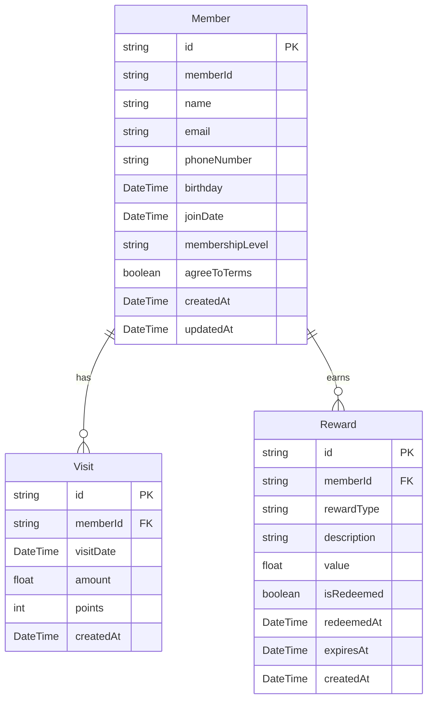

# TapPass Prisma Implementation Plan

## Overview

This document outlines the implementation plan for migrating the TapPass feature from using in-memory storage to a Prisma-backed database solution. This migration will resolve the issue of data persistence and enhance the member management capabilities of the TapPass system.

## Prerequisites

- ✅ Prisma packages are installed in the project
- ✅ Prisma schema is defined with Member, Visit, and Reward models
- ✅ Database URL is configured in .env.local
- ✅ Database service files are created in src/lib/db

## Implementation Steps

### 1. Initialize Git Branch

```bash
git checkout -b feature/tappass-prisma
```

### 2. Initialize Prisma Database

```bash
# Generate Prisma client
npx prisma generate

# Push the schema to the database
npx prisma db push

# Optionally seed the database with test data
npx prisma db seed
```

### 3. Replace Server Actions

The existing `actions.ts` file currently uses an in-memory Map to store member data. We need to replace it with the Prisma-backed implementation.

#### Option 1: Rename Files Approach
1. Rename the current `actions.ts` to `actions-memory.ts` (for reference)
2. Rename `actions-prisma.ts` to `actions.ts`

#### Option 2: Gradual Replacement
1. Keep both files
2. Update component imports to use the new actions
3. Once confirmed working, remove the old actions file

We'll go with Option 1 for a cleaner transition.

### 4. Update Type Definitions

Ensure that the types used in the TapPass components are compatible with Prisma response types. This is already handled in the new actions file by mapping Prisma objects to the expected response formats.

### 5. Test the Migration

1. Start the dev server
2. Test member registration
3. Verify data persistence by restarting the server
4. Test member lookup by email and phone

### 6. Clean Up

1. Remove any duplicate implementations
2. Organize functions and exports
3. Remove old comments referring to in-memory storage

### 7. Enhance the Feature

With the database backend in place, we can now enhance the TapPass feature:

1. Create admin dashboard to view and manage members
2. Add ability to upgrade member tiers
3. Implement visit tracking
4. Add reward generation and redemption

## Database Overview



## Future Improvements

1. **Authentication Integration**:
   - Link TapPass members to application users
   - Allow members to log in and manage their accounts

2. **Points System**:
   - Implement a comprehensive points tracking system
   - Allow points redemption for rewards

3. **Membership Tier Management**:
   - Automatic tier upgrades based on visit frequency and spending
   - Tier-specific benefits and rewards

4. **Analytics Dashboard**:
   - Visualize member data and trends
   - Track redemption rates and popular rewards

## Monitoring and Maintenance

1. **Prisma Studio**:
   - Use `npx prisma studio` for database administration
   - Regularly check data integrity

2. **Migration Scripts**:
   - Add scripts for future schema changes
   - Document migration procedures

3. **Error Logging**:
   - Implement detailed error logging
   - Set up monitoring for database errors

## Conclusion

This migration will significantly improve the TapPass feature by providing data persistence and enabling more sophisticated member management capabilities. By following this plan, we can ensure a smooth transition to the Prisma-backed database while maintaining compatibility with existing components.

The implementation adheres to Next.js 15 best practices, including server components, server actions, and proper error handling. 